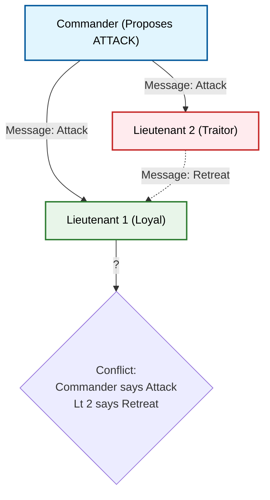

**Q: Explain the Byzantine Generals Problem in the context of blockchain consensus.**

### **1. Definition**

The **Byzantine Generals Problem (BGP)** is a classic logical dilemma in distributed computing. It describes the difficulty of achieving consensus (agreement) in a distributed network where some participants may fail or act maliciously to send conflicting information to others.

In **Blockchain**, it represents the challenge of ensuring all nodes agree on a single, valid version of the transaction ledger, preventing "traitors" (malicious nodes) from corrupting the system.

### **2. The Analogy (The Scenario)**

Imagine a group of Byzantine generals commanding armies around an enemy city. They must agree on a unified plan: **Attack** or **Retreat**.

  * **The Constraint:** They are physically separated and communicate only via messengers.
  * **The Goal:** All loyal generals must agree on the *same* action to succeed.
  * **The Problem:**
    1.  **Traitors:** Some generals might be traitors who send conflicting messages (e.g., telling General A to "Attack" while telling General B to "Retreat") to confuse the loyalists.
    2.  **Unreliable Communication:** Messengers might be intercepted or delayed.

### **3. Conceptual Diagram**



### **4. Mapping to Blockchain**

The problem aligns perfectly with blockchain network architecture:

| The Analogy | The Blockchain Component |
| :--- | :--- |
| **Generals** | **Nodes** (Computers) participating in the network. |
| **Traitors** | **Malicious Nodes** (Hackers) or faulty/offline nodes. |
| **The Consensus** | **The Ledger** (Agreeing on which block is valid). |
| **Conflicting Messages** | **Double Spending** (Trying to spend the same coin twice). |
| **Messengers** | **P2P Network Protocols**. |

### **5. Byzantine Fault Tolerance (BFT)**

A system is **Byzantine Fault Tolerant** if it can reach a consensus even when some nodes fail or lie.

  * **The Mathematical Rule:** To guarantee consensus, the number of traitors ($f$) must be less than one-third of the total nodes ($n$).
      * **Formula:** $n \ge 3f + 1$
      * *Example:* To tolerate **1** traitor, you need at least **4** nodes.

### **6. Solution in Blockchain**

Modern blockchains use consensus mechanisms to solve this by making it expensive or difficult to lie:

  * **Proof of Work (Bitcoin):** Solves BGP by requiring **computation**. To act as a successful "traitor" and trick the network, an attacker needs more computing power than all honest nodes combined (51% attack), which is economically unfeasible.
  * **Proof of Stake:** Solves BGP by requiring **financial collateral**. Traitors lose their staked money (Slashing) if they propagate conflicting messages.

### **7. Next Step**

Would you like me to explain **Double Spending** in detail next, as it is the primary "Conflicting Message" problem BFT aims to solve?

---
Below is a **clear, point-wise, exam-ready answer** with **technical keywords** and a **small diagram**.

---

# **✦ Byzantine Generals Problem in Blockchain Consensus**

## **Definition**

The **Byzantine Generals Problem (BGP)** is a **distributed systems fault-tolerance problem** where nodes must reach **agreement (consensus)** even if some nodes act **maliciously, send false data, or fail arbitrarily**.
It describes the challenge of achieving **reliable consensus in an unreliable environment**.

---

# **✦ Explanation in Context of Blockchain**

### **1. Problem Scenario**

* A group of generals (nodes) must agree on a common plan (block).
* Some generals may be **traitors** (malicious nodes).
* Messages can be **delayed**, **forged**, or **incorrect**.
* The goal is **all honest nodes agree on the same value**, despite dishonest ones.

### **2. How It Relates to Blockchain**

Blockchain is a **decentralized, distributed network**.
Nodes must agree on:

* The **next block**
* The **valid transactions**
* The **state of the ledger**

However:

* Some nodes may behave **Byzantine** (faulty or malicious).
* Blockchain must tolerate these failures without breaking consensus.

Thus, blockchain consensus algorithms are designed to be **Byzantine Fault Tolerant (BFT).**

---

# **✦ How Blockchain Solves the Byzantine Problem**

### **✔ Proof of Work (PoW)**

* Makes attacks computationally expensive.
* Honest nodes follow the **longest chain rule**.
* Malicious nodes cannot easily rewrite history.

### **✔ Proof of Stake (PoS)**

* Validators are penalized (slashing) for malicious behavior.
* Economic incentives ensure honest participation.

### **✔ Byzantine Fault Tolerance (PBFT / dBFT)**

* Nodes communicate and vote on blocks.
* Finality is fast and tolerates up to **1/3 malicious nodes**.

### **✔ General Solution Principle**

Blockchain systems ensure:

* **Consistency:** All honest nodes agree on the same block.
* **Validity:** Only valid transactions enter the chain.
* **Fault Tolerance:** Network continues even if some nodes fail or cheat.

---

# **✦ Small Diagram**

```
                [ Honest Node ]
                     |
     -------------------------------------
    |                 |                  |
[Honest]         [Malicious]        [Honest]
    |                 |                  |
    ---------> Consensus Message --------->
               (may be true or false)

Goal: All honest nodes agree on the same block
       despite malicious messages.
```

---

# **✦ Key Points (For 5–7 Marks)**

* Byzantine Generals Problem explains the difficulty of achieving **trust-less consensus** in a **distributed network**.
* Blockchain must handle **Byzantine faults** such as fraud, misinformation, and node failures.
* Consensus algorithms (PoW, PoS, PBFT) implement **Byzantine Fault Tolerance (BFT)**.
* Ensures the blockchain remains **secure, decentralized, and tamper-proof** even under malicious actors.

---

If you want, I can also write a **short 4-mark version** or a **long 10-mark version**.
