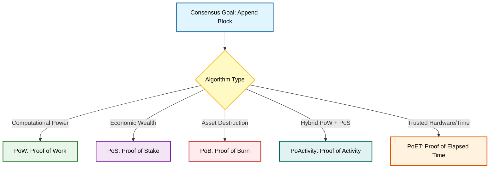
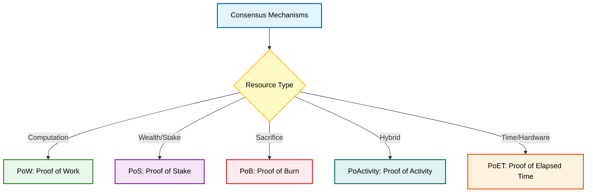

**Q: Illustrate 5 different types of consensus algorithms with examples (PoW, PoS, PoB, PoActivity, PoET).**

### **1. Introduction**

A **Consensus Algorithm** is a protocol within a blockchain network that ensures all distributed nodes agree on the validity of transactions and the state of the ledger. It provides fault tolerance and prevents double-spending.

### **2. Conceptual Comparison Diagram**

The following diagram illustrates the primary resource or mechanism utilized by each algorithm to achieve consensus.



### **3. Detailed Explanation of Algorithms**

#### **A. Proof of Work (PoW)**

  * **Mechanism:** Miners compete to solve complex mathematical puzzles (finding a specific hash **nonce**). The first to solve it broadcasts the block.
  * **Key Technical Concept:** **Hashrate** and **Difficulty Adjustment**.
  * **Pros:** High security, proven Sybil resistance.
  * **Cons:** Extremely energy-intensive, slow throughput.
  * **Example:** **Bitcoin**, Litecoin.

#### **B. Proof of Stake (PoS)**

  * **Mechanism:** Instead of mining, the creator of a new block is chosen in a deterministic way based on their **stake** (wealth) in the network. There are no miners, only **validators**.
  * **Key Technical Concept:** **Staking Age**, **Randomized Block Selection**.
  * **Pros:** Energy-efficient, faster than PoW.
  * **Cons:** "Nothing at Stake" problem, risk of centralization (rich get richer).
  * **Example:** **Ethereum (2.0)**, Cardano.

#### **C. Proof of Burn (PoB)**

  * **Mechanism:** Miners send coins to an unspendable address (an "**eater address**"). This action "burns" the coins. The more coins a user burns, the higher their probability of being selected to mine the next block.
  * **Key Technical Concept:** **Virtual Mining Rigs** (burning coins mimics buying hardware).
  * **Pros:** Prevents centralization of powerful hardware, encourages long-term commitment.
  * **Cons:** Wastes resources (permanently destroys capital).
  * **Example:** **Slimcoin**.

#### **D. Proof of Activity (PoActivity)**

  * **Mechanism:** A **hybrid** approach combining PoW and PoS.
    1.  **Phase 1 (PoW):** Miners solve a cryptographic puzzle to create a "template" block header (without transactions).
    2.  **Phase 2 (PoS):** The network randomly selects a group of validators based on stake to sign the template.
  * **Key Technical Concept:** **Hybrid Security Model**.
  * **Pros:** More secure against 51% attacks than pure PoW or PoS.
  * **Cons:** Inherits some disadvantages of both (energy usage of PoW, stake centralization of PoS).
  * **Example:** **Decred**, Espers.

#### **E. Proof of Elapsed Time (PoET)**

  * **Mechanism:** A lottery-based algorithm used in permissioned networks. Each node generates a random wait time. The node with the shortest wait time wakes up first and gets to lead the block creation.
  * **Key Technical Concept:** **TEE (Trusted Execution Environment)**, specifically **Intel SGX**. It ensures the wait time is genuinely random and the node actually waited.
  * **Pros:** Extremely energy-efficient, fair lottery system.
  * **Cons:** Reliance on specific hardware (Intel), not suitable for public/permissionless networks.
  * **Example:** **Hyperledger Sawtooth**.

### **4. Comparative Summary**

| Algorithm | Resource Used | Primary Advantage | Typical Use Case |
| :--- | :--- | :--- | :--- |
| **PoW** | CPU/Electricity | Maximum Security | Public Cryptocurrency (Bitcoin) |
| **PoS** | Token Stake | Energy Efficiency | Modern Public Chains (Ethereum) |
| **PoB** | Burnt Coins | Long-term Commitment | Alternative Cryptocurrencies |
| **PoActivity**| Compute + Stake | Defense against 51% attacks | Hybrid Blockchains |
| **PoET** | Trusted CPU Time | Fairness & Low Energy | Enterprise/Supply Chain (Hyperledger) |

---

**Q: Illustrate 5 different types of consensus algorithms with their working and examples.**

### **1. Introduction**

A **Consensus Algorithm** is a fault-tolerant mechanism in blockchain systems used to achieve necessary agreement on a single state of the network among distributed processes. It ensures the **integrity**, **consistency**, and **validity** of the shared ledger.

### **2. Conceptual Classification Diagram**



### **3. Detailed Working of Algorithms**

#### **A. Proof of Work (PoW)**

  * **Concept:** Nodes (Miners) compete to solve complex mathematical puzzles.
  * **Working:**
    1.  **Transaction Aggregation:** Transactions are gathered from the memory pool and grouped into a block.
    2.  **Puzzle Solving:** Miners repeatedly change a variable called a **Nonce** and hash the block header.
    3.  **Target Verification:** The miner checks if the resulting hash is less than the network's **Difficulty Target**.
    4.  **Broadcast:** The first miner to find the valid hash broadcasts the block.
    5.  **Verification:** Other nodes verify the hash matches the difficulty and append the block.
  * **Example:** Bitcoin.

#### **B. Proof of Stake (PoS)**

  * **Concept:** Block creators are selected deterministically based on their wealth (stake) in the network.
  * **Working:**
    1.  **Staking:** Users lock up a certain amount of cryptocurrency as a deposit (stake) to become **Validators**.
    2.  **Selection:** The protocol selects a validator to forge the next block. Selection is often based on **Randomized Block Selection** or **Coin Age Selection**.
    3.  **Validation:** The selected validator creates the block and signs it.
    4.  **Attestation:** Other validators attest to the validity of the block.
    5.  **Finalization:** Once enough attestations are received, the block is added. Malicious behavior results in **Slashing** (loss of stake).
  * **Example:** Ethereum (2.0), Cardano.

#### **C. Proof of Burn (PoB)**

  * **Concept:** Miners demonstrate proof of "burning" coins (destroying them) to earn the right to mine.
  * **Working:**
    1.  **Burning:** A user sends coins to a verifiable un-spendable address (an "Eater Address").
    2.  **Virtual Mining Power:** This action grants the user "Virtual Mining Power" proportional to the coins burnt.
    3.  **Decay:** The power of burnt coins decays over time to encourage fresh activity.
    4.  **Selection:** The protocol selects a miner; the more you have burnt, the higher your probability of being chosen.
  * **Example:** Slimcoin.

#### **D. Proof of Activity (PoActivity)**

  * **Concept:** A hybrid consensus combining PoW and PoS to utilize the strengths of both.
  * **Working:**
    1.  **Phase 1 (PoW):** Miners compete to solve a cryptographic puzzle to mine a block **header** (empty block).
    2.  **Phase 2 (PoS):** Once the header is mined and broadcast, the network converts to PoS.
    3.  **Validator Selection:** A group of validators is randomly chosen from the network based on stake.
    4.  **Signing:** These validators must sign the block header.
    5.  **Completion:** Once signed by all selected validators, the block is considered complete and added to the chain.
  * **Example:** Decred.

#### **E. Proof of Elapsed Time (PoET)**

  * **Concept:** A fair lottery system where the leader is chosen based on the shortest wait time, enforced by trusted hardware.
  * **Working:**
    1.  **Request:** Each participating node requests a random wait time from a **Trusted Execution Environment (TEE)** (e.g., Intel SGX).
    2.  **Wait:** The node sleeps/waits for the assigned duration.
    3.  **Win:** The node with the shortest assigned time wakes up first.
    4.  **Proof Generation:** The TEE generates a cryptographic proof that the node waited the actual time.
    5.  **Broadcast:** The winning node broadcasts the block along with the proof.
  * **Example:** Hyperledger Sawtooth.

### **4. Comparative Summary**

| Algorithm | Key Resource | Energy Efficiency | Primary Security Mechanism |
| :--- | :--- | :--- | :--- |
| **PoW** | CPU Power | Low | Cost of Electricity/Hardware |
| **PoS** | Cryptocurrency | High | Economic Penalty (Slashing) |
| **PoB** | Burnt Coins | High | Cost of Destroyed Assets |
| **PoActivity**| CPU + Stake | Medium | Hybrid (Work + Stake) |
| **PoET** | Trusted Hardware | Very High | Hardware-enforced Lottery |

---
Below is a **university-level, exam-ready answer** with **clear points, technical keywords, and a small diagram**.

---

# **✦ Types of Consensus Algorithms (PoW, PoS, PoB, PoA, PoET)**

*(Illustrated with examples)*

## **1. Proof of Work (PoW)**

**Definition:**
A consensus mechanism where miners solve a **cryptographic puzzle (hash-based)** to validate blocks.

**Key Points:**

* Uses **computational power** to win block creation rights.
* Ensures **security** by making attacks expensive.
* High **energy consumption**.

**Example:**

* **Bitcoin**, **Litecoin** use PoW for block validation.

**Small Diagram:**

```
[Transaction Pool] --> [Hash Puzzle Solver] --> [Valid Block]
```

---

## **2. Proof of Stake (PoS)**

**Definition:**
Validators are chosen to create the next block based on the **amount of cryptocurrency staked**.

**Key Points:**

* No mining → **energy efficient**.
* Validators with higher **stake** have more chances.
* Provides **Sybil resistance** using economic incentives.

**Example:**

* **Ethereum 2.0**, **Cardano**, **Polkadot** use PoS.

**Small Diagram:**

```
[Validators] --(Stake Weight)--> [Block Creator Selection] --> [Block Finalized]
```

---

## **3. Proof of Burn (PoB)**

**Definition:**
Participants destroy (“burn”) coins to gain the **right to mine/validate**.

**Key Points:**

* Burning coins = **long-term commitment**.
* Reduces **mining hardware requirement**.
* Helps control **inflation** by reducing supply.

**Example:**

* **Slimcoin** uses PoB to replace expensive PoW mining.

**Small Diagram:**

```
[Coins Burned] --> [Burn Proof] --> [Mining Rights]
```

---

## **4. Proof of Activity (PoA / PoActivity)**

**Definition:**
A **hybrid consensus** combining **PoW + PoS**.

**Working:**

1. Miners perform **PoW** to create a block header.
2. Validators (stakers) then **sign (PoS)** and confirm the block.

**Key Points:**

* Increases **security** by combining two mechanisms.
* Reduces risk of **51% attack**.
* More **energy efficient** than pure PoW.

**Example:**

* **Decred (DCR)** uses Proof of Activity.

**Small Diagram:**

```
PoW Miners --> [Block Header] --> PoS Validators --> [Final Block]
```

---

## **5. Proof of Elapsed Time (PoET)**

**Definition:**
A consensus algorithm where each node waits for a **random time in a trusted execution environment (TEE)** like Intel SGX, and the **shortest wait time** wins.

**Key Points:**

* Very **energy efficient** (no mining).
* Relies on **trusted hardware**.
* Ensures fairness via **random timer assignment**.

**Example:**

* Used in **Hyperledger Sawtooth** (enterprise blockchain).

**Small Diagram:**

```
[Nodes] --(Random Wait Time)--> [Winner Node] --> [Block Creation]
```

---

# **✓ Summary Table**

| Consensus Type | Full Form             | Core Idea                       | Example              |
| -------------- | --------------------- | ------------------------------- | -------------------- |
| PoW            | Proof of Work         | Solve hash puzzles              | Bitcoin              |
| PoS            | Proof of Stake        | Stake-based validator selection | Ethereum 2.0         |
| PoB            | Proof of Burn         | Burn coins for rights           | Slimcoin             |
| PoActivity     | Proof of Activity     | PoW + PoS hybrid                | Decred               |
| PoET           | Proof of Elapsed Time | Random wait in secure hardware  | Hyperledger Sawtooth |

---

If you want, I can also write **a shorter 8–10 mark version** or **add diagrams in ASCII art style**.
