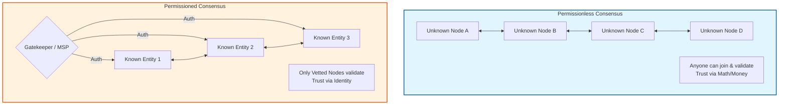

**Q: Explain the difference between a permissioned and permissionless consensus approach.**

### **1. Core Concept**

The fundamental difference lies in **who is allowed to participate** in the consensus process (validating transactions and creating blocks).

  * **Permissionless Consensus:** An open, decentralized approach where **anyone** can join the network, become a validator node, and participate in consensus without prior approval. Trust is established through cryptographic proofs and economic incentives.
  * **Permissioned Consensus:** A closed, restricted approach where only **authorized** and identifiably known entities are allowed to validate transactions. Trust is established through identity management and legal agreements.

### **2. Conceptual Diagram**

### **3. Detailed Technical Comparison**

#### **A. Access & Identity (The Sybil Defense)**

  * **Permissionless:** Relies on **"Cost of Participation"** to prevent Sybil attacks (where one user pretends to be many). You don't need an ID, but you need resources (Computing power for PoW or Capital for PoS).
  * **Permissioned:** Relies on **Identity & Access Management (IAM/MSP)**. Validators are known organizations. If a node acts maliciously, it can be identified and legally held accountable or ejected by the administrator.

#### **B. Consensus Algorithms**

  * **Permissionless:** Uses **Competitive** or **Economic** algorithms.
      * *Examples:* Proof of Work (PoW), Proof of Stake (PoS).
      * *Goal:* Probabilistic Finality (blocks are eventually confirmed).
  * **Permissioned:** Uses **Vote-based** or **Collaborative** algorithms.
      * *Examples:* PBFT (Practical Byzantine Fault Tolerance), RAFT, IBFT.
      * *Goal:* Immediate/Deterministic Finality (once voted, a block is permanent).

#### **C. Performance (Throughput & Scalability)**

  * **Permissionless:** **Low throughput**. The network must wait for propagation across thousands of nodes to ensure synchronization. (e.g., Bitcoin \~7 TPS).
  * **Permissioned:** **High throughput**. With fewer, high-performance nodes and lighter consensus algorithms (no mining), they can process thousands of transactions per second.

### **4. Comparison Table**

| Feature | Permissionless Consensus | Permissioned Consensus |
| :--- | :--- | :--- |
| **Participation** | Open / Public | Vetted / Restricted |
| **Trust Model** | **Trustless** (Math-based) | **Semi-Trusted** (Identity-based) |
| **Sybil Resistance** | Resource Cost (Energy/Stake) | Identity Verification (PKI/MSP) |
| **Throughput** | Low (Slow) | High (Fast) |
| **Consensus Mechanism** | PoW, PoS | PBFT, RAFT, PoA |
| **Finality** | Probabilistic (e.g., wait 6 confirmations) | Deterministic (Immediate) |
| **Example** | Bitcoin, Ethereum Mainnet | Hyperledger Fabric, R3 Corda |

### **5. Summary**

  * Use **Permissionless** when you need **censorship resistance** and global decentralization (e.g., Digital Currency).
  * Use **Permissioned** when you need **privacy**, regulatory compliance, and high performance (e.g., Banking Settlements, Supply Chain).

---
Below is a **clear, pointwise, exam-ready answer** with **technical keywords** and **proper formatting**.

---

# **✦ Difference Between Permissioned and Permissionless Consensus Approach**

Consensus algorithms differ based on **who is allowed to participate** in block creation, validation, and governance.
They are broadly classified into **permissionless** and **permissioned** approaches.

---

# **1. Permissionless Consensus**

### **Definition:**

A **public, open-access consensus mechanism** where **anyone can join**, validate blocks, or participate in the network **without prior approval**.

### **Key Features:**

* **Open participation**
* **High decentralization**
* **Anonymous or pseudonymous identities**
* Uses PoW, PoS, etc.
* **Trustless environment** (no central authority)

### **Examples:**

* Bitcoin (PoW)
* Ethereum (PoS)

### **Advantages:**

* **Maximum decentralization**
* **High transparency and censorship resistance**
* Strong **Byzantine fault tolerance**
* Anyone can become a validator/miner

### **Disadvantages:**

* **Slower performance**, low TPS
* Higher energy consumption (in PoW)
* **Scalability issues**
* Limited privacy since data is public

---

# **2. Permissioned Consensus**

### **Definition:**

A **restricted-access consensus mechanism** where only **authorized, known, trusted participants** can validate or propose blocks.

### **Key Features:**

* **Controlled participation** (requires identity verification)
* **Semi-centralized or consortium-based**
* Uses BFT, PBFT, Raft, PoA (Proof of Authority)
* High performance and privacy

### **Examples:**

* Hyperledger Fabric
* R3 Corda
* Quorum

### **Advantages:**

* **High transaction throughput**
* **Low latency** and fast finality
* **Better privacy** (data visible only to authorized members)
* Suitable for **enterprise and government systems**

### **Disadvantages:**

* Less decentralized → **single point of control or trust**
* Risk of **collusion** among validators
* Requires **identity management**

---

# **✦ Key Differences (Table Format)**

| Aspect                   | Permissionless Consensus       | Permissioned Consensus              |
| ------------------------ | ------------------------------ | ----------------------------------- |
| **Access**               | Open to everyone               | Only authorized participants        |
| **Identity**             | Anonymous/pseudonymous         | Known, verified identities          |
| **Decentralization**     | Highly decentralized           | Partially centralized               |
| **Consensus Algorithms** | PoW, PoS, PoB                  | PBFT, PoA, Raft                     |
| **Speed/Throughput**     | Slow, low TPS                  | Fast, high TPS                      |
| **Security Model**       | Trustless, economic incentives | Trust-based, controlled environment |
| **Example Networks**     | Bitcoin, Ethereum              | Hyperledger, Corda                  |
| **Energy Usage**         | High (PoW)                     | Low (no mining needed)              |
| **Use Cases**            | Public crypto networks         | Enterprise, supply chain, banking   |

---

# **✦ Summary Statement**

**Permissionless consensus** prioritizes **decentralization and openness**, while **permissioned consensus** focuses on **control, performance, and privacy**.
Both are suitable for different environments—public blockchains vs. enterprise networks.

---

