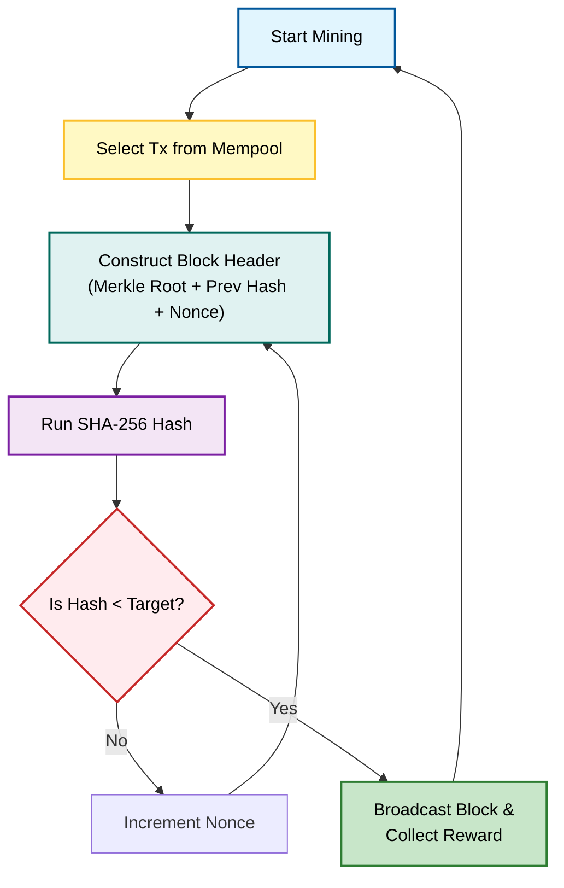

**Q: State and discuss Bitcoin mining? Elaborate the functionality of miners.**

### **1. Definition**

**Bitcoin Mining** is the decentralized computational process of validating pending transactions, securing the network, and introducing new Bitcoins into circulation. It relies on the **Proof of Work (PoW)** consensus mechanism.

Technically, it involves using specialized hardware (ASICs) to execute the **SHA-256** cryptographic hash function repeatedly until a specific condition (the Difficulty Target) is met.

### **2. Primary Objectives of Mining**

1.  **Transaction Clearing:** Mining confirms pending transactions from the memory pool (Mempool) and adds them to the immutable ledger.
2.  **Network Security:** By requiring expensive energy expenditure, mining makes it economically infeasible for an attacker to rewrite the blockchain (51% Attack).
3.  **Currency Issuance:** It is the only mechanism to create (mint) new Bitcoins, simulating the extraction of gold.

### **3. Functionality of Miners (Step-by-Step)**

Miners perform the following technical functions in a continuous loop:

#### **Step 1: Transaction Aggregation**

  * The miner listens to the P2P network for new unconfirmed transactions.
  * They validate these transactions (checking digital signatures and input availability).
  * Valid transactions are selected from the **Mempool** (usually prioritizing those with higher fees) to form a **Candidate Block**.

#### **Step 2: Constructing the Block Header**

The miner constructs a block header containing:

  * **Previous Block Hash:** Links to the existing chain.
  * **Merkle Root:** A single hash representing all transactions in the block.
  * **Timestamp:** Current time.
  * **Nonce:** A random number (starts at 0) that the miner will change repeatedly.

#### **Step 3: The Proof of Work (The "Puzzle")**

[Image of Bitcoin block header hashing process]

  * This is the core functionality. The miner runs the block header through the **SHA-256** algorithm.
  * **The Goal:** Find a hash that is **lower than** the network's current **Target Difficulty**.
  * **Formula:**
    $$SHA256(SHA256(BlockHeader)) \le Target$$
  * If the resulting hash is higher than the target, the miner increments the **Nonce** and tries again. This happens trillions of times per second (Hashrate).

#### **Step 4: Broadcasting and Validation**

  * Once a miner finds a valid Nonce (the "Golden Nonce"), they immediately broadcast the block to the network.
  * Other nodes verify the solution (which is easy to check).
  * If valid, the block is appended to the blockchain, and the miner receives the **Block Reward** (currently 3.125 BTC) plus transaction fees.

### **4. Mining Process Diagram**

### **5. Key Technical Components**

  * **Nonce (Number Used Once):** The 32-bit field miners change to alter the block hash.
  * **Difficulty Adjustment:** The network automatically adjusts the difficulty every 2,016 blocks (approx. 2 weeks) to ensure a block is mined every 10 minutes, regardless of total network power.
  * **Coinbase Transaction:** The first transaction in every block, created by the miner to pay themselves the reward.
  * **ASIC (Application-Specific Integrated Circuit):** Specialized hardware designed solely for calculating SHA-256 hashes efficiently.
