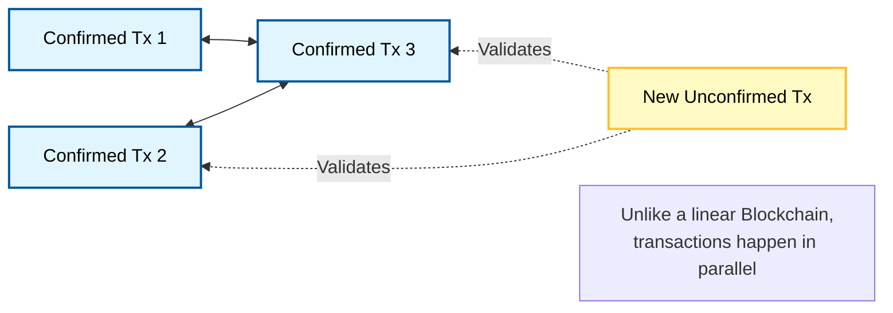

**Q: Explain IOTA in detail.**

### **1. Introduction**

**IOTA** is an open-source distributed ledger technology (DLT) specifically designed for the **Internet of Things (IoT)** and the machine-to-machine (M2M) economy. Unlike Bitcoin or Ethereum, IOTA does **not** use a blockchain. Instead, it uses a unique data structure called the **Tangle** (based on a Directed Acyclic Graph or DAG).

It addresses the limitations of traditional blockchains—such as scalability and transaction fees—enabling secure, fee-less data and value transfers between devices.

### **2. Architecture: The Tangle (DAG)**

The core innovation of IOTA is the **Tangle**.

  * **Directed Acyclic Graph (DAG):** Instead of sequential blocks, transactions are linked together in a web-like structure.
  * **No Miners:** There are no miners or blocks. Every user who issues a transaction also acts as a validator.
  * **The "Pay-it-Forward" Logic:** To issue 1 valid transaction, a node must validate **2 previous transactions** (called "Tips").

### **3. Conceptual Diagram (The Tangle)**

### **4. Working Mechanism**

The lifecycle of an IOTA transaction involves three specific steps:

1.  **Signing:** The node creates a transaction and signs it using its private key.
2.  **Tip Selection:** The node uses an algorithm (typically **MCMC - Markov Chain Monte Carlo**) to randomly select two unconfirmed transactions (Tips) from the network to validate.
3.  **Proof of Work (PoW):** The node performs a small computational puzzle (similar to Hashcash) to prevent spam. This is much lighter than Bitcoin's mining.
4.  **Broadcast:** The transaction is broadcast to the network. It becomes a "Tip" for others to validate.

### **5. Key Technical Features**

  * **Zero Transaction Fees:** Since users validate each other's transactions, there are no miners to pay. This makes **Microtransactions** (e.g., sending $0.001) economically viable.
  * **Infinite Scalability:** In blockchain, more users = slower network (congestion). In IOTA, more users = faster network (because there are more validators confirming transactions).
  * **Quantum Resistance:** IOTA uses **Winternitz One-Time Signatures (WOTS)**, which are resistant to attacks from future quantum computers, unlike Elliptic Curve Cryptography (ECC) used by Bitcoin.
  * **Partition Tolerance:** Devices can transact offline (in a local sub-tangle) and merge with the main Tangle later, which is crucial for IoT devices with intermittent connectivity.

### **6. Consensus Mechanism**

IOTA uses a **Probabilistic Consensus** model.

  * **Confidence Level:** A transaction is not "confirmed" or "unconfirmed" in a binary sense. Instead, it gains a "confirmation confidence" (e.g., 99%) as more new transactions reference it.
  * **The Coordinator (Legacy):** Historically, IOTA used a central node called the "Coordinator" to prevent attacks (Milestones).
  * **Coordicide (IOTA 2.0):** The network is transitioning to a fully decentralized mechanism called "Coordicide," removing the central Coordinator and using a voting mechanism (like **FPC - Fast Probabilistic Consensus**) to resolve conflicts.

### **7. Use Cases**

  * **IoT Data Integrity:** Sensors can store tamper-proof data on the Tangle (e.g., temperature logs for supply chains).
  * **Micro-payments:** An electric car paying for charging automatically in real-time.
  * **Smart Cities:** Selling energy back to the grid peer-to-peer.

### **8. Summary Comparison**

| Feature | Blockchain (Bitcoin) | IOTA (Tangle) |
| :--- | :--- | :--- |
| **Structure** | Linear Chain of Blocks | Directed Acyclic Graph (DAG) |
| **Transaction Fees** | High (paid to miners) | **Zero** |
| **Scalability** | Low (Limited block size) | High (Parallel processing) |
| **Role of Users** | Users vs. Miners | Users **are** Validators |
| **Best For** | Store of Value | Machine-to-Machine Economy |

**IOTA (Internet of Things Angles)** is an **open-source, decentralized, highly scalable Distributed Ledger Technology (DLT)** specifically designed to support **frictionless data transfer** across the network. It is intended to provide a specialized Blockchain solution for **IoT Products**.

R3 developers observed that IOTA provides **features and functionality similar to those provided by blockchain technology**, but it uses a unique structure instead of the traditional block-and-chain model. IOTA is described as a **feeless, scalable, and lightweight DLT**.

### Architecture: The Tangle (Directed Acyclic Graph)

IOTA is referred to as a **'block' less Blockchain** because it does not use a chain of blocks. Instead, it uses the concept called the **Directed Acyclic Graph (DAG)**, which is also known as the **Tangle**.

The Tangle functions as a non-linear Data Structure consisting of two main components:

1.  **Nodes or Vertices:** These represent the **physical devices and gadgets** in the network.
2.  **Edges:** These are directed from one vertex to another and represent a **transaction or exchange of data** from one device to another.

Unlike traditional blockchains that process transactions one after the other in blocks, the IOTA architecture supports **parallel transaction processing**, where multiple transactions can be processed simultaneously.

### Key Features and Functionality

The Tangle architecture enables several advantages over traditional blockchain structures:

1.  **Scalability and Speed:** IOTA is highly scalable. It is capable of processing **more than 1000 transactions per second**, which is significantly faster and more efficient than both Bitcoin (seven transactions per second) and Ethereum (thirty transactions per second).
2.  **Feeless Transactions:** The IOTA protocol is **free of transaction fees**. The fees of transactions will **at no point exceed their value**. This feature is designed to manage "Nano transactions" and low-value transactions, which would otherwise be disproportionately impacted by the unpredictable transaction fees found in systems like Bitcoin and Ethereum.
3.  **No Mining Process:** **No miners or mining process is involved** in the IOTA network. The verification of transactions is done by the **node itself** that generated the transaction. This node must first verify **two other random transactions** in the network using the same validation algorithm, effectively contributing to network security and consensus. IOTA uses the **GHOST (Greedy Heaviest Observed Subtree) protocol** (a modified version of the Bitcoin protocol) for creating a tree structure instead of a blockchain.
4.  **Flexibility (Public and Private Tangle):** IOTA is **flexible** and enables both public (Permissionless) and private (Permissioned) ledgers. It provides flexibility by supporting both **public and private tangle** environments, where every transaction takes place in its workspace or consortiums.
5.  **Quantum Proof Security:** IOTA ensures data security and integrity using the **Masked Messaging Technique**. Data transfer through the IOTA tangle is encrypted. Additionally, IOTA employs **Quantum Proof Security** methods to detect small changes in the graph using mathematical equations, protecting data from external attacks, especially against potential breaches by quantum computers.

### Use Cases of IOTA

IOTA empowers businesses to build IoT solutions using its open-source framework and tech stacks. Its use cases span several industries, including:

*   Industry 4.0
*   Travel and healthcare
*   Smart city and mobility
*   Supply chains
*   Smart Buildings
