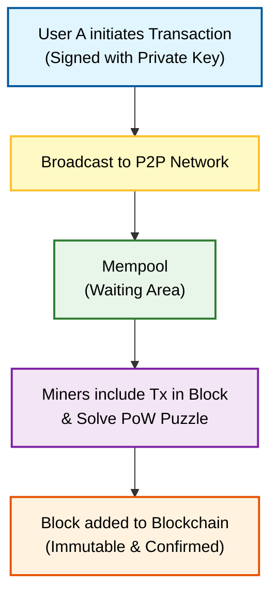

**Q: Explain Bitcoin in detail.**

### **1. Introduction**

**Bitcoin (BTC)** is the first decentralized digital currency and payment network, introduced in a 2008 whitepaper titled *"Bitcoin: A Peer-to-Peer Electronic Cash System"* by the pseudonymous creator **Satoshi Nakamoto**.

It allows for secure, borderless, and censorship-resistant value transfer without the need for a trusted intermediary (like a bank or government).

### **2. Core Technical Architecture**

Bitcoin operates on four primary technological pillars:

  * **A. Distributed Ledger (Blockchain):** A public, immutable database shared across thousands of nodes. Every participant has a copy of the entire transaction history.
  * **B. Peer-to-Peer (P2P) Network:** A decentralized network where all computers (nodes) are equal. Transactions are broadcast directly between peers.
  * **C. Cryptography:**
      * **SHA-256:** Used for mining and linking blocks (hashing).
      * **ECDSA (Elliptic Curve Digital Signature Algorithm):** Used for creating public/private key pairs and digitally signing transactions.
  * **D. Consensus Mechanism (Proof of Work):** The protocol rules that ensure all nodes agree on the state of the ledger and prevent double-spending.

### **3. Key Concepts & Terminology**

#### **1. UTXO Model (Unspent Transaction Output)**

Unlike a bank account that stores a "balance," Bitcoin stores "outputs." Your balance is simply the sum of all unspent outputs (UTXOs) that your private key can unlock.

#### **2. Limited Supply (Deflationary)**

  * **Hard Cap:** There will never be more than **21 million** bitcoins.
  * **Halving:** Every 210,000 blocks (approx. 4 years), the mining reward is cut in half (currently 3.125 BTC per block) to control inflation.

#### **3. Keys and Addresses**

  * **Private Key:** A secret alphanumeric string that proves ownership and signs transactions (e.g., your ATM PIN).
  * **Public Key:** Derived from the private key, it is visible to the network.
  * **Address:** A hashed version of the public key, acting as the destination for payments (e.g., your Bank Account Number).

### **4. Bitcoin Transaction Lifecycle**

The following diagram illustrates how a transaction moves through the Bitcoin network.

### **5. Working Mechanism**

1.  **Creation:** User A wants to send 1 BTC to User B. User A's wallet constructs a transaction using B's address and signs it with A's private key.
2.  **Propagation:** The transaction is broadcast to the network nodes (Gossip Protocol). Nodes validate it (checking if A has the UTXO).
3.  **Mining:** Valid transactions wait in the **Mempool**. Miners pick these transactions, bundle them into a block, and race to solve the cryptographic puzzle (PoW).
4.  **Confirmation:** The first miner to solve the puzzle broadcasts the block. Other nodes verify the solution and update their local ledger.
5.  **Settlement:** User B sees the 1 BTC in their wallet. After subsequent blocks are added (confirmations), the transaction becomes irreversible.

### **6. Advantages and Disadvantages**

| Advantages | Disadvantages |
| :--- | :--- |
| **Decentralization:** No single point of failure or control. | **Scalability:** Low throughput (approx. 7 transactions per second). |
| **Censorship Resistance:** No one can freeze your account. | **Volatility:** Price fluctuates significantly. |
| **Transparency:** Anyone can audit the supply and transactions. | **Energy Usage:** High electricity consumption due to PoW. |
| **Security:** Practically impossible to hack (requires 51% of global computing power). | **Irreversibility:** Lost private keys or wrong transfers cannot be recovered. |
