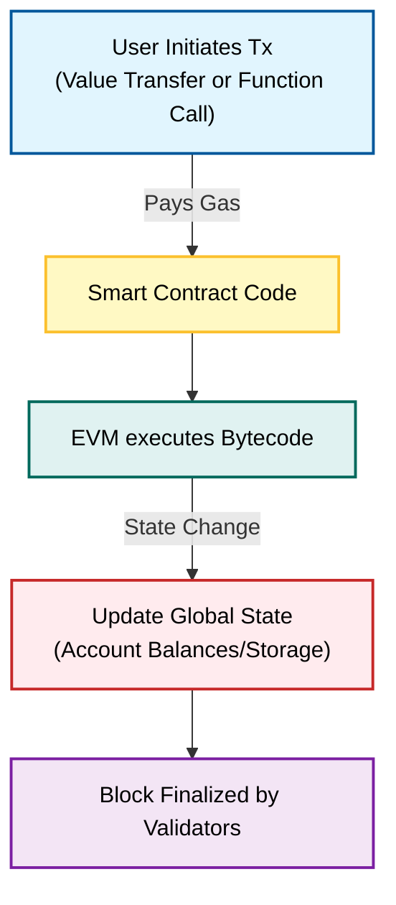

**Q: Explain Ethereum in detail.**

### **1. Introduction**

**Ethereum** is a decentralized, open-source blockchain platform that enables developers to build and deploy **Smart Contracts** and **Decentralized Applications (dApps)**.

Proposed by **Vitalik Buterin** in 2013 and launched in 2015, it differs from Bitcoin by not just being a currency system, but a **programmable blockchain** (often referred to as the "World Computer").

### **2. Core Technical Components**

#### **A. The Ethereum Virtual Machine (EVM)**

The EVM is the runtime environment for Ethereum. It is a **Turing-complete** virtual machine that runs on every node in the network. It executes the bytecode of smart contracts, ensuring that every node processes transactions in the exact same way.

#### **B. Ether (ETH)**

Ether is the native cryptocurrency of the platform. It serves two purposes:

1.  **Store of Value:** Traded on exchanges.
2.  **Fuel:** Used to pay transaction fees (Gas) to validators for computational resources.

#### **C. Smart Contracts**

These are self-executing contracts with the terms of the agreement directly written into code. Once deployed to the blockchain, they run exactly as programmed without any possibility of downtime, censorship, fraud, or third-party interference.

#### **D. Gas**

**Gas** is the unit that measures the amount of computational effort required to execute operations. Users must pay a gas fee (in ETH) to incentivize validators to process their transactions and to prevent infinite loops (Halting Problem) in the code.

### **3. Consensus Mechanism: Proof of Stake (PoS)**

Originally, Ethereum used Proof of Work (like Bitcoin). However, in September 2022 (an event known as **"The Merge"**), it transitioned to **Proof of Stake (PoS)**.

  * **Validators:** Instead of miners, users "stake" (lock up) 32 ETH to become validators.
  * **Finality:** Validators propose and attest to new blocks.
  * **Efficiency:** This reduced Ethereum's energy consumption by \~99.95%.

### **4. Ethereum Transaction Architecture Diagram**

### **5. Token Standards**

Ethereum defined technical standards that allowed for the creation of new types of digital assets:

  * **ERC-20:** The standard for **Fungible Tokens** (e.g., USDT, UNI, SHIB). All tokens are identical in value.
  * **ERC-721:** The standard for **Non-Fungible Tokens (NFTs)**. Each token is unique (e.g., Digital Art, Game Items).

### **6. Key Differences: Bitcoin vs. Ethereum**

| Feature | Bitcoin | Ethereum |
| :--- | :--- | :--- |
| **Primary Purpose** | Digital Gold (Store of Value) | World Computer (dApps platform) |
| **Language** | Script (Non-Turing complete) | Solidity (Turing complete) |
| **Block Time** | \~10 Minutes | \~12 Seconds |
| **Consensus** | Proof of Work (PoW) | Proof of Stake (PoS) |
| **Supply** | Hard Capped (21 Million) | No Hard Cap (Inflationary/Deflationary) |

### **7. Advantages and Disadvantages**

| Advantages | Disadvantages |
| :--- | :--- |
| **Programmability:** Can build financial systems (DeFi), games, and DAOs. | **Gas Fees:** Transaction costs can become very high during network congestion. |
| **Ecosystem:** Largest community of developers and dApps. | **Scalability:** The main layer (L1) can currently handle only \~15-30 TPS. |
| **Interoperability:** Standardized tokens allow easy integration. | **Complexity:** Smart contracts can have bugs/hacks (e.g., The DAO Hack). |
