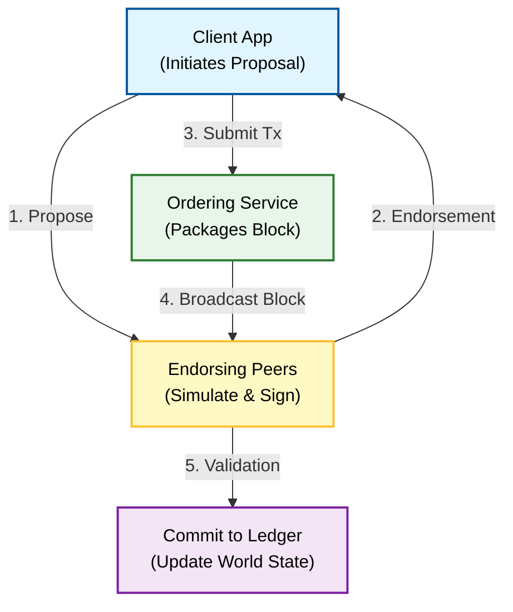

**Q: Explain Hyperledger in detail.**

### **1. Introduction**

**Hyperledger** is not a specific blockchain or a cryptocurrency; it is an **open-source umbrella project** hosted by the **Linux Foundation** (established in 2015).

It serves as a collaborative environment for developing **enterprise-grade, permissioned blockchain frameworks** and tools. Unlike public blockchains (like Bitcoin/Ethereum), Hyperledger projects are designed for business uses where participants are known and trusted (B2B).

### **2. Core Design Philosophy**

Hyperledger differs from public chains in three fundamental ways:

1.  **Permissioned Network:** Participants must be authorized and identified via a **Membership Service Provider (MSP)**.
2.  **No Native Cryptocurrency:** It does not require a token (like BTC or ETH) to operate. It focuses on logic and data, not value transfer incentives.
3.  **Modular Architecture:** It allows components (consensus, ledger, database, identity) to be "plug-and-play."

### **3. Key Frameworks under Hyperledger**

Hyperledger hosts several distributed ledger frameworks, including:

  * **Hyperledger Fabric:** (Most popular) A modular architecture for general industrial applications.
  * **Hyperledger Sawtooth:** Developed by Intel, uses Proof of Elapsed Time (PoET), ideal for supply chains.
  * **Hyperledger Indy:** Purpose-built for decentralized identity (Self-Sovereign Identity).
  * **Hyperledger Besu:** An Ethereum client designed for enterprise use.

-----

### **4. Technical Architecture (Focus: Hyperledger Fabric)**

Since Fabric is the standard taught in universities, here is its detailed architecture:

#### **A. Components**

1.  **Peers:** Nodes that maintain the ledger and run smart contracts (Chaincode).
      * **Endorsing Peers:** Simulate transactions and sign them.
      * **Committing Peers:** Verify blocks and add them to the ledger.
2.  **Orderer (Ordering Service):** A specialized node that receives endorsed transactions, orders them chronologically into a block, and broadcasts the block to peers. It does **not** validate transactions, it only orders them.
3.  **MSP (Membership Service Provider):** Manages IDs and certificates (PKI), ensuring only authorized members access the network.
4.  **Channels:** Private "sub-blockchains" between specific members. Data on Channel A is invisible to members on Channel B, ensuring **data privacy**.
5.  **Chaincode:** The smart contract (written in Go, Java, or Node.js) that encapsulates the business logic.

#### **B. The Ledger Structure**

The ledger in Fabric consists of two parts:

1.  **World State:** A database (CouchDB or LevelDB) holding the *current* value of attributes.
2.  **Blockchain:** A transaction log recording all changes (history).

### **5. Transaction Flow (Execute-Order-Validate Model)**

Unlike Bitcoin (Order-Execute), Fabric uses a unique **Execute-Order-Validate** flow to support parallelism.

**Step-by-Step Working:**

1.  **Proposal:** Client app sends a transaction proposal to Endorsing Peers.
2.  **Execute (Simulation):** Endorsers simulate the transaction (run Chaincode) without updating the ledger. They return a signed "Read-Write set".
3.  **Ordering:** Client sends the endorsements to the Orderer. The Orderer creates a block.
4.  **Validation:** The block is sent to all peers. Peers check if the endorsements are valid and if the data versions match (MVCC check).
5.  **Commit:** If valid, the ledger is updated.

### **6. Advantages and Disadvantages**

| Advantages | Disadvantages |
| :--- | :--- |
| **Privacy:** Channels allow confidential data sharing. | **Complexity:** Setting up the network (MSP, certificates, Docker containers) is difficult. |
| **Performance:** High throughput (Execute-Order-Validate allows parallel processing). | **Centralization:** Relies on trusted Orderers and MSPs (Semi-decentralized). |
| **Flexibility:** Supports standard languages (Java, Go) for smart contracts. | **No Public Auditing:** Public cannot verify the data. |

### **7. Summary**

Hyperledger is the **Linux of Blockchain**: a modular, permissioned, enterprise-focused umbrella project. Its flagship framework, **Fabric**, utilizes a unique architecture of Channels, MSPs, and an Execute-Order-Validate flow to solve business privacy and scalability needs.

---
---
txt

Hyperledger Foundation is a **non-profit organization** dedicated to bringing together the necessary resources and infrastructure to ensure thriving and stable ecosystems around open-source software blockchain projects. It operates under the umbrella of the **Linux Foundation**.

### Core Identity and Purpose

The Hyperledger Foundation is not a single blockchain network itself; instead, it hosts a variety of **enterprise-grade blockchain software projects** that are often collectively referred to as the **'Hyperledger Umbrella'**.

*   **Collaborative Effort:** Hyperledger is a collaborative effort involving leaders from different industry sectors—including **IBM, Intel, and Samsung**, among others—to frame an **open-source, cross-industry Blockchain-aided technology**.
*   **Goal:** The movement aims to develop **distributed ledgers that can support enterprise-level business transactions**.
*   **Funding and Structure:** The project is entirely developed on the open-source platform, hosted and driven by the free folk of the internet (Linux Foundation), and is the **largest blockchain technology consortium**, funded by its members.
*   **Modularity and Flexibility:** Hyperledger technologies are highly **modular and flexible**, allowing businesses, consortia, and other organizations to deploy these technologies to build networks that support their specific needs across different industries and use cases. Enterprises can mix and match technologies to balance **privacy and performance**, and can create permissioned, permissionless, or hybrid networks.

### Design Philosophy and Goals

All Hyperledger projects follow a specific design philosophy focused on enterprise suitability:

| Design Philosophy Element | Description |
| :--- | :--- |
| **Modular** | Designed with interchangeable components. |
| **Highly Secure** | Ensures a high level of data protection. |
| **Interoperable** | Capable of working with different systems. |
| **Cryptocurrency-Agnostic** | Does not rely on or create its own cryptocurrency "mainnet," though it can tap into one. |
| **Complete with APIs** | Provides comprehensive tools for integration. |

The main goals of the Hyperledger Foundation are to:
1.  Provide a neutral, open community around enterprise blockchain.
2.  Foster the development and adoption of cross-industry platforms powered by distributed ledgers supported by technical and business governance.
3.  Educate the public about the market opportunity for business blockchain technology.
4.  Create **enterprise-grade, open-source, distributed ledger frameworks and code bases** to support business transactions.

### Architecture and Components

The Hyperledger architecture has nine key components:

1.  **Consensus Layer:** Responsible for verifying blocks of transactions and agreeing on their order.
2.  **Smart Contract Layer:** Responsible for transaction processing (proposal takeover, execution, and validation).
3.  **Communication Layer:** Responsible for P2P transport.
4.  **Data Store Abstraction:** Responsible for different data stores which can be used by other modules.
5.  **Crypto Abstraction:** Responsible for crypto algorithms.
6.  **Identity Service:** Enables the establishment of a root of trust, including enrollment and registration of identities, and authentication and authorization during network setup.
7.  **Policy Service:** Responsible for policy management.
8.  **APIs:** Required for interactions with applications.
9.  **Inter-operation Service:** In charge of supporting the inter-operation between different blockchain instances.

### Hyperledger Fabric

One of the most notable projects under the Hyperledger Umbrella is **Hyperledger Fabric**.

*   **Classification:** Fabric is a **Private and Permissioned system** designed as a foundation for developing blockchain applications, products, or solutions.
*   **Features:** It delivers a **high degree of confidentiality, resilience, flexibility, and scalability**. It has a ledger and smart contracts, which are known as **chaincode** within Fabric, where the business logic is embedded.
*   **Development:** Fabric was initially developed by Digital Asset and IBM, and is now hosted by the Linux Foundation. It became the first project in the Hyperledger Umbrella to reach an 'active' state.

The success of Hyperledger highlights that, for enterprises, adopting DLT is a foundational change that enables trust where it didn't exist before, thus removing layers of inefficiency.
