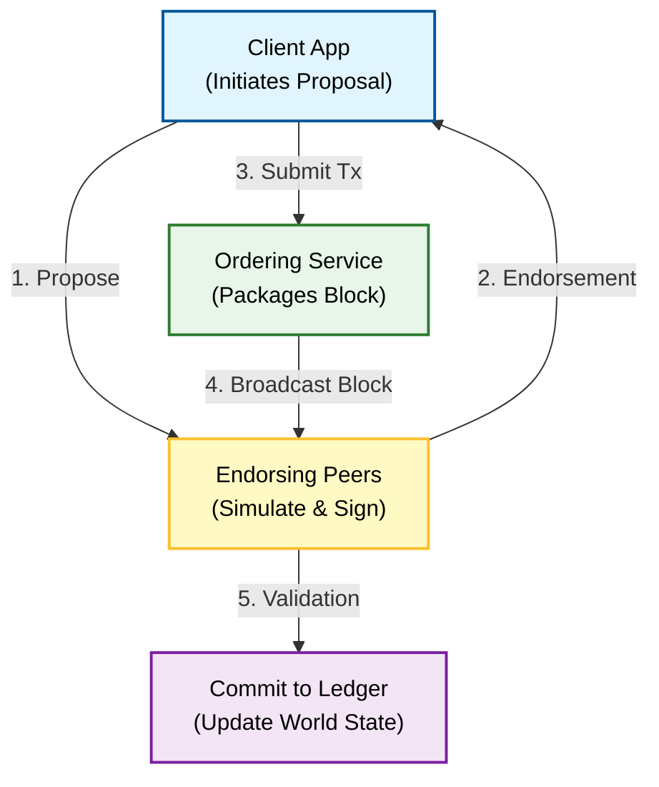

**Q: Explain Hyperledger in detail.**

### **1. Introduction**

**Hyperledger** is not a specific blockchain or a cryptocurrency; it is an **open-source umbrella project** hosted by the **Linux Foundation** (established in 2015).

It serves as a collaborative environment for developing **enterprise-grade, permissioned blockchain frameworks** and tools. Unlike public blockchains (like Bitcoin/Ethereum), Hyperledger projects are designed for business uses where participants are known and trusted (B2B).

### **2. Core Design Philosophy**

Hyperledger differs from public chains in three fundamental ways:

1.  **Permissioned Network:** Participants must be authorized and identified via a **Membership Service Provider (MSP)**.
2.  **No Native Cryptocurrency:** It does not require a token (like BTC or ETH) to operate. It focuses on logic and data, not value transfer incentives.
3.  **Modular Architecture:** It allows components (consensus, ledger, database, identity) to be "plug-and-play."

### **3. Key Frameworks under Hyperledger**

Hyperledger hosts several distributed ledger frameworks, including:

  * **Hyperledger Fabric:** (Most popular) A modular architecture for general industrial applications.
  * **Hyperledger Sawtooth:** Developed by Intel, uses Proof of Elapsed Time (PoET), ideal for supply chains.
  * **Hyperledger Indy:** Purpose-built for decentralized identity (Self-Sovereign Identity).
  * **Hyperledger Besu:** An Ethereum client designed for enterprise use.

-----

### **4. Technical Architecture (Focus: Hyperledger Fabric)**

Since Fabric is the standard taught in universities, here is its detailed architecture:

#### **A. Components**

1.  **Peers:** Nodes that maintain the ledger and run smart contracts (Chaincode).
      * **Endorsing Peers:** Simulate transactions and sign them.
      * **Committing Peers:** Verify blocks and add them to the ledger.
2.  **Orderer (Ordering Service):** A specialized node that receives endorsed transactions, orders them chronologically into a block, and broadcasts the block to peers. It does **not** validate transactions, it only orders them.
3.  **MSP (Membership Service Provider):** Manages IDs and certificates (PKI), ensuring only authorized members access the network.
4.  **Channels:** Private "sub-blockchains" between specific members. Data on Channel A is invisible to members on Channel B, ensuring **data privacy**.
5.  **Chaincode:** The smart contract (written in Go, Java, or Node.js) that encapsulates the business logic.

#### **B. The Ledger Structure**

The ledger in Fabric consists of two parts:

1.  **World State:** A database (CouchDB or LevelDB) holding the *current* value of attributes.
2.  **Blockchain:** A transaction log recording all changes (history).

### **5. Transaction Flow (Execute-Order-Validate Model)**

Unlike Bitcoin (Order-Execute), Fabric uses a unique **Execute-Order-Validate** flow to support parallelism.

**Step-by-Step Working:**

1.  **Proposal:** Client app sends a transaction proposal to Endorsing Peers.
2.  **Execute (Simulation):** Endorsers simulate the transaction (run Chaincode) without updating the ledger. They return a signed "Read-Write set".
3.  **Ordering:** Client sends the endorsements to the Orderer. The Orderer creates a block.
4.  **Validation:** The block is sent to all peers. Peers check if the endorsements are valid and if the data versions match (MVCC check).
5.  **Commit:** If valid, the ledger is updated.

### **6. Advantages and Disadvantages**

| Advantages | Disadvantages |
| :--- | :--- |
| **Privacy:** Channels allow confidential data sharing. | **Complexity:** Setting up the network (MSP, certificates, Docker containers) is difficult. |
| **Performance:** High throughput (Execute-Order-Validate allows parallel processing). | **Centralization:** Relies on trusted Orderers and MSPs (Semi-decentralized). |
| **Flexibility:** Supports standard languages (Java, Go) for smart contracts. | **No Public Auditing:** Public cannot verify the data. |

### **7. Summary**

Hyperledger is the **Linux of Blockchain**: a modular, permissioned, enterprise-focused umbrella project. Its flagship framework, **Fabric**, utilizes a unique architecture of Channels, MSPs, and an Execute-Order-Validate flow to solve business privacy and scalability needs.
