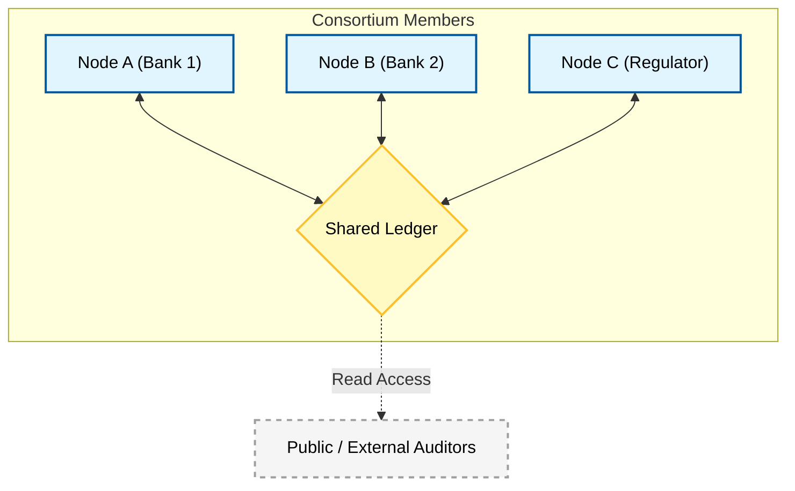

**Q: Explain consortium blockchain platform.**

### **1. Definition**

A **Consensus** or **Federated Blockchain** is a hybrid blockchain platform where the consensus process is controlled by a pre-selected set of nodes (a group of organizations) rather than a single entity (Private) or the entire public (Public).

It acts as a bridge between public and private blockchains, offering a **semi-decentralized** environment ideal for collaboration between specific organizations (e.g., a group of banks or supply chain partners).

### **2. Conceptual Architecture Diagram**

### **3. Key Characteristics**

  * **Semi-Decentralized:** Power is distributed among a known group of participants (Consortium members), ensuring no single organization has absolute control.
  * **Permissioned Access:** While it is more open than a private chain, access is still restricted. Only authorized members can validate transactions.
  * **Multi-Party Trust:** Designed for environments where organizations need to work together but do not fully trust each other (e.g., competitors in the same industry).
  * **Controlled Visibility:** Read access can be public, restricted to members, or strictly private, depending on the configuration.

### **4. How It Works**

1.  **Governance:** The consortium establishes a governance model (e.g., "7 out of 10 members must sign to valid a block").
2.  **Transaction:** A member initiates a transaction.
3.  **Validation:** Only the pre-approved validator nodes (one from each organization) participate in the consensus protocol.
4.  **Commitment:** Once the supermajority agrees, the block is added to the shared ledger.

### **5. Consensus Mechanisms**

Consortiums typically use **Vote-Based** or **Leader-Based** consensus algorithms that prioritize speed and finality over raw difficulty.

  * **IBFT (Istanbul Byzantine Fault Tolerance):** Deterministic finality; once a block is added, it cannot be changed.
  * **Proof of Authority (PoA):** Approved accounts (validators) validate transactions and blocks.

### **6. Advantages and Limitations**

| Advantages | Limitations |
| :--- | :--- |
| **Scalability:** Faster than public blockchains due to fewer nodes. | **Centralization Risk:** Can be colluded if a majority of consortium members agree to act maliciously. |
| **Efficiency:** No mining required; low energy consumption. | **Governance Complexity:** Getting multiple competitors to agree on protocol rules/upgrades can be difficult. |
| **Privacy & Control:** Offers a balance of transparency and privacy suitable for B2B use. | **Less Secure:** Less secure than public chains due to fewer independent nodes. |

### **7. Examples**

  * **R3 Corda:** A global consortium blockchain designed specifically for the financial services industry.
  * **Quorum:** An enterprise-focused version of Ethereum developed by J.P. Morgan (now ConsenSys).
  * **Energy Web Foundation (EWF):** A consortium blockchain for the energy sector.

### **8. Next Step**

[Image of Consortium Blockchain Architecture]

Would you like a comparison table summarizing **Public vs. Private vs. Consortium** to conclude this module?
