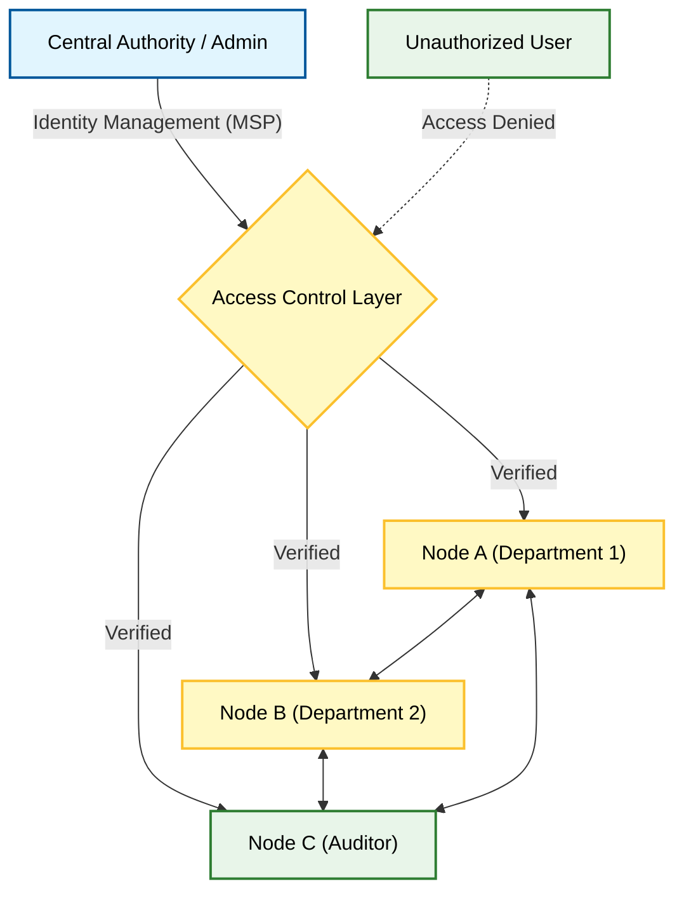

**Q: Explain private blockchain platform.**

### **1. Definition**

A **Private Blockchain** (also known as an **Enterprise Blockchain**) is a **permissioned** distributed ledger system where the network is controlled by a single organization or a designated central entity. Access to the network, the ability to submit transactions, and participation in the consensus process are strictly restricted to authorized and verified participants.

### **2. Conceptual Architecture Diagram**

### **3. Key Characteristics**

  * **Permissioned:** Users must undergo identity verification (KYC/Identity & Access Management) before joining. Anonymity is generally not supported.
  * **Centralized Control:** A single entity has the authority to dictate rules, override transactions (in some cases), and manage network upgrades.
  * **Privacy:** Data visibility is restricted. Read permissions can be granular (e.g., only specific nodes see specific transaction data).
  * **Efficiency:** Due to the known and trusted nature of participants, the network does not require heavy computational proof.
  * **No Native Cryptocurrency:** Unlike public chains, private blockchains typically do not need tokens/coins to incentivize miners, as nodes are run by internal stakeholders.

### **4. Consensus Mechanisms**

Since all nodes are authenticated and legally bound to the organization, the environment is considered **semi-trusted**. Therefore, heavy algorithms like Proof of Work (PoW) are unnecessary.

  * **CFT (Crash Fault Tolerance):** Algorithms like **RAFT** or **Paxos**. These ensure the system keeps working if a component fails, but don't protect against malicious actors (as malicious internal actors are less likely).
  * **BFT (Byzantine Fault Tolerance):** Algorithms like **PBFT** are used if some internal defense against malicious nodes is required.

### **5. Advantages and Limitations**

| Advantages | Limitations |
| :--- | :--- |
| **High Performance:** Very high throughput (thousands of TPS) and low latency. | **Centralization:** Relies on a central point of trust, negating the core philosophy of "decentralization." |
| **Data Privacy:** Sensitive business data is kept confidential from the public. | **Immutability Risks:** The controlling entity could theoretically revert or alter transactions. |
| **Cost Effective:** Low energy consumption and zero transaction fees (gas). | **Interoperability:** Often operates in silos, making it hard to communicate with other chains. |

### **6. Examples**

  * **Hyperledger Fabric:** A modular blockchain framework hosted by the Linux Foundation, widely used for supply chain and trade finance.
  * **MultiChain:** A platform that helps organizations build and deploy private blockchains.
  * **Corda:** Developed by R3, specifically designed for the financial services industry.

### **7. Next Step**

Would you like me to create a comparison table (Difference between Public vs. Private Blockchain) to complete this topic for your notes?
