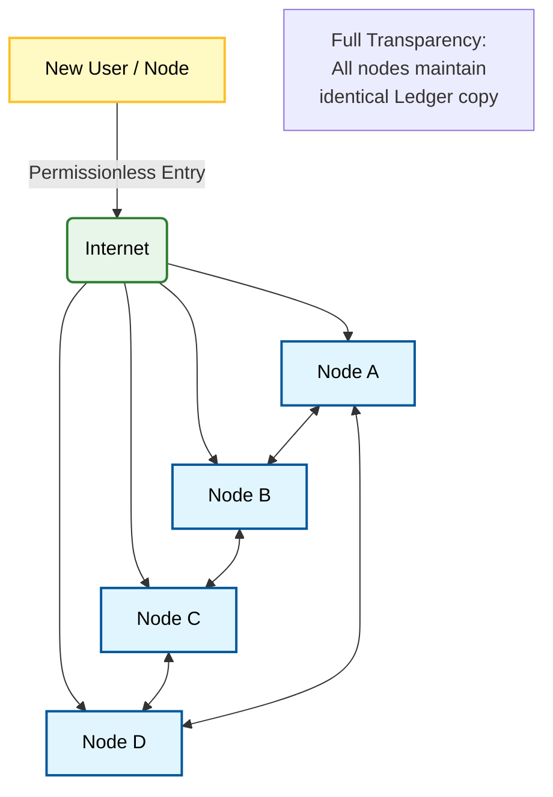

**Q: Explain public blockchain platform.**

### **1. Definition**

A **Public Blockchain** is a permissionless distributed ledger system where anyone is free to join the network, participate in the consensus process, and read or write transactions without requiring authorization from a central authority. It is the purest form of **decentralization**, relying on cryptographic verification and economic incentives rather than trust.

### **2. Conceptual Architecture Diagram**

### **3. Key Characteristics**

  * **Permissionless:** It is an open network. No "Gatekeeper" or administrator exists to grant access. Any user can download the protocol software and become a node.
  * **Decentralization:** Control is distributed across thousands of nodes globally. No single point of failure (SPOF) exists.
  * **Transparency:** All transactions are recorded on a public ledger visible to anyone using a block explorer.
  * **Immutability:** Once a block is confirmed, it is computationally infeasible to alter the data (due to hash linking and consensus).
  * **Pseudo-anonymity:** Users are identified by cryptographic public keys (wallet addresses), not by real-world identities.
  * **Censorship Resistance:** No central entity can freeze assets or stop a valid transaction from being processed.

### **4. How It Works**

1.  **Transaction Initiation:** A user creates a transaction and signs it with their private key.
2.  **Broadcasting:** The transaction is propagated to the peer-to-peer (P2P) network.
3.  **Consensus:** Nodes (miners/validators) execute a consensus algorithm (e.g., PoW or PoS) to validate the transaction.
4.  **Block Addition:** Validated transactions are bundled into a block and appended to the chain.
5.  **Synchronization:** The updated ledger state is propagated to all nodes.

### **5. Consensus Mechanisms**

Public blockchains operate in a trustless environment, requiring robust algorithms to prevent malicious activity (like double-spending).

  * **Proof of Work (PoW):** Used by Bitcoin. Relies on computational power.
  * **Proof of Stake (PoS):** Used by Ethereum. Relies on economic staking.

### **6. Advantages and Limitations**

| Advantages | Limitations |
| :--- | :--- |
| **Trustless:** No intermediary required. | **Scalability:** Low throughput (TPS) due to global consensus needs. |
| **Security:** extremely high cost to attack (51% attack). | **Energy Consumption:** PoW chains consume vast amounts of electricity. |
| **Data Integrity:** Permanent, tamper-proof records. | **Privacy:** Transaction details are visible to the public. |

### **7. Examples**

  * **Bitcoin (BTC):** The first implementation of a public blockchain for peer-to-peer electronic cash.
  * **Ethereum (ETH):** A public platform supporting Smart Contracts and Decentralized Applications (dApps).
  * **Litecoin (LTC):** A lighter version of Bitcoin with faster block generation.
