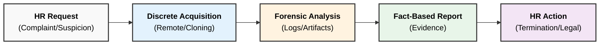
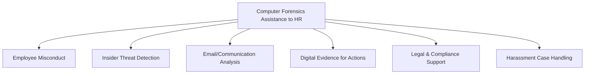

### **Q: Explain in detail Computer Forensics Assistance to Human Resources.**

#### **1. Overview**

Computer forensics assists Human Resources (HR) by providing **technical evidence** for internal investigations. It ensures that disciplinary actions, terminations, or legal proceedings against employees are backed by irrefutable digital proof rather than hearsay. This reduces corporate liability in cases of wrongful termination lawsuits.

-----

#### **2. Key Areas of Forensic Assistance to HR**

**A. Departing Employee Investigations (IP Theft)**

  * **Context:** When high-value employees (sales, R\&D) leave the company, there is a risk of them taking proprietary data (client lists, source code) to a competitor.
  * **Forensic Assistance:**
      * **USB Artifact Analysis:** Checking registry keys (`USBSTOR`) to see if unauthorized USB drives were connected recently.
      * **File Transfer Logs:** Analyzing specific file access times or uploads to cloud services (Google Drive, Dropbox) just before resignation.
      * **Email Forensics:** Recovering deleted emails sent to personal accounts containing sensitive attachments.
  * **Goal:** To prevent **Data Exfiltration** and protect Intellectual Property.

**B. Workplace Misconduct & Harassment**

  * **Context:** HR often receives complaints regarding sexual harassment, bullying, or a hostile work environment.
  * **Forensic Assistance:**
      * **Communication Analysis:** Retrieving chat logs (Teams, Slack) and emails, even if the user has deleted them from their inbox.
      * **Timeline Reconstruction:** Establishing a pattern of behavior by correlating timestamps of messages with reported incidents.
  * **Goal:** To provide objective evidence that supports or refutes the victim's claims.

**C. Policy Violations & Resource Misuse**

  * **Context:** Employees violating the company's **Acceptable Use Policy (AUP)** (e.g., watching pornography, online gambling, or excessive social media use during work hours).
  * **Forensic Assistance:**
      * **Internet History Analysis:** Examining browser cache, cookies, and history files to prove non-work-related activity.
      * **Time Theft:** Correlating system login/logout times and idle times to prove an employee was not working during billed hours.
  * **Goal:** To justify disciplinary action or termination for cause.

**D. White Collar Crime (Internal Fraud)**

  * **Context:** Suspicion of embezzlement, kickbacks, or falsifying records.
  * **Forensic Assistance:**
      * **Document Analysis:** Detecting alterations in spreadsheets or financial PDF documents.
      * **Deleted Data Recovery:** Retrieving "shredded" or deleted financial ledgers.
  * **Goal:** To gather evidence for criminal prosecution or civil recovery of funds.

-----

#### **3. The Investigation Process (HR & Forensics Workflow)**

The interaction between HR and the Forensic team usually follows a discreet protocol to avoid alerting the suspect.

-----

#### **4. Importance of "Forensic Soundness" in HR**

HR departments must use forensic specialists rather than standard IT staff for these investigations because:

  * **Admissibility:** If the employee sues for wrongful termination, standard IT copies of data may be rejected by the court. Forensic copies maintain the **Chain of Custody**.
  * **Non-Repudiation:** Forensic tools prove that the *employee* performed the action (via User IDs and specific timestamps), preventing them from claiming "it was a virus" or "someone else did it."

-----

#### **5. Key Technical Keywords**

  * **Acceptable Use Policy (AUP):** A set of rules applied by the owner/manager of a network/website that restrict the ways in which the network/website may be used.
  * **Data Exfiltration:** The unauthorized transfer of data from a computer.
  * **Wrongful Termination:** A situation where an employee's contract of employment has been terminated by the employer in breach of one or more terms of the contract or employment law.
  * **USB Artifacts:** Traces left in the Windows Registry when a USB device is connected (e.g., Vendor ID, Product ID, Serial Number).
---
# **Computer Forensics Assistance to Human Resources**

---

## **1️⃣ Introduction**

Computer forensics provides **technical support** to Human Resources (HR) departments in handling cases involving **employee misconduct, policy violations, data misuse, and internal investigations**.
It ensures decisions are based on **accurate, verifiable, and legally admissible digital evidence**.

---

# **2️⃣ Detailed Points – Computer Forensics Assistance to HR**

---

## **A. Investigation of Employee Misconduct**

* Helps detect **policy violations** such as unauthorized software installation, misuse of company assets, or violation of IT policies.
* Analyzes **system logs, browsing history, file access records**.

---

## **B. Detection of Insider Threats**

* Identifies employees involved in **data theft, fraud, IP leakage, and sabotage**.
* Monitors endpoint activity using **SIEM systems, DLP tools, and access logs**.

---

## **C. Analysis of Email and Communication**

* Examines **email headers, attachments, metadata** to uncover:

  * Harassment
  * Workplace bullying
  * Leak of confidential information
* Recovers **deleted emails**, internal chat messages, VoIP logs.

---

## **D. Digital Evidence for Disciplinary Actions**

* Provides HR with **forensically sound evidence** to support disciplinary procedures.
* Ensures decisions are legally defensible using:

  * **Hash-verified forensic images**
  * Documented **chain of custody**
  * Detailed forensic reports

---

## **E. Prevention of Legal Liabilities**

* Avoids wrongful termination by basing actions on **validated forensic data**.
* Helps HR navigate compliance with regulations like **GDPR, SOX, HIPAA**.
* Protects the organization from lawsuits and legal disputes.

---

## **F. Monitoring Workplace Productivity**

* Forensic tools assist in analyzing:

  * Excessive personal browsing
  * Misuse of office software
  * Unauthorized communication channels
* Enables HR to enforce **productivity and behavior standards**.

---

## **G. Handling Cases of Harassment & Abuse**

* Recovers evidence from emails, chat logs, USB logs, and mobile devices.
* Helps evaluate complaints regarding **sexual harassment, bullying**, or **threats**.

---

## **H. Support in Hiring & Background Verification**

* Helps verify authenticity of **digital resumes**, certificates, and employment records.
* Detects forged or manipulated digital documents.

---

## **I. Incident Response Coordination**

* Assists HR during internal incidents involving employees such as:

  * Breach of contract
  * Unauthorized data exposure
  * System compromise due to negligence
* Provides technical evidence for internal reviews.

---

# **3️⃣ Small Diagram – HR Assistance Through Forensics**

---

# **4️⃣ Summary**

Computer forensics assists Human Resources by supporting **misconduct investigations**, detecting **insider threats**, analyzing **emails and communication**, providing **legally defensible evidence**, preventing **liabilities**, monitoring **productivity**, handling **harassment complaints**, and verifying **digital documents**.
These capabilities help HR make informed, fair, and legally compliant decisions.
