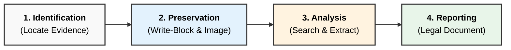
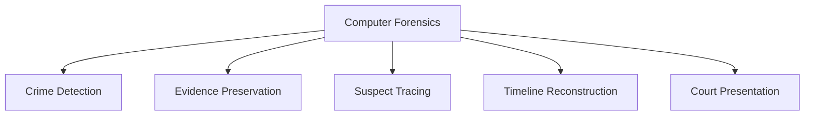

### **Q: What is Computer Forensics? What is the use of Computer Forensics in Law Enforcement? What are different computer forensics schemes?**

#### **1. Definition: Computer Forensics**

**Computer Forensics** is the application of computer investigation and analysis techniques in the interest of determining potential legal evidence. It involves the scientific process of **preserving**, **identifying**, **extracting**, **documenting**, and **interpreting** computer media for evidentiary purposes.

  * **Key Goal:** To ensure the evidence is **admissible** in a court of law by maintaining a strict **Chain of Custody**.
  * **Technical Definition:** The use of specialized techniques for recovery, authentication, and analysis of electronic data when a case involves issues relating to reconstruction of computer usage.

-----

#### **2. Use of Computer Forensics in Law Enforcement**

Law enforcement agencies use computer forensics to attribute crimes to suspects and gather irrefutable evidence.

  * **Prosecution of Criminals:** It provides the necessary digital evidence to prove guilt **beyond a reasonable doubt** in court (e.g., finding child exploitation material or illegal financial ledgers).
  * **Attribution & Identification:** Linking a specific digital artifact (IP address, file, email) to a specific physical person or device.
  * **Evidence Recovery:** Retrieving **deleted**, **hidden**, or **encrypted** data that suspects attempted to destroy to cover their tracks.
  * **Timeline Analysis:** Reconstructing the sequence of events (e.g., browser history followed by file execution) to establish **Mens Rea** (criminal intent).
  * **Corroboration:** verifying statements made by suspects or witnesses (e.g., GPS data on a phone contradicting a suspect's alibi).

-----

#### **3. Computer Forensics Schemes (Investigation Models)**

"Schemes" in computer forensics typically refer to the standard **Investigation Methodologies** or **Phases** followed to ensure data integrity. The most widely accepted scheme is the **3-A Scheme** or the Standard Lifecycle.

**A. The 3-A Scheme (Acquisition, Authentication, Analysis)**

1.  **Acquisition:** The process of creating a bit-by-bit copy (**Forensic Image**) of the evidence. This ensures the original media is left untouched ("Dead Analysis").
2.  **Authentication:** verifying the integrity of the copy using **Cryptographic Hashing** (MD5/SHA-256). If the hash of the image matches the hash of the original, the evidence is authenticated.
3.  **Analysis:** The technical review of the data to find artifacts, deleted files, and logs relevant to the case.

**B. The Standard Forensic Lifecycle (Detailed Scheme)**
This is the formal procedure used by agencies like the FBI/DoD.

  * **Phase 1: Identification:** Recognizing potential evidence sources (Laptops, USBs, Cloud).
  * **Phase 2: Preservation:** Securing the crime scene and using **Write Blockers** to prevent data alteration.
  * **Phase 3: Collection:** Recording the physical scene and acquiring digital images.
  * **Phase 4: Examination:** Automated searching and filtering of data.
  * **Phase 5: Analysis:** Human interpretation of the results to draw conclusions.
  * **Phase 6: Reporting:** Presenting the findings in a legal format.

-----

#### **4. Diagram: The Forensic Scheme (Workflow)**

-----

#### **5. Key Technical Keywords**

  * **Admissibility:** The quality of evidence being acceptable in a court of law.
  * **Bit-Stream Copy:** A bit-for-bit duplicate of data on the original storage medium.
  * **Chain of Custody:** The chronological documentation of the handling of evidence.
  * **Write Blocker:** A hardware tool that prevents the computer from writing to a disk drive, ensuring data integrity.
---
# **Computer Forensics – Definition, Use in Law Enforcement & Forensic Schemes**

---

# **1️⃣ What is Computer Forensics?**

* Computer Forensics is the **systematic process of identifying, preserving, analyzing, and presenting digital evidence** from computers, networks, storage devices, and electronic systems.
* It uses **scientific techniques**, **forensically sound tools**, and **legal procedures** to ensure evidence remains **authentic, reliable, and admissible** in court.
* Focuses on recovering **deleted, hidden, encrypted, or tampered** data.

---

# **2️⃣ Use of Computer Forensics in Law Enforcement**

## **A. Crime Detection and Investigation**

* Helps investigate **cybercrimes** such as hacking, identity theft, fraud, cyberstalking, and data leaks.
* Recovers **deleted emails, chat logs, browsing history**, and system activity.

## **B. Evidence Acquisition and Integrity**

* Creates **bit-stream forensic images** using write-blockers.
* Ensures authenticity with **hash values (MD5/SHA-1)** for legal admissibility.

## **C. Suspect Tracing and Profiling**

* Network forensics traces **IP addresses, communication patterns, and intrusion paths**.
* Assists in linking criminals to digital actions.

## **D. Timeline Reconstruction**

* Reconstructs **sequence of events** through logs, metadata, and activity reports.

## **E. Court Presentation**

* Produces **legally acceptable forensic reports** and supports expert testimony.

---

# **Small Diagram – Use of Forensics in Law Enforcement**

---

# **3️⃣ Different Computer Forensics Schemes**

### **A. Disk Forensics**

* Analysis of **hard drives, SSDs, USBs**.
* Recovers deleted files, examines file systems, metadata, partitions.

### **B. Network Forensics**

* Captures and analyzes **network packets, logs, connections**.
* Detects intrusions, data exfiltration, malicious traffic.

### **C. Memory (RAM) Forensics**

* Extraction of **running processes, malware traces, encryption keys** from RAM.
* Useful for volatile data attacks.

### **D. Mobile Device Forensics**

* Recovery of **SMS, call logs, GPS data, app artifacts** from smartphones.
* Useful in fraud, harassment, and location-based investigations.

### **E. Email & Communication Forensics**

* Analysis of **email headers, metadata, attachments**.
* Detects phishing, fraud, insider threats.

### **F. Cloud Forensics**

* Investigation of **SaaS, IaaS, PaaS logs, access patterns, cloud storage**.
* Handles remote data and distributed environments.

### **G. Malware Forensics**

* Reverse engineering of malware to understand **payload, infection vectors, persistence**.

### **H. Database Forensics**

* Examination of **transaction logs, stored procedures, unauthorized changes**.

---

# **Summary**

Computer Forensics involves **scientific analysis of digital evidence** for legal and investigative purposes.
In law enforcement, it aids in **crime detection, evidence preservation, suspect tracing, timeline reconstruction**, and **court presentation**.
Computer forensics schemes include **disk, network, memory, mobile, email, cloud, malware, and database forensics**, each targeting a specific type of digital artifact.
