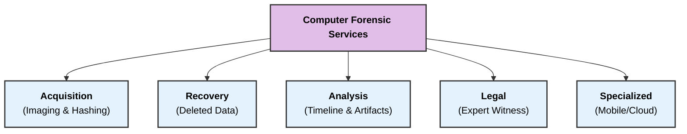
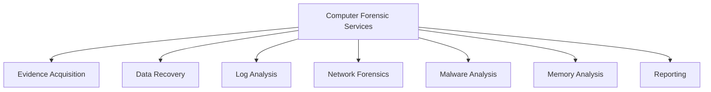

### **Q: Explain in detail computer forensic services.**

#### **1. Overview**

Computer forensic services encompass a range of specialized technical activities performed by forensic professionals to identify, preserve, analyze, and present digital evidence. These services are utilized by **Law Enforcement** (for criminal prosecution), **Corporations** (for internal investigations), and **Legal Firms** (for civil litigation).

The primary goal is to convert raw binary data into **admissible legal evidence**.

-----

#### **2. Detailed Description of Services**

**A. Data Acquisition & Preservation**
This is the foundational service where evidence is secured without alteration.

  * **Forensic Imaging:** Creating a **Bit-Stream Image** (a sector-by-sector duplicate) of the source media (hard drives, USBs).
  * **Write Blocking:** Using hardware tools to ensure the original device is "Read-Only" during the copy process to preserve data integrity.
  * **Hashing:** Generating cryptographic checksums (**MD5/SHA-256**) to mathematically prove that the copy matches the original exactly.

**B. Data Recovery**
Retrieving data that is not accessible through standard operating system commands.

  * **Deleted File Recovery:** Using **File Carving** techniques to recover files from "Unallocated Clusters" based on file headers and footers.
  * **Format Recovery:** Recovering data from drives that have been formatted or partitioned.
  * **Password Recovery:** Using dictionary attacks or brute-force methods to bypass encryption on files, archives, or operating systems.

**C. Forensic Analysis & Examination**
The core investigative service where the "story" is reconstructed.

  * **Timeline Analysis:** Reconstructing the chronological sequence of events using **Metadata** (Created, Accessed, Modified timestamps) to establish **Mens Rea** (intent).
  * **Artifact Analysis:** Examining OS artifacts like **Registry Keys**, **Prefetch files**, and **Shellbags** to prove program execution or file knowledge.
  * **Internet History Reconstruction:** Retrieving browser history, cookies, and cache to prove user activity even if the browser history was cleared.

**D. Expert Witness & Litigation Support**
Bridging the gap between technical findings and the courtroom.

  * **Reporting:** Creating detailed, jargon-free reports that explain findings to judges and juries.
  * **Testimony:** Providing **Expert Witness** testimony in court to defend the methodology used and explain the significance of the evidence.
  * **E-Discovery:** Assisting in civil lawsuits by processing vast amounts of electronic documents (emails, PDFs) to find relevant information for discovery requests.

**E. Incident Response (IR)**
Rapid services deployed during an active cyber attack.

  * **Malware Analysis:** Reverse-engineering malicious code to understand its behavior and origin.
  * **Breach Investigation:** Determining the **Root Cause** of a security breach (e.g., how ransomware entered the network).

-----

#### **3. Diagram: Spectrum of Forensic Services**

-----

#### **4. Key Technical Keywords**

  * **Bit-Stream Image:** An exact bit-for-bit copy of a storage medium, including slack space and unallocated space.
  * **Chain of Custody:** A critical document that tracks the handling of evidence from seizure to court to prevent tampering.
  * **File Carving:** The process of extracting data from a disk drive without the assistance of the file system table (used for recovering deleted files).
  * **Steganography:** The technique of hiding secret data within an ordinary, non-secret, file or message (e.g., hiding text inside an image).
---
# **Computer Forensic Services (Detailed Explanation)**

---

## **1️⃣ Overview**

Computer forensic services involve a structured set of **technical, legal, and analytical processes** used to collect, preserve, examine, and present **digital evidence** in a forensically sound manner.

---

# **2️⃣ Computer Forensic Services (Detailed)**

---

## **A. Evidence Acquisition**

* Creation of **bit-stream forensic images** of hard drives, SSDs, USBs, and mobile devices.
* Use of **write-blockers** to prevent modification of original data.
* Generation of **hash values (MD5, SHA-1, SHA-256)** to verify evidence integrity.
* Ensures preservation of the **chain of custody**.

---

## **B. Data Recovery and Data Carving**

* Recovery of **deleted, hidden, encrypted, or damaged** files.
* Extracting data from **slack space, unallocated space, and fragmented clusters**.
* File carving based on **file signatures** when metadata is missing.

---

## **C. Log and Audit Trail Analysis**

* Examination of **system logs, application logs, security logs, firewall logs**.
* Reconstruction of **user actions**, login activity, file modifications, and system events.
* Essential for **timeline reconstruction**.

---

## **D. Network Forensics**

* Capturing and analyzing **network packets (PCAP files)**.
* Identifying **intrusion attempts, malware traffic, unauthorized access, data exfiltration**.
* Analysis of firewall, IDS/IPS, proxy, and router logs.

---

## **E. Malware Analysis**

* Static and dynamic analysis of **viruses, trojans, spyware, ransomware**.
* Identifying **payload behavior**, infection vectors, persistence techniques.
* Reverse engineering using specialized tools.

---

## **F. Memory (RAM) Forensics**

* Extracting volatile data such as **running processes, open network connections, registry hives**, and **malicious code**.
* Useful for detecting **in-memory attacks**, fileless malware, and encryption keys.

---

## **G. Mobile Device Forensics**

* Extraction of **SMS, call logs, GPS data, photos, app data**, and network traces.
* Useful in cases involving **fraud, harassment, and insider activities**.

---

## **H. Reporting and Documentation**

* Preparation of **legally admissible forensic reports**.
* Clear documentation of **tools, methods, findings, timestamps, and hash values**.
* Supports **expert testimony** in court.

---

# **3️⃣ Small Diagram – Computer Forensic Services**

---

# **4️⃣ Summary**

Computer forensic services include **evidence acquisition, data recovery, log analysis, network forensics, malware examination, memory forensics, mobile extraction**, and **formal reporting**. These services ensure the **accurate, reliable, and legally acceptable** handling of digital evidence during investigations.
