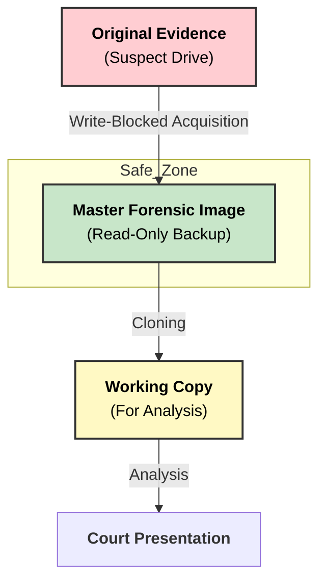

Here is the answer formatted according to university examination standards: clear, structured, and technical.

### **Q: Why is data backup & recovery important in computer forensics?**

#### **1. Overview**

In the context of computer forensics, "Data Backup" refers to **Forensic Imaging** (Acquisition), and "Recovery" refers to the restoration of evidence integrity. These processes are the bedrock of the **Chain of Custody** and **Legal Admissibility**.

The "Golden Rule" of Computer Forensics states: **Never work on the original evidence.**

#### **2. Key Reasons for Importance**

**A. Preservation of Original Evidence (Integrity)**

  * **Concept:** Digital evidence is fragile. Opening a file changes its "Last Access" timestamp; booting a computer changes system logs.
  * **Importance:** By creating a **Bit-Stream Backup** (Forensic Image) immediately, investigators preserve the original state of the suspect drive. If the original drive fails or is damaged during the investigation, the evidence is lost forever without this backup.

**B. Prevention of Spoliation (Accidental Damage)**

  * **Concept:** **Spoliation** is the destruction or alteration of evidence.
  * **Importance:** Forensic analysis involves complex tools that could accidentally corrupt data. If an examiner works on a "backup" (working copy) and makes a mistake, they can simply restore the image from the master copy and start over. This ensures the process is **non-destructive**.

**C. Judicial Admissibility & Verification**

  * **Concept:** Courts require proof that the evidence presented is identical to what was found at the crime scene.
  * **Importance:** After creating a backup/image, a **Cryptographic Hash** (MD5/SHA-256) is generated. This hash acts as a digital fingerprint. If the hash of the backup matches the original, it proves the "Recovery" of data is authentic and has not been tampered with.

**D. Availability of Historical Data (Enterprise Context)**

  * **Concept:** In corporate investigations, current systems may have been wiped by a hacker.
  * **Importance:** Enterprise "Disaster Recovery" backups serve as a time machine. Investigators can recover data from tape or cloud backups from *before* the incident occurred to identify when the breach started (Patient Zero).

-----

#### **3. Diagram: The Forensic Backup Strategy**

The diagram below illustrates the "Working Copy" model used to protect evidence.

-----

#### **4. Key Technical Keywords**

  * **Forensic Image:** An exact, bit-by-bit copy of a storage medium, including slack space and unallocated space.
  * **Spoliation:** The intentional or accidental destruction/alteration of evidence that renders it useless in legal proceedings.
  * **Write Blocker:** A hardware device used during the backup process to ensure no data is written back to the source drive.
  * **Non-Destructive Analysis:** An investigation method that ensures the original data remains unchanged.
---
# **Importance of Data Backup & Recovery in Computer Forensics**

---

# **1️⃣ Importance of Data Backup in Computer Forensics**

## **A. Prevents Permanent Loss of Digital Evidence**

* Ensures critical evidence is preserved even if the original device is damaged, overwritten, or tampered with.
* Supports **forensic soundness** through verified backup copies.

## **B. Maintains Integrity of Original Evidence**

* Backups allow investigators to analyze **copies**, keeping the original media untouched.
* Uses **hash values (MD5/SHA-1/SHA-256)** to validate authenticity.

## **C. Supports Chain of Custody Requirements**

* Multiple backup copies help maintain a **clear, documented trail** of evidence handling.
* Prevents legal challenges about data alteration.

## **D. Essential for Disaster Recovery**

* Protects evidence from loss due to **hardware failure, malware/ransomware, human error, or physical damage**.
* Ensures investigation can continue after system failures.

## **E. Enables Long-Term Storage of Evidence**

* Backups allow long-term retention for **appeals, future analysis**, or **reopened cases**.
* Supports regulatory retention policies.

---

# **2️⃣ Importance of Data Recovery in Computer Forensics**

## **A. Recovers Deleted or Hidden Evidence**

* Extracts **deleted, formatted, encrypted, or intentionally destroyed** data.
* Techniques like **file carving**, slack space analysis, and unallocated space recovery.

## **B. Supports Accurate Event Reconstruction**

* Recovered logs, metadata, network traces, and user activity help build a **chronological timeline**.
* Essential for proving the sequence of events in court.

## **C. Critical for Investigating Cybercrimes**

* Recovers evidence from systems affected by **malware, intrusion, unauthorized access**, or insider threats.
* Identifies attacker activity through recovered system artifacts.

## **D. Ensures Completeness of Evidence**

* Prevents gaps in the investigation by retrieving **missing, corrupted, or hidden** data.
* Provides a comprehensive dataset for analysis.

---

# **3️⃣ Small Diagram – Role of Backup & Recovery**

---

# **4️⃣ Summary**

Data backup and recovery are crucial in computer forensics because they **prevent evidence loss, maintain integrity, support legal requirements, enable reconstruction of digital events**, and ensure that investigations remain complete and reliable even after system failures or intentional destruction of data.
