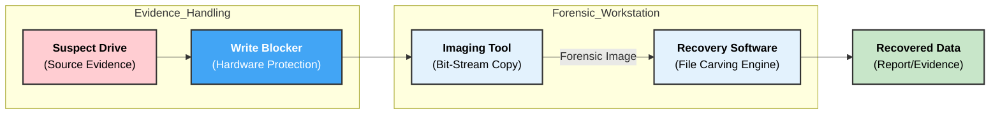
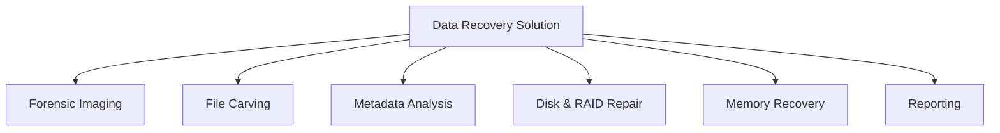

### **Q: What are the key components of a data recovery solution in computer forensics? Explain in detail.**

#### **1. Overview**

In computer forensics, **Data Recovery Solutions** refer to the integrated ecosystem of hardware and software used to retrieve accessible, deleted, corrupted, or hidden data from storage media. Unlike standard IT recovery, forensic recovery must ensure **Evidence Integrity** (no alteration of source data) and **Legal Admissibility**.

#### **2. Key Components of the Solution**

A complete forensic data recovery solution consists of three primary layers:

1.  **Hardware Layer (Protection & Repair):** Tools to physically access and protect the drive.
2.  **Acquisition Layer (Imaging):** Tools to create an exact clone of the data.
3.  **Logical Analysis Layer (Extraction):** Software engines to reconstruct files.

-----

#### **3. Detailed Explanation of Components**

**A. Hardware Write Blockers (The Protection Component)**

  * **Function:** This is the most critical component. It acts as a physical bridge between the suspect’s drive and the forensic workstation.
  * **Mechanism:** It intercepts all commands sent by the Operating System. It allows **Read** commands to pass through but blocks any **Write**, **Modify**, or **Format** commands.
  * **Technical Importance:** Without a write blocker, simply plugging a USB drive into Windows updates the "Last Access Date" in the registry or creates hidden system folders (e.g., `System Volume Information`), which alters the evidence and breaks the **Chain of Custody**.

**B. File Carving Engines (The Extraction Component)**

  * **Function:** Software used to recover files when the file system (NTFS, FAT32, exFAT) is corrupted or the file table (MFT) has been deleted.
  * **Mechanism:**
      * The engine ignores the file system structure and scans the **Raw Data** (Unallocated Space) sector by sector.
      * It looks for specific **File Signatures** (Headers and Footers). For example, it knows a JPEG image starts with `0xFFD8` and ends with `0xFFD9`.
      * When it finds a header, it extracts the data following it until it hits the footer or a file-size limit.
  * **Limitation:** Recovered files often lose their original filenames and directory structure (e.g., `File001.jpg` instead of `Vacation.jpg`).

**C. Forensic Duplicators (The Imaging Component)**

  * **Function:** Specialized hardware devices designed to clone hard drives rapidly without a computer.
  * **Mechanism:** They perform a **Bit-Stream Copy**, copying every bit (0s and 1s) from the source to the destination, including "Slack Space" (where deleted data hides).
  * **Technical Feature:** They automatically calculate the **Hash Value** (MD5/SHA-256) of the source and destination in real-time to verify that the copy is mathematically identical to the original.

-----

#### **4. Diagram: Forensic Recovery Architecture**

The following diagram illustrates how these components interact during an investigation.

-----

#### **5. Key Technical Keywords**

  * **Bit-Stream Image:** A sector-by-sector copy of the hard drive, capturing active data, deleted data, and swap files.
  * **File Signature (Magic Number):** A unique sequence of bytes at the beginning of a file that identifies its format (e.g., `PK` for Zip files).
  * **Bad Sector:** A permanently damaged area on a storage drive; forensic tools attempt to read these multiple times (retries) or mark them as unreadable in the log rather than crashing.
  * **Chain of Custody:** The chronological documentation of the seizure, custody, control, transfer, analysis, and disposition of evidence.
---
# **Key Components of a Data Recovery Solution in Computer Forensics**

---

# **1️⃣ Key Components of Data Recovery Solutions**

## **A. Forensic Imaging Tools**

* Create **bit-by-bit replicas** of storage media.
* Preserve original data using **write-blockers**.
* Generate **hash values (MD5/SHA-1/SHA-256)** to verify integrity.

## **B. File Carving & Data Extraction**

* Recovers **deleted, fragmented, or partially overwritten** files.
* Extracts data from **unallocated space, slack space, and raw sectors**.
* Uses signature-based extraction.

## **C. Metadata & File System Analysis**

* Examines **file metadata** (MAC times), directory structure, partition tables.
* Identifies file manipulation, access patterns, and hidden files.

## **D. Faulty/Corrupted Disk Handling**

* Performs recovery from damaged disks using **low-level sector scanning**.
* Uses tools for **bad sector remapping, RAID reconstruction**, and error correction.

## **E. Memory (RAM) Data Recovery**

* Extracts volatile data: **running processes, network sessions, encryption keys**.
* Essential for recovering evidence lost after power-off.

## **F. Specialized Recovery Software**

* Tools such as **Autopsy, EnCase, R-Studio, FTK, Recuva**.
* Supports multiple file systems (NTFS, FAT32, ext4, APFS).

## **G. Documentation & Reporting**

* Records recovery steps, tools used, hashes, timestamps.
* Ensures **chain of custody** for legal admissibility.

---

# **2️⃣ Small Diagram – Data Recovery Components**

---

# **3️⃣ Detailed Explanation of Key Components**

---

## **1. Forensic Imaging Tools (Detailed)**

### **Technical Function**

* Produce an **exact sector-level duplicate** of the original storage media.
* Use **write-blockers** to avoid accidental modification.
* Verify authenticity using **cryptographic hashes**.

### **Importance in Recovery**

* Allows investigators to analyze data **without touching the original** evidence.
* Enables safe recovery of deleted or hidden data.
* Ensures legally admissible, tamper-proof evidence.

---

## **2. File Carving & Data Extraction (Detailed)**

### **Technical Function**

* Recovers files based on **file signatures** even if the file system is damaged.
* Extracts data from:

  * **Unallocated space**
  * **Slack space**
  * **Raw disk sectors**
* Reconstructs fragmented files using pattern matching.

### **Importance in Recovery**

* Critical when criminals **delete or format drives** to destroy evidence.
* Helps reconstruct images, documents, videos, or logs required for investigation.
* Frequently used in cybercrime, fraud, and insider threat cases.

---

# **Summary**

A data recovery solution in computer forensics consists of **forensic imaging tools, file carving techniques, metadata analysis, corrupted disk handling, memory extraction, specialized software, and detailed reporting**.
Key components like **forensic imaging** and **file carving** ensure accurate, reliable, and legally admissible recovery of critical digital evidence.
