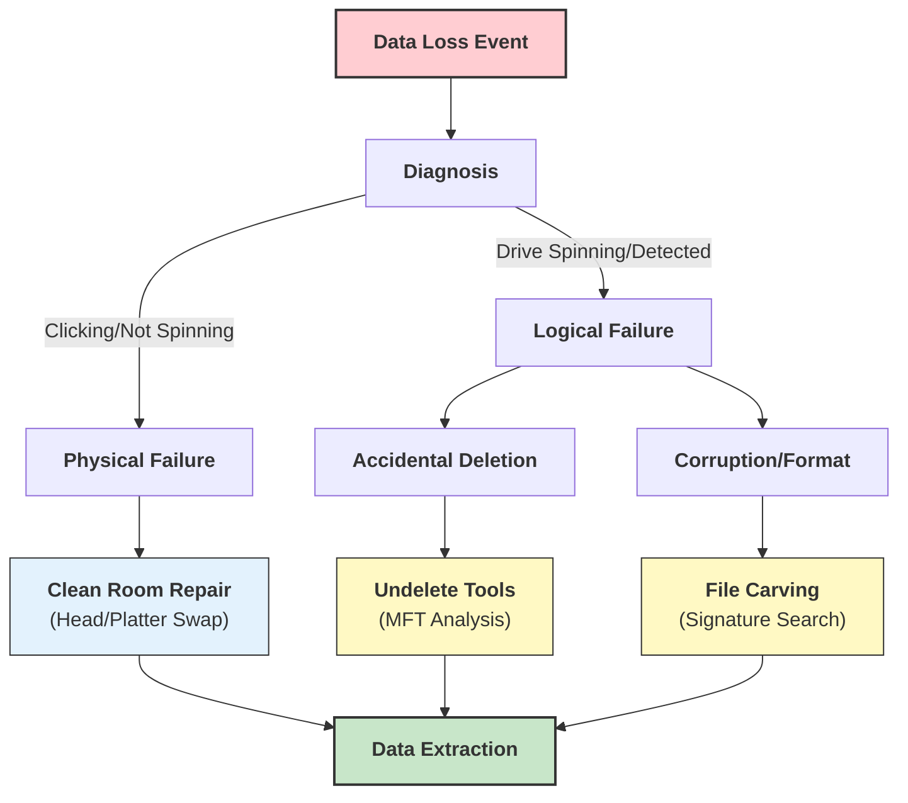
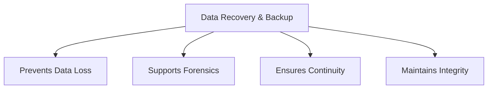

Here is the answer formatted according to university examination standards: clear, structured, and technical.

### **Q: What is the significance of data recovery and backup? Explain various data recovery solutions.**

#### **1. Significance of Data Recovery and Backup**

Data is often the most valuable asset of an organization. The combination of backup (proactive) and recovery (reactive) ensures **Business Continuity** and **Resilience**.

  * **Business Continuity (BC):** Minimizes "Downtime." Statistics show that 60% of small businesses that lose their data shut down within 6 months. Recovery ensures operations resume quickly after a failure.
  * **Protection Against Cyber Threats:** In the era of **Ransomware**, where data is encrypted by attackers, a reliable offline backup is often the *only* way to restore data without paying the ransom.
  * **Legal & Regulatory Compliance:** Laws like **GDPR**, **HIPAA**, and **SOX** mandate that organizations must protect user data and ensure its availability. Failure to recover lost data can lead to massive fines.
  * **Asset Protection:** Protects against "Single Points of Failure" such as hardware crashes, accidental deletion, or natural disasters (fire/flood).

-----

#### **2. Various Data Recovery Solutions**

Data recovery solutions are categorized based on the nature of the failure: **Logical** (Software) or **Physical** (Hardware).

**A. Logical Recovery Solutions (Software-Based)**
Used when the storage hardware is functioning, but the data is inaccessible due to corruption, deletion, or formatting.

  * **File Carving:**
      * **Technique:** When the file system (MFT/FAT) is destroyed, software scans the raw sectors of the drive looking for **File Signatures** (Headers and Footers).
      * **Tools:** PhotoRec, Scalpel.
  * **Partition Recovery:**
      * **Technique:** Software scans the disk to locate lost partition boundaries and rebuilds the partition table.
      * **Tools:** TestDisk.
  * **Snapshot/Shadow Copy Recovery:**
      * **Technique:** Utilizing OS features (like Windows Volume Shadow Copy or Linux LVM snapshots) to roll back files to a previous state without a full restore.

**B. Physical Recovery Solutions (Hardware-Based)**
Used when the storage media has suffered physical damage (clicking sounds, not spinning, burnt PCB).

  * **Clean Room Recovery:**
      * **Technique:** Opening the hard drive in a **Class 100 Clean Room** (dust-free environment) to replace damaged read/write heads or transplant magnetic platters to a donor drive.
  * **PCB Replacement (Hot Swapping):**
      * **Technique:** Replacing a burnt Printed Circuit Board (PCB) with an identical match. This often requires transplanting the ROM chip which contains unique drive calibration data.

**C. Forensic Data Recovery (Legal Context)**
Used when data must be recovered for legal evidence.

  * **Technique:** strictly uses **Write Blockers** and **Bit-Stream Imaging** to recover data without altering metadata (Last Access Time), ensuring **Admissibility** in court.

-----

#### **3. Diagram: The Recovery Decision Flow**

The following diagram illustrates the process of selecting the correct recovery solution.

-----

#### **4. Key Technical Keywords**

  * **Ransomware:** Malware that encrypts data and demands payment for the decryption key.
  * **Head Crash:** A physical failure where the read/write head of a hard drive touches the rotating platter, destroying data.
  * **MFT (Master File Table):** A database in NTFS file systems that stores information about every file (size, time, permissions).
  * **Clean Room:** An environment with a low level of environmental pollutants such as dust, airborne microbes, and aerosol particles, essential for opening hard drives.
---
# **Significance of Data Recovery & Backup + Various Data Recovery Solutions**

---

# **1️⃣ Significance of Data Recovery**

## **A. Protection Against Data Loss**

* Recovers data lost due to **accidental deletion, hardware failure, corruption, malware, or formatting**.
* Ensures business continuity.

## **B. Support in Legal & Forensic Investigations**

* Recovers **deleted, hidden, or tampered** data for use as **digital evidence**.
* Helps reconstruct events and user activities.

## **C. Maintains Operational Continuity**

* Minimizes downtime after system crashes or cyber-attacks.
* Ensures critical systems remain functional.

## **D. Preservation of Critical Information**

* Protects **intellectual property, financial records, customer data**, etc.
* Vital for compliance (GDPR, SOX, HIPAA).

## **E. Ensures Data Integrity**

* Uses checksums/hashes to maintain authenticity of recovered data.

---

# **2️⃣ Significance of Data Backup**

## **A. Prevents Permanent Data Loss**

* Regular backups ensure data can be restored even if original systems fail.

## **B. Critical for Disaster Recovery**

* Supports recovery after **natural disasters, ransomware, theft**, or hardware damage.

## **C. Enables Quick Restoration**

* Reduces recovery time (**RTO**) and data loss window (**RPO**).

## **D. Supports Legal & Regulatory Requirements**

* Backups are necessary for **audit trails**, compliance, and retention policies.

---

# **3️⃣ Small Diagram – Significance of Recovery & Backup**

---

# **4️⃣ Various Data Recovery Solutions**

---

## **1. Software-Based Data Recovery**

### **Details**

* Uses specialized recovery tools: **R-Studio, Recuva, Autopsy, TestDisk**.
* Recovers **deleted, formatted, corrupted, or partially overwritten** files.
* Works on multiple file systems (NTFS, FAT32, ext4, APFS).

### **Use Case**

* Ideal for accidental deletion, file system errors, or minor corruption.

---

## **2. Forensic Data Recovery**

### **Details**

* Uses **forensic imaging**, **file carving**, and **hash-based verification**.
* Extracts data from **unallocated space, slack space, damaged partitions, encrypted storage**.
* Tools: **EnCase, FTK, Sleuth Kit**.

### **Use Case**

* Needed for **legal investigations, cybercrime analysis**, and evidence preservation.

---

## **3. Hardware-Based Recovery**

### **Details**

* Involves physical repair of damaged drives:

  * **Bad sector repair**
  * **Head replacement**
  * **PCB swap**
* Clean room environments used to prevent contamination.

### **Use Case**

* For **mechanically failed hard drives**, burnt circuits, or physically damaged storage devices.

---

## **4. Cloud-Based Recovery**

### **Details**

* Uses **cloud backups and snapshots** for restoring data.
* Cloud systems offer **redundancy, replication, version control**, and strong security.

### **Use Case**

* Remote recovery after ransomware, theft, or major system failures.

---

## **5. RAID & Server Data Recovery**

### **Details**

* Reconstructs data from **RAID arrays** (RAID 0/1/5/10).
* Recovers data after **controller failure, disk mismatch**, or parity corruption.

### **Use Case**

* Essential for enterprises using multi-disk storage systems.

---

## **6. Mobile Device Data Recovery**

### **Details**

* Recovers **SMS, call logs, app data, contacts, and deleted media**.
* Tools: **Cellebrite, Oxygen Forensics**.

### **Use Case**

* Necessary for smartphones damaged, formatted, or involved in investigations.

---

# **5️⃣ Summary**

Data recovery and backup are significant for **preventing permanent data loss**, ensuring **operational continuity**, supporting **legal investigations**, and protecting **critical information**.
Data recovery solutions include **software recovery, forensic recovery, hardware repair, cloud-based recovery, RAID recovery, and mobile device recovery**, each suited to different data-loss situations.
