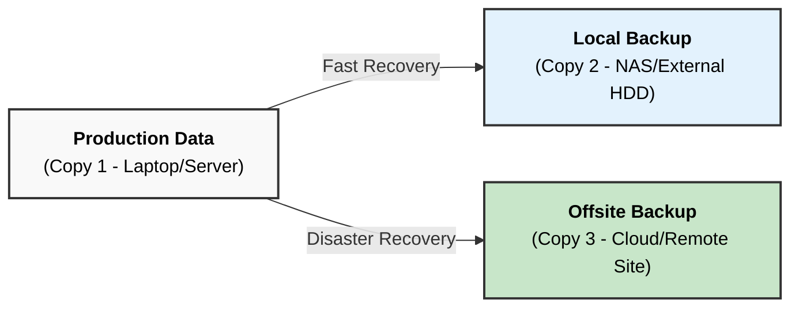
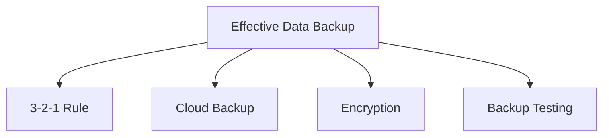

Here is the answer formatted according to university examination standards: clear, structured, and technical.

### **Q: What strategies can individuals & organizations use to ensure effective data backup for recovery purposes? Describe any two in detail.**

#### **1. Overview of Backup Strategies**

Effective data backup ensures **Business Continuity** and **Disaster Recovery (DR)**. The goal is to minimize **RPO (Recovery Point Objective)** and **RTO (Recovery Time Objective)**.

**Common Strategies Include:**

  * **The 3-2-1 Rule:** The industry gold standard for redundancy.
  * **RAID (Redundant Array of Independent Disks):** For real-time hardware failure protection.
  * **Hybrid Cloud Backup:** Combining local speed with cloud security.
  * **Immutable Backups:** Write-once-read-many (WORM) storage to prevent ransomware encryption.
  * **Backup Rotations:** Grandfather-Father-Son (GFS) schemes for version history.

-----

#### **2. Detailed Explanation of Two Strategies**

**Strategy A: The 3-2-1 Backup Rule**
This is the most universally recommended strategy for both individuals and enterprises to eliminate "Single Points of Failure."

  * **Concept:**
      * **3 Copies of Data:** You must have at least three copies of your data (1 Primary Production Data + 2 Backups).
      * **2 Different Media Types:** Store the copies on two different types of storage media (e.g., Internal Hard Drive and External NAS, or Tape). This protects against media-specific failures (like a batch of bad hard drives).
      * **1 Offsite Copy:** Keep one copy in a physically different location (e.g., Cloud Storage or a remote branch office). This protects against site-level disasters like fire, flood, or theft.
  * **Technical Benefit:** It creates **Air-Gapped** protection. If the local network is infected with Ransomware, the offsite cloud copy remains isolated and safe.

**Strategy B: Incremental vs. Differential Backup Implementation**
Organizations must balance storage costs with restoration speed. Choosing the right backup method is crucial.

  * **Full Backup:** A complete copy of all data. (High Storage, Slow Backup, Fast Restore).
  * **Incremental Backup:**
      * **Mechanism:** Backs up *only* the data that has changed since the **last backup** (whether it was full or incremental).
      * **Benefit:** Lowest storage consumption and fastest backup window.
      * **Drawback:** Slower recovery, as the system must restore the last Full Backup + *every* subsequent incremental file in order.
  * **Differential Backup:**
      * **Mechanism:** Backs up data changed since the **last Full Backup**.
      * **Benefit:** Faster recovery than incremental (requires only Full + latest Differential).
      * **Drawback:** Consumes more storage than incremental as time passes.

-----

#### **3. Diagram: The 3-2-1 Backup Architecture**

-----

#### **4. Key Technical Keywords**

  * **RPO (Recovery Point Objective):** The maximum acceptable amount of data loss measured in time (e.g., "We can lose 1 hour of data").
  * **RTO (Recovery Time Objective):** The targeted duration of time within which a business process must be restored after a disaster.
  * **Air-Gapped:** A security measure where a computer or network is physically isolated from unsecured networks (like the internet).
  * **Deduplication:** A technique to eliminate duplicate copies of repeating data to save storage space.

---
# **Strategies for Effective Data Backup for Recovery Purposes**

---

# **1️⃣ Strategies to Ensure Effective Data Backup**

## **A. Regular Backup Scheduling**

* Perform **daily, weekly, and monthly** backups.
* Automate backups to reduce human error.
* Maintain **backup logs** for monitoring.

## **B. Use of the 3-2-1 Backup Rule**

* Keep **3 copies** of data:

  * 1 primary + 2 backups
* Store on **2 different storage media** (HDD + cloud).
* Keep **1 copy offsite** to protect against disasters.

## **C. Cloud-Based Backup Solutions**

* Use cloud services offering **redundancy, scalability, encryption, and versioning**.
* Protects against physical damage and device loss.

## **D. Encryption & Access Control**

* Encrypt backups using **AES-256** or similar algorithms.
* Restrict access via **authentication, authorization, and audit logs**.

## **E. Disaster Recovery Planning**

* Maintain **DR sites**, warm/cold backups.
* Test recovery procedures regularly.

## **F. Versioning and Incremental Backups**

* Use **incremental, differential, and version-based** backups.
* Saves space and preserves multiple versions of files.

## **G. Testing Backups Regularly**

* Verify backup integrity using **checksum or hash validation**.
* Ensure data can be restored without corruption.

---

# **2️⃣ Small Diagram – Data Backup Strategy**

---

# **3️⃣ Detailed Explanation of Any Two Strategies**

---

## **1. 3-2-1 Backup Rule (Detailed)**

### **Key Technical Points**

* Maintain **3 copies** of data: primary + two backup copies.
* Store on **2 different storage types**:

  * Example: Local HDD + Network Attached Storage (NAS).
* Keep **1 backup offsite**, such as cloud storage or remote data center.
* Reduces risks from **hardware failure, ransomware, fire, theft**, or natural disasters.

### **Importance**

* Ensures high **data availability**, even when one or two storage mediums fail.
* Considered an **industry-standard** backup approach for disaster recovery.

---

## **2. Cloud-Based Backup (Detailed)**

### **Key Technical Points**

* Uses cloud providers offering **redundant storage**, multi-region replication, and encrypted data transfers.
* Supports **automated backups**, versioning, and real-time synchronization.
* Accessible from anywhere with proper authentication.
* Ensures long-term retention with minimal manual maintenance.

### **Importance**

* Protects data from local hardware failures or site-level disasters.
* Offers **scalability**, cost efficiency, and strong **security controls** like MFA and encryption.
* Ideal for organizations handling large volumes of critical data.

---

# **Summary**

Effective data backup strategies include **regular scheduling, 3-2-1 rule, cloud backups, encryption, versioning, disaster recovery planning, and backup testing**.
Detailed approaches like the **3-2-1 rule** and **cloud-based backups** ensure reliable, secure, and high-availability data recovery for both individuals and organizations.
