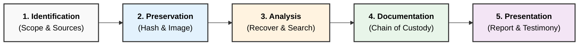

### **Q: What are the benefits of professional forensics methodology? What are steps taken by computer forensics specialist?**

#### **1. Benefits of Professional Forensics Methodology**

Adhering to a standardized, professional methodology ensures that the investigation is scientific, ethical, and legally sound.

  * **Judicial Admissibility:** The primary benefit is ensuring that evidence is accepted in court. Methodology guarantees that the evidence was not tampered with during collection.
  * **Data Integrity:** Professional methods (like write-blocking and hashing) ensure the original evidence remains unaltered, preserving its "probative value."
  * **Repeatability & Reproducibility:** A structured approach ensures that if another expert follows the same steps, they will achieve the exact same results, validating the findings.
  * **Minimization of Error:** Standard Operating Procedures (SOPs) reduce human error and accidental spoliation of evidence.
  * **Credibility:** A methodological approach enhances the credibility of the expert witness during cross-examination.

-----

#### **2. Steps Taken by Computer Forensics Specialist**

A forensic specialist follows a rigid lifecycle, often referred to as the **IPADP Model** (Identification, Preservation, Analysis, Documentation, Presentation).

**Step 1: Identification**

  * **Action:** Identifying the scope of the crime and the potential sources of digital evidence.
  * **Detail:** Determining what hardware (Laptops, Mobiles, Servers) or software (Cloud logs, Databases) contains relevant data.

**Step 2: Preservation (Acquisition)**

  * **Action:** Securing the data to prevent modification.
  * **Detail:**
      * **Isolate:** Disconnect the device from networks to prevent remote wiping.
      * **Write-Block:** Use a hardware **Write Blocker** to ensure read-only access.
      * **Imaging:** Create a **Bit-Stream Image** (forensic clone) of the drive.
      * **Hashing:** Calculate MD5/SHA-256 hash values of the original and the copy to verify they match perfectly.

**Step 3: Analysis**

  * **Action:** Extracting and interpreting data from the forensic image.
  * **Detail:**
      * **Recovery:** Using tools (EnCase/FTK) to recover **deleted files** and **partitions**.
      * **Search:** Keyword searching and filtering for relevant artifacts (emails, chat logs, browser history).
      * **Timeline:** Reconstructing the chronological sequence of user activities.

**Step 4: Documentation**

  * **Action:** Keeping a detailed log of every action taken.
  * **Detail:** Maintaining the **Chain of Custody** form, which tracks who handled the evidence, when, and why.

**Step 5: Presentation**

  * **Action:** Reporting the findings.
  * **Detail:** creating a technical report and a non-technical summary for legal counsel. The specialist may testify as an **Expert Witness** to explain the findings in court.

-----

#### **3. Diagram: The Forensic Lifecycle**

-----

#### **4. Key Technical Keywords**

  * **Chain of Custody:** The documentation trail that accounts for the sequence of custody, control, transfer, analysis, and disposition of evidence.
  * **Probative Value:** The ability of evidence to prove something that is relevant to the crime.
  * **Repeatability:** The ability to get the same results using the same method and tools.
  * **Write Blocker:** A tool that allows access to a drive without allowing any data to be written or changed.

---
# **Benefits of Professional Forensics Methodology & Steps Taken by Computer Forensics Specialists**

---

# **1️⃣ Benefits of Professional Forensics Methodology**

## **A. Ensures Evidence Integrity**

* Uses **write-blockers**, **bit-stream imaging**, and **hash algorithms (MD5/SHA-1/SHA-256)**.
* Prevents alteration of original data and maintains authenticity.

## **B. Legally Admissible Evidence**

* Follows proper **chain of custody**, standardized documentation, and forensic procedures.
* Ensures evidence is **accepted in court** without objections.

## **C. Accurate and Repeatable Results**

* Uses **scientific, standardized, and reproducible techniques**.
* Enables independent verification of findings.

## **D. Efficient Investigation Process**

* Provides a structured approach: **identify → preserve → analyze → report**.
* Reduces time taken to isolate and interpret critical evidence.

## **E. Protection Against Data Loss**

* Recovers deleted, encrypted, or hidden data using **forensic imaging and recovery tools**.
* Saves critical business or legal information.

## **F. Improved Incident Response**

* Quickly identifies security breaches, malware, and insider threats.
* Supports rapid containment and mitigation.

## **G. Transparent & Professional Reporting**

* Produces detailed **forensic reports** with logs, screenshots, and timelines.
* Helps legal teams and management make informed decisions.

---

# **2️⃣ Steps Taken by Computer Forensics Specialists**

---

## **1. Identification of Evidence Sources**

* Determine where potential evidence exists: **hard drives, SSDs, RAM, logs, mobiles, network traces**.

## **2. Preservation of Evidence**

* Secure devices physically and digitally.
* Use **write-blockers**, secure storage, and hashing to prevent modification.

## **3. Forensic Acquisition (Imaging)**

* Create **bit-stream copies** of storage media.
* Generate **pre- and post-imaging hash values** for authenticity.

## **4. Examination and Analysis**

* Analyze **file systems, network packets, logs, registry data, memory dumps, malware**.
* Recover deleted files and detect anomalies.

## **5. Timeline Reconstruction**

* Correlate **MAC times, log events, network timestamps** to form a sequence of actions.

## **6. Documentation & Chain of Custody**

* Maintain records of **handlers, timestamps, tools used, evidence state**.
* Ensures legal compliance.

## **7. Report Generation & Presentation**

* Prepare a **court-admissible report** containing findings, techniques, screenshots, and conclusions.
* Provide **expert testimony** if required.

---

# **Small Diagram – Forensic Process**

---

# **Summary**

Professional forensic methodology ensures **integrity, accuracy, legal admissibility, and efficiency** in investigations.
Computer forensics specialists follow a structured process: **identification, preservation, acquisition, analysis, timeline reconstruction, documentation, and reporting**, ensuring reliable and defensible forensic outcomes.
