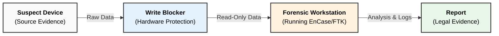
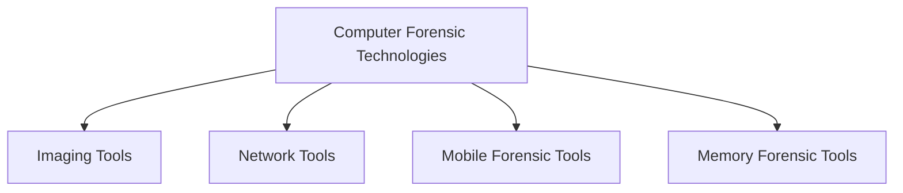

### **Q: What are some examples of technologies used in computer forensic investigation? Explain any two.**

#### **1. Examples of Forensic Technologies**

Computer forensic investigations rely on a combination of specialized hardware and software to ensure data integrity and effective analysis.

**A. Hardware Technologies:**

  * **Write Blockers:** Devices that prevent accidental modification of data on a suspect drive.
  * **Disk Duplicators:** Hardware used to create exact bit-by-bit copies (images) of hard drives.
  * **Faraday Bags:** Shielding bags used to block network signals (4G/Wi-Fi) from mobile devices to prevent remote wiping.

**B. Software Technologies:**

  * **EnCase / FTK (Forensic Toolkit):** Comprehensive suites for data acquisition and analysis.
  * **Autopsy:** An open-source digital forensics platform (GUI for The Sleuth Kit).
  * **Wireshark:** Used for network packet capturing and traffic analysis.
  * **Volatility:** A framework for memory (RAM) forensics to analyze volatile data.

-----

#### **2. Detailed Explanation of Two Technologies**

Here are explanations for one critical hardware tool and one critical software tool.

**1. Write Blockers (Hardware Technology)**

  * **Purpose:** The primary purpose of a write blocker is **Evidence Preservation**. It ensures that the "Chain of Custody" remains intact by preventing any alteration to the original evidence.
  * **Mechanism:** It acts as a bridge between the suspect's drive and the investigator's workstation. It allows **Read** commands to pass through but blocks all **Write** or **Modify** commands sent by the operating system.
  * **Key Technical Features:**
      * **Read-Only Access:** Guarantees that the hash value (MD5/SHA) of the source drive remains unchanged before and after acquisition.
      * **Interface Compatibility:** Supports various connections like SATA, IDE, USB, and NVMe.

**2. EnCase / FTK (Software Technology)**

  * **Purpose:** These are the industry-standard software suites used for **Acquisition, Analysis, and Reporting**.
  * **Mechanism:** They ingest forensic images (E01, dd files) and index the data to make it searchable. They reconstruct the file system to display active, deleted, and hidden files.
  * **Key Technical Features:**
      * **Deleted File Recovery:** Can recover files that have been deleted but not overwritten by analyzing the Master File Table (MFT) or using file carving.
      * **Keyword Searching:** Allows investigators to search for specific terms (e.g., "drug," "invoice") across the entire drive in hex or text format.
      * **Registry Analysis:** Extracts user artifacts like recent documents, USB connection history, and browser history.

-----

#### **3. Workflow Diagram: Technology Integration**

The following diagram illustrates where these technologies fit into the investigation workflow.

-----

---

# **Technologies Used in Computer Forensic Investigation**

## **1️⃣ Examples of Technologies**

Common technologies/tools used in digital forensic investigations include:

1. **Forensic Imaging Tools**
   (e.g., EnCase Imager, FTK Imager, dd)

2. **File Recovery & Analysis Tools**
   (e.g., Autopsy/Sleuth Kit, Recuva)

3. **Network Forensic Tools**
   (e.g., Wireshark, tcpdump)

4. **Mobile Device Forensic Tools**
   (e.g., Cellebrite UFED, Oxygen Forensics)

5. **Memory Forensic Tools**
   (e.g., Volatility, Rekall)

6. **Password Cracking Tools**
   (e.g., John the Ripper, Hashcat)

7. **Log & Event Analysis Tools**
   (e.g., Splunk, ELK Stack)

8. **Write Blockers**
   (Hardware or software to prevent evidence alteration)

---

# **📌 Small Diagram – Categories of Forensic Technologies**

---

# **2️⃣ Explanation of Any Two Technologies**

---

## **A. Forensic Imaging Tools (e.g., FTK Imager, EnCase Imager)**

### **Purpose**

Used to create an exact **bit-by-bit copy** (forensic image) of storage media.

### **Key Features**

* Generates **hash values (MD5/SHA-1)** to ensure integrity
* Creates **E01**, **DD**, or **RAW** image formats
* Supports **write-blocking** to avoid modification of original evidence

### **Why Important?**

* Ensures the **original data remains untouched**
* Enables safe, repeatable analysis of a **verified copy**
* Legally acceptable in court due to **evidence integrity**

---

## **B. Network Forensic Tools (e.g., Wireshark, tcpdump)**

### **Purpose**

Used to capture, inspect, and analyze **network packets** for detecting attacks or intrusions.

### **Key Features**

* Real-time **packet capture**
* Deep inspection of **protocols** (TCP, UDP, HTTP, DNS, SSL)
* Detection of **malicious traffic**, port scanning, data exfiltration
* Generates logs for **timeline reconstruction**

### **Why Important?**

* Helps trace **network-based cybercrimes**
* Identifies **source and destination** of malicious packets
* Supports **intrusion detection** and **incident response**

---

# **3️⃣ Short Summary (for 2–4 marks)**

Computer forensic investigations use technologies like **forensic imaging tools**, **network analyzers**, **mobile forensic kits**, **memory analysis frameworks**, **password crackers**, and **log analyzers**.
Among them, **forensic imaging tools** create verified duplicates of digital evidence, while **network forensic tools** capture and analyze network traffic for identifying intrusion activities.

---

