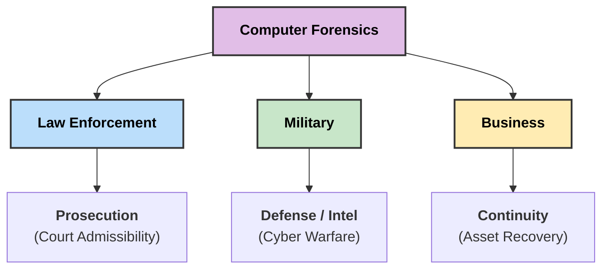
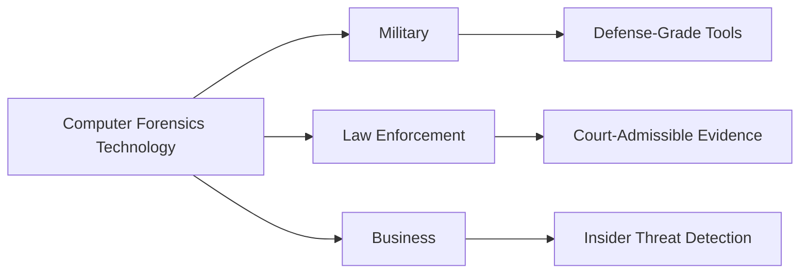

### **Q: How does computer forensics technology vary across different sectors like military, law enforcement & business?**

#### **1. Overview of Sector Variations**

While the core tools (like EnCase, FTK) remain similar across sectors, the **objectives**, **legal constraints**, and **outcome expectations** differ significantly.

#### **2. Sector-Wise Breakdown**

**A. Law Enforcement Forensics (Criminal Prosecution)**

  * **Primary Objective:** To gather evidence for criminal prosecution in a court of law.
  * **Focus:** Post-incident investigation of crimes like murder, fraud, child exploitation, or cyberstalking.
  * **Key Constraint:** Must strictly adhere to **Search & Seizure laws** and maintain a perfect **Chain of Custody**. Any procedural error can render evidence inadmissible.
  * **Technology Use:** Focuses on deep-dive analysis of seized physical devices (dead acquisition) to recover deleted artifacts.

**B. Military Forensics (Information Warfare)**

  * **Primary Objective:** **National Security** and actionable intelligence.
  * **Focus:** Counter-terrorism, cyber warfare, and intelligence gathering regarding enemy capabilities.
  * **Key Constraint:** Speed is critical. The goal is often **Real-Time Analysis** to thwart an immediate threat rather than preparing a court case.
  * **Technology Use:** Includes offensive capabilities (counter-measures), network traffic analysis, and analyzing encrypted communication channels of state actors.

**C. Business / Corporate Forensics (Internal & Civil)**

  * **Primary Objective:** **Business Continuity**, asset protection, and policy enforcement.
  * **Focus:** Intellectual Property (IP) theft, employee misconduct (harassment/fraud), and data breaches.
  * **Key Constraint:** Minimizing downtime. Investigations are often conducted **remotely** over the network to avoid disrupting business operations.
  * **Technology Use:** E-Discovery tools for litigation support and Incident Response (IR) tools to patch vulnerabilities and restore systems.

-----

#### **3. Comparison Table**

| Feature | **Law Enforcement** | **Military** | **Business (Corporate)** |
| :--- | :--- | :--- | :--- |
| **Goal** | Prosecution & Punishment | National Defense & Intel | Recovery & Policy Enforcement |
| **Evidence Standard** | Beyond Reasonable Doubt | Actionable Intelligence | Preponderance of Evidence |
| **Response Time** | Post-Mortem (After crime) | Real-Time / Proactive | Near Real-Time (Incident Response) |
| **Legal Basis** | Criminal Law | Rules of Engagement / Geneva Convention | Civil Law / Contract Law |
| **Outcome** | Jail / Fines | Strategic Advantage | Termination / Civil Lawsuit |

-----

#### **4. Concept Diagram**

The following diagram visualizes the primary "End-Goal" for each sector.

-----

#### **5. Key Technical Keywords**

  * **Chain of Custody:** The documentation trail that accounts for the sequence of custody, control, transfer, analysis, and disposition of physical or electronic evidence.
  * **E-Discovery:** The process of identifying and delivering electronic information that can be used as evidence in legal cases (common in Business).
  * **Information Warfare (IW):** The use of information technology to gain a tactical advantage over an opponent (Military).
  * **Dead vs. Live Acquisition:** Law enforcement often prefers "dead" (powered off) acquisition to prevent data change, while business/military often require "live" analysis to catch active threats.
  * ---
  * # **How Computer Forensics Technology Varies Across Military, Law Enforcement & Business**

## **1️⃣ Overview**

Computer forensics technologies differ across sectors due to **threat level, data sensitivity, legal requirements, and operational objectives**.

---

# **Sector-Wise Differences**

## **A. Military Sector**

1. **High-Security Forensic Tools**

   * Use **classified, defense-grade tools** (e.g., DC3 Tools).
2. **Focus on Cyber Warfare & Espionage**

   * Detection of **nation-state attacks, APTs, cyber-espionage**.
3. **Real-Time Incident Response**

   * Continuous monitoring of **mission-critical networks**.
4. **Offline & Air-Gapped Forensics**

   * Analysis on **isolated systems** to prevent data leakage.
5. **Advanced Malware & Memory Forensics**

   * Reverse engineering, kernel-level analysis.

---

## **B. Law Enforcement Sector**

1. **Court-Admissible Evidence Tools**

   * Uses tools like **EnCase, FTK, Cellebrite** ensuring **chain of custody**.
2. **Focus on Cybercrime Investigation**

   * Fraud, hacking, identity theft, digital harassment.
3. **Standardized Procedures**

   * Maintains **forensic imaging, hashing, documentation**.
4. **Mobile & Network Forensics**

   * Extraction of data from phones, computers, servers.
5. **Timeline Reconstruction**

   * Logs, metadata, user activity tracking.

---

## **C. Business/Corporate Sector**

1. **Insider Threat Detection Tools**

   * DLP systems, SIEM tools (e.g., **Splunk, QRadar**).
2. **Email & Database Forensics**

   * Investigation of **fraud, policy violations, IP theft**.
3. **Endpoint Monitoring Solutions**

   * Detecting unauthorized data access or data exfiltration.
4. **Cloud Forensics**

   * SaaS, IaaS log analysis, cloud data extraction.
5. **Regulatory Compliance**

   * Evidence collection aligned with **GDPR, SOX, HIPAA**.

---

# **2️⃣ Small Diagram – Sector-Wise Variation**

---

# **3️⃣ Summary**

* **Military forensics** uses **high-security, classified, and real-time cyber defense tools**.
* **Law enforcement forensics** focuses on **legally admissible digital evidence** and **criminal investigation**.
* **Business forensics** relies on **SIEM, DLP, email/database forensics** to handle **insider threats, fraud, and compliance**.
