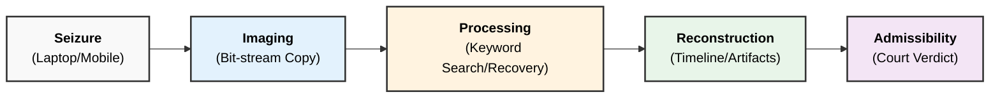

### **Q: How do law enforcement computer forensic technologies aid in criminal investigation?**

#### **1. Core Function**

Law enforcement agencies utilize computer forensic technologies to bridge the gap between **digital artifacts** and **physical reality**. These technologies transform raw binary data into **actionable intelligence** and **admissible evidence** that can prove guilt or innocence in a court of law.

#### **2. Key Ways Technologies Aid Investigations**

  * **Data Recovery & Reconstruction:**
      * Forensic tools (e.g., **Autopsy**, **Recuva**) can recover **deleted**, **formatted**, or **corrupted** files. Criminals often attempt to destroy evidence, but forensic technologies can retrieve data from unallocated clusters on a drive.
  * **Attribution (Linking Suspect to Crime):**
      * Technologies analyze **IP addresses**, **MAC addresses**, and **User Logs** to prove that a specific device was used by a specific individual at the time of the crime.
  * **Timeline Analysis:**
      * Forensic software builds a chronological timeline of events by analyzing **metadata** (Created, Modified, Accessed timestamps). This establishes the **mens rea** (intent) and sequence of actions (e.g., Googling "how to make a bomb" followed by purchasing chemicals).
  * **Decryption & Password Cracking:**
      * Advanced tools (e.g., **Passware**, **Hashcat**) use dictionary attacks or brute-force methods to bypass encryption on seized devices, revealing hidden communications or financial ledgers.
  * **Corroboration of Physical Evidence:**
      * Digital evidence often supports physical findings. For example, GPS data extracted from a mobile phone can place a suspect at the physical scene of a murder.
  * **Network Forensics:**
      * Tools like **Wireshark** capture packet data to trace the source of cyberattacks (like DDoS or Ransomware) and identify the path of data exfiltration.

-----

#### **3. Investigation Workflow Diagram**

The following diagram illustrates how technology converts a seized device into a legal verdict.

-----

#### **4. Application in Crime Types**

Forensic technologies are not limited to cybercrime; they aid in:

1.  **Cyber Crimes:** Hacking, Phishing, Identity Theft, Ransomware.
2.  **Traditional Crimes:**
      * **Fraud:** Tracing money trails via spreadsheets or crypto wallets.
      * **Homicide/Kidnapping:** Using **Cell Tower Triangulation** and chat logs to find victims or suspects.
      * **Intellectual Property Theft:** Detecting unauthorized file transfers to USB drives or cloud storage.

#### **5. Technical Keywords**

  * **Admissibility:** The quality of evidence being acceptable in court.
  * **Bit-stream Image:** A clone of the drive including hidden/deleted sectors.
  * **Metadata:** Data about data (e.g., file creation time).
  * **Steganography:** The practice of hiding data within other files (e.g., an image).
  ---
  # **How Law Enforcement Computer Forensic Technologies Aid in Criminal Investigation**

## **1️⃣ Role of Computer Forensic Technologies in Criminal Investigation**

1. **Identification of Digital Evidence**

   * Detects **files, logs, emails, browsing history, metadata**.
   * Locates **hidden, deleted, or encrypted** information.

2. **Preservation of Evidence Integrity**

   * Uses **write blockers**, **forensic imaging**, and **hash values (MD5/SHA-1)**.
   * Ensures evidence remains **untampered and legally admissible**.

3. **Efficient Evidence Acquisition**

   * Tools like **FTK Imager, EnCase, Cellebrite** acquire data from computers, mobiles, IoT devices.
   * Supports **bit-stream imaging** for exact copies.

4. **In-Depth Data Analysis**

   * Analyzes **file systems, registry entries, network packets, memory dumps**.
   * Detects patterns of **cybercrimes, fraud, malware activity, unauthorized access**.

5. **Timeline Reconstruction**

   * Uses log and metadata analysis to reconstruct the **sequence of events**, user actions, and intrusion attempts.

6. **Tracking Suspects Through Network Forensics**

   * Tools like **Wireshark, tcpdump** trace **IP addresses, communication channels, data transfers**.
   * Identifies attacker’s **origin, methods, and intrusion path**.

7. **Mobile & Cloud Forensics**

   * Recovers **SMS, call logs, GPS data, social media artifacts, cloud backups**.
   * Useful in cases like kidnapping, fraud, cyberstalking.

8. **Malware & Memory Analysis**

   * Tools like **Volatility, Rekall** detect malware behavior and extract artifacts from RAM.
   * Helps determine **injection methods, payloads, keylogging activities**.

9. **Legal Documentation & Reporting**

   * Generates **forensic reports** that are clear, structured, and legally acceptable.
   * Supports **expert testimony** in court.

---

## **2️⃣ Small Diagram – How Forensic Technologies Support Investigation**

---

## **3️⃣ Summary**

Law enforcement agencies use computer forensic technologies to **identify, preserve, analyze, reconstruct, and present** digital evidence. These tools make investigations **faster, accurate, legally valid**, and essential for solving modern cyber-enabled crimes.
