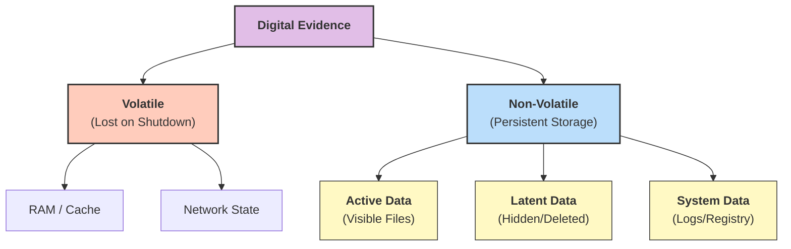
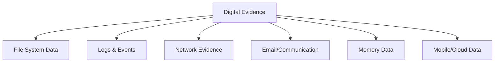

Here is the answer formatted according to university examination standards: clear, structured, and technical.

### **Q: What kind of digital evidences can be collected in computer forensics? Explain in detail.**

#### **1. Definition of Digital Evidence**

Digital evidence is defined as any information of probative value that is stored or transmitted in binary form. It is often referred to as "latent" evidence because it requires software tools to be visible and understood.

#### **2. Classification of Digital Evidence**

Digital evidence is broadly categorized based on its **state** and **source**.

**A. Based on Volatility (State of Data)**

1.  **Volatile Evidence:**

      * **Description:** Data that is transient and will be lost if the device loses power. It must be collected first during a "Live Acquisition."
      * **Examples:**
          * **System RAM:** Contains running processes, open network connections, and sometimes encryption keys or passwords in plain text.
          * **Network State:** Active TCP/UDP connections and ARP tables.
          * **Clipboard Contents:** Text or images currently copied by the user.

2.  **Non-Volatile (Persistent) Evidence:**

      * **Description:** Data stored permanently on physical media that remains intact after a reboot or power-down.
      * **Examples:** Hard Disk Drives (HDD), Solid State Drives (SSD), USB Thumb Drives, and Optical Discs.

**B. Based on Data Type (Source)**

1.  **Active Data (User-Created):**

      * **Description:** Files that are visible to the Operating System (OS) and accessible to the user without special tools.
      * **Examples:** Documents (`.docx`, `.pdf`), Spreadsheets, Images (`.jpg`), Emails, and Database files. These reveal the **intent** and **actions** of the suspect.

2.  **Archival Data:**

      * **Description:** Data that has been backed up to external media.
      * **Examples:** Tape backups, Cloud storage snapshots, and external hard drive backups.

3.  **Latent Data (Hidden/Deleted):**

      * **Description:** Data that the OS has marked as deleted or is hidden in areas not meant for user storage. This is often the "smoking gun" in investigations.
      * **Examples:**
          * **Slack Space:** The unused space at the end of a file cluster.
          * **Unallocated Space:** Disk space where files have been deleted but the actual bits have not yet been overwritten.
          * **Swap/Page Files:** Virtual memory files on the hard disk that may contain fragments of RAM data.

4.  **System-Generated Data (Metadata & Logs):**

      * **Description:** Records created automatically by the OS or applications, often without the user's knowledge.
      * **Examples:**
          * **Windows Registry:** Stores hardware attachments (USB history), software installations, and user preferences.
          * **Event Logs:** Records of login attempts (successful/failed), security warnings, and system errors.
          * **Browser Artifacts:** History, cookies, and cache which prove internet activity.
          * **Metadata:** "Data about data" such as Creation Date, Modification Date, and Author Name.

-----

#### **3. Classification Diagram**

The following diagram illustrates the hierarchy of digital evidence types.

-----

#### **4. Key Technical Keywords**

  * **Latent Evidence:** Evidence that is not visible to the naked eye and requires forensic processing.
  * **Slack Space:** The remnant data located at the end of a file between the end of the file and the end of the cluster.
  * **Metadata:** Definitional data that provides information about other data (e.g., timestamps).
  * **Artifacts:** Digital traces left behind by the operating system or applications (e.g., thumbnails, jump lists).
---
# **Digital Evidences in Computer Forensics**

---

## **1️⃣ Types of Digital Evidence That Can Be Collected**

### **A. File System Evidence**

* Files, folders, documents
* **Deleted, hidden, encrypted** files
* File metadata (**MAC times – Modified, Accessed, Created**)

### **B. System Logs & Event Logs**

* OS logs, security logs, application logs
* Login attempts, user activity, error logs

### **C. Network Evidence**

* **Packet captures**, TCP/UDP sessions
* Firewall logs, proxy logs
* IP address trails and connection timelines

### **D. Email & Communication Evidence**

* Emails, attachments, headers, timestamps
* Chat logs (WhatsApp, Teams, Slack), VoIP records

### **E. Browser & Internet Artifacts**

* History, cache, cookies, downloaded files
* Search queries, saved passwords

### **F. Memory Evidence (RAM)**

* Running processes
* Open network connections
* Malware traces, encryption keys

### **G. Mobile Device Data**

* SMS, call logs, GPS data
* App usage, social media artifacts
* Photos, deleted media

### **H. Cloud & Server Evidence**

* Cloud storage logs (AWS, Google Drive)
* Access logs, API calls, backup data

### **I. Hardware & Peripheral Evidence**

* USB usage history
* External drives, SD cards
* Printer logs, IoT device data

---

# **Small Diagram – Categories of Digital Evidence**

---

# **2️⃣ Detailed Explanation (Any Two)**

---

## **1. File System Evidence (Detailed)**

### **Components**

* **Documents, images, executables, archives**
* **Deleted or partially recovered files** using file carving
* **Metadata (MAC times)** showing modification or access patterns

### **Forensic Importance**

* Reveals **what data was created, accessed, modified, or deleted**.
* Helps identify **user activity**, file tampering, and **intentional destruction**.
* Metadata assists in **timeline reconstruction** during investigations.

---

## **2. Network Evidence (Detailed)**

### **Components**

* Captured traffic (**PCAP files**)
* Firewall/proxy logs showing **blocked/allowed** traffic
* IP addresses, session details, DNS queries

### **Forensic Importance**

* Traces **intrusion attempts**, malware communication, and data exfiltration.
* Identifies **attacker origin**, command-and-control channels, and connection routes.
* Essential in cybercrimes like **hacking, phishing, DDoS**, and insider misuse.

---

# **Summary**

Digital evidence in computer forensics includes **file system artifacts, logs, network packets, emails, memory data, mobile device content, and cloud records**. These evidences help reconstruct user actions, identify attacks, trace offenders, and support legal investigations.
