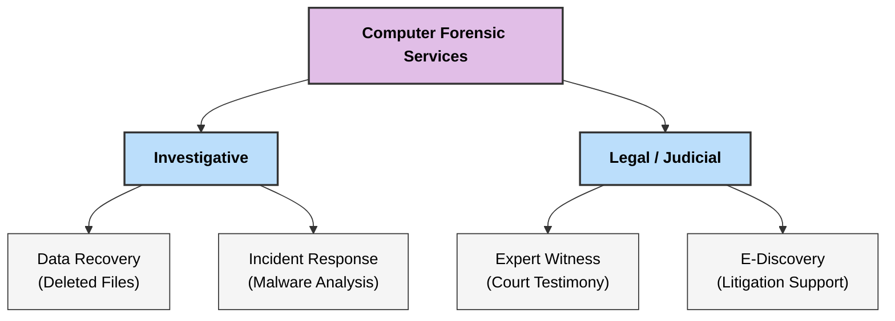
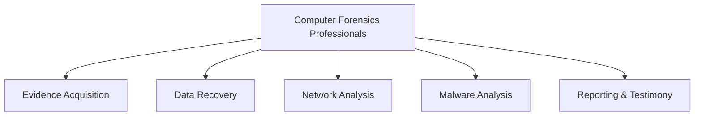

### **Q: What are the typical services offered by computer forensics professionals? (Explain any two)**

#### **1. Overview of Services**

Computer forensics professionals bridge the gap between technology and the legal system. They offer specialized services to law enforcement, corporations, and legal firms to manage digital evidence.

**Typical Services Include:**

  * **Data Recovery & Acquisition:** Retrieving data from damaged, deleted, or encrypted sources.
  * **Expert Witness Testimony:** presenting technical findings in a court of law.
  * **E-Discovery (Electronic Discovery):** Identifying and collecting electronic information for lawsuits.
  * **Incident Response:** Immediate action to handle security breaches (e.g., hacking, malware).
  * **Mobile Device Forensics:** Extracting data from smartphones, tablets, and GPS devices.
  * **Password Cracking & Decryption:** Accessing protected files or systems.

-----

#### **2. Detailed Explanation of Two Services**

**A. Data Recovery & Acquisition**

  * **Definition:** The process of extracting data from digital media (hard drives, RAM, mobiles) in a way that preserves the integrity of the evidence.
  * **Scope:** This goes beyond standard IT data recovery. It involves retrieving **deleted files**, files from **formatted partitions**, and data from **physically damaged** devices.
  * **Technical Aspects:**
      * **Imaging:** Creating a bit-by-bit copy (forensic image) of the storage media.
      * **File Carving:** Recovering files based on headers and footers from **unallocated clusters** (disk space marked as empty by the OS).
      * **Integrity:** Ensuring the **Hash Value** (digital fingerprint) of the recovered data matches the original to prove no tampering occurred.

**B. Expert Witness Testimony**

  * **Definition:** Providing professional opinion and explanation of digital evidence in a legal setting (courtroom or deposition).
  * **Scope:** The forensic professional acts as a neutral party to explain complex technical concepts to a non-technical audience (judge and jury).
  * **Technical Aspects:**
      * **Simplification:** Translating technical jargon (e.g., "hex dump," "metadata," "IP headers") into plain language.
      * **Cross-Examination:** Defending the **methodology** used during the investigation to prove it was scientifically sound and followed the **Chain of Custody**.
      * **Objectivity:** Presenting facts without bias, confirming whether the evidence supports or refutes the case theories.

-----

#### **3. Diagram: Spectrum of Forensic Services**

---
# **Typical Services Offered by Computer Forensics Professionals**

## **1️⃣ Typical Services**

1. **Evidence Acquisition & Preservation**

   * Creating **bit-stream forensic images**, using **write blockers**, generating **hash values** for integrity.

2. **Data Recovery & Carving**

   * Recovering **deleted, formatted, hidden, or encrypted** files.

3. **Malware & Rootkit Analysis**

   * Identifying malicious programs, analyzing payloads, persistence methods.

4. **Network Forensics & Traffic Analysis**

   * Monitoring and analyzing **packet flows**, intrusion detection, tracing attacker IPs.

5. **Log & Timeline Reconstruction**

   * Analyzing system logs, user actions, and generating **event timelines**.

6. **Mobile Device Forensics**

   * Extracting SMS, call logs, GPS data, application artifacts.

7. **Incident Response & Breach Analysis**

   * Handling cyber incidents, isolating affected systems, assessing damage.

8. **Expert Reporting & Court Testimony**

   * Preparing **legally admissible forensic reports** and serving as **expert witnesses**.

---

## **2️⃣ Small Diagram – Services of Forensic Professionals**

---

# **2️⃣ Explanation of Any Two**

---

## **A. Evidence Acquisition & Preservation**

### **Key Points**

* Creates **exact forensic copies** using **bit-stream imaging**.
* Uses **write-blockers** to prevent modification of original storage.
* Generates **MD5/SHA-1 hash values** to ensure integrity.
* Documentation follows **chain of custody** requirements.

### **Importance**

* Ensures evidence remains **authentic, unchanged, and legally admissible**.

---

## **B. Data Recovery & Carving**

### **Key Points**

* Recovers **deleted, corrupted, or hidden** data from digital media.
* Uses techniques like **file carving, slack space analysis**, and **partition recovery**.
* Handles encrypted or partially damaged files.

### **Importance**

* Retrieves crucial evidence that may have been **intentionally erased** by offenders.

---
