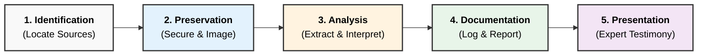

Here is the answer formatted according to university examination standards: clear, structured, and technical.

### **Q: What are the typical steps followed by computer forensics specialists in an investigation? Explain any 2 in detail.**

#### **1. Overview of Forensic Methodology**

To ensure digital evidence is admissible in court, forensic specialists follow a rigid, standardized lifecycle. The most common framework is the **Identification, Preservation, Analysis, Documentation, and Presentation** model.

**The 5 Key Phases:**

1.  **Identification:** Locating potential sources of digital evidence (laptops, servers, cloud logs).
2.  **Preservation:** Securing the data to prevent tampering or alteration.
3.  **Analysis:** Extracting, processing, and interpreting the data.
4.  **Documentation:** Creating a detailed record of all steps taken.
5.  **Presentation:** Explaining findings in a legal setting.

-----

#### **2. Process Flow Diagram**

-----

#### **3. Detailed Explanation of Two Steps**

**Step A: Preservation (Acquisition)**
This is the most critical phase because any error here renders the evidence inadmissible. The goal is to create an exact duplicate of the evidence without altering the original.

  * **Write Blocking:** A hardware **Write Blocker** is connected to the suspect drive. This physically prevents the operating system from sending "write" commands, ensuring the original data is not modified (not even a timestamp change).
  * **Bit-Stream Imaging:** Specialists do not just "copy-paste" files. They create a **Bit-Stream Image** (e.g., `.E01` or `.dd` format), which copies every bit (0 and 1) from the drive, including hidden sectors, slack space, and deleted data.
  * **Hashing (Integrity Check):** Before and after imaging, a cryptographic hash (like **MD5** or **SHA-256**) is calculated. If the hashes match, it proves the copy is mathematically identical to the original.
  * **Chain of Custody:** A document is started to log who collected the evidence, where it was stored, and who had access to it.

**Step B: Analysis**
In this phase, the forensic specialist uses software (like EnCase, FTK, or Autopsy) to convert binary data into human-readable evidence.

  * **Data Recovery:** The specialist attempts to recover **deleted files** by scanning the "Unallocated Space" of the hard drive using a technique called **File Carving**.
  * **Timeline Reconstruction:** Analyzing metadata (creation, access, modify times) to build a chronological sequence of the suspect's activities.
  * **Artifact Analysis:** Examining OS artifacts such as:
      * **Registry Keys:** To find USB connection history or installed software.
      * **Browser History:** To track internet activity.
      * **Email Logs:** To trace communication.
  * **Decryption:** Using brute-force or dictionary attacks to bypass passwords on encrypted files or archives.

-----

#### **4. Key Technical Keywords**

  * **Chain of Custody:** The paper trail documenting the seizure, custody, control, and transfer of evidence.
  * **Hash Value:** A digital fingerprint used to verify data integrity.
  * **Slack Space:** The wasted space at the end of a file cluster where fragments of old (deleted) data often reside.
  * **Write Blocker:** A tool that permits read-only access to data storage devices without compromising the integrity of the data.
---
# **Typical Steps Followed by Computer Forensics Specialists in an Investigation**

---

## **1️⃣ Typical Steps in a Forensic Investigation**

1. **Identification of Evidence Sources**

   * Locate potential digital evidence: disks, RAM, logs, mobiles, network traces.

2. **Preservation & Securing the Scene**

   * Prevent data alteration using **write-blockers**, sealing devices, and documenting state.

3. **Forensic Acquisition (Imaging)**

   * Create **bit-stream forensic copies** and generate **hash values** (MD5/SHA-1).

4. **Examination & Analysis**

   * Analyze files, logs, registry, network packets, malware, or user activity patterns.

5. **Documentation & Chain of Custody**

   * Maintain proper **timestamps, signatures, device details, and handling records**.

6. **Reporting & Presentation**

   * Prepare **legally admissible forensic reports** and present findings in court.

---

# **Small Diagram – Forensic Investigation Steps**

---

# **2️⃣ Explanation of Any Two Steps**

---

## **A. Preservation & Securing the Evidence**

### **Key Points**

* Ensures the **original digital evidence remains unchanged**.
* Use of **hardware write-blockers** to prevent accidental writes.
* Properly sealing, labeling, and storing devices.
* Documenting **system state, running processes, connected devices** at seizure time.
* Generates **hash values** immediately to maintain integrity.

### **Importance**

* Maintains **legal credibility**, prevents contamination, and protects the **chain of custody**.

---

## **B. Forensic Acquisition (Imaging)**

### **Key Points**

* Creation of a **bit-by-bit, sector-level image** of the storage device.
* Produces formats like **RAW/DD/E01**.
* Hash values (MD5/SHA-1/SHA-256) are generated **before and after imaging** to verify accuracy.
* Involves tools such as **FTK Imager, EnCase Imager, dd**.
* Ensures the original device is **never analyzed directly**.

### **Importance**

* Provides a **forensically sound duplicate** that can be safely analyzed and presented as evidence in court.

---
