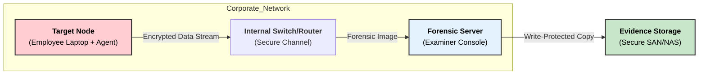
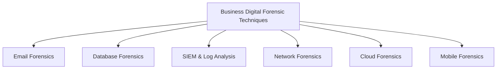

Here is the answer formatted according to university examination standards: clear, structured, and technical.

### **Q: What are the various business-oriented digital forensic techniques?**

#### **1. Overview**

Business-oriented digital forensics (often called **Enterprise Forensics**) focuses on investigating digital incidents while minimizing disruption to business operations. Unlike law enforcement, which may seize hardware, business techniques prioritize **remote acquisition**, **business continuity**, and **regulatory compliance**.

-----

#### **2. Key Business Forensic Techniques**

**1. Remote Forensic Acquisition (Agent-Based)**

  * **Concept:** Instead of physically seizing a laptop, investigators deploy a small software **agent** to the target device.
  * **Technique:** The agent allows the forensic server to copy data (disk image or specific files) over the corporate network (LAN/WAN) securely.
  * **Business Value:** No travel costs, and the employee can often continue working during the acquisition.
  * **Keywords:** **Endpoint Forensics**, **Agent Deployment**, **Bit-stream Image**.

**2. Live Forensics (Volatile Data Analysis)**

  * **Concept:** Analyzing a system while it is still powered on and running.
  * **Technique:** Used primarily for **Servers** that cannot be shut down due to Service Level Agreements (SLAs). Investigators capture **Volatile Data** (RAM, Running Processes, Network Connections) that would be lost if the system were powered off.
  * **Business Value:** Ensures **Business Continuity** (zero downtime) and captures active malware or encryption keys.
  * **Keywords:** **Volatile Memory**, **RAM Dump**, **Uptime**.

**3. E-Discovery (Electronic Discovery)**

  * **Concept:** The process of identifying, collecting, and producing Electronically Stored Information (ESI) for legal cases (lawsuits/audits).
  * **Technique:** Uses automated tools to sift through terabytes of emails, chats, and documents to find relevant evidence based on keywords or date ranges.
  * **Business Value:** Reduces legal costs and ensures compliance with regulations (like GDPR or HIPAA).
  * **Keywords:** **EDRM (Electronic Discovery Reference Model)**, **ESI**, **Deduplication**.

**4. Log Analysis & Correlation (SIEM)**

  * **Concept:** Aggregating logs from various sources (Firewalls, Active Directory, File Servers) to identify patterns.
  * **Technique:** Using **SIEM (Security Information and Event Management)** tools to correlate events (e.g., a user logging in from an unusual IP address at 3 AM).
  * **Business Value:** Proactively detects **Insider Threats** or data exfiltration before significant damage occurs.
  * **Keywords:** **Event Logs**, **Correlation**, **Anomaly Detection**.

-----

#### **3. Diagram: Enterprise Remote Forensic Architecture**

The diagram below illustrates how a forensic examiner investigates an employee's machine without physical access.

-----

#### **4. Key Technical Keywords**

  * **Business Continuity:** Maintaining essential functions during a disaster or investigation.
  * **Chain of Custody:** Documentation proving who handled the data and when, essential for legal validity.
  * **Cross-Drive Analysis:** Correlating data across multiple company hard drives to find a pattern of fraud.
  * **Steganography Detection:** Finding sensitive company data hidden inside harmless files (like images) by employees attempting data theft.
---
# **Business-Oriented Digital Forensic Techniques**

---

## **1️⃣ Email Forensics**

* Examination of **email headers, metadata, timestamps, attachments**.
* Recovery of **deleted or archived** emails (PST, OST, MBOX).
* Detection of **phishing, fraud, insider threats, unauthorized data sharing**.

---

## **2️⃣ Database Forensics**

* Analysis of **transaction logs, triggers, stored procedures**.
* Detection of **data manipulation, unauthorized transactions, SQL injection traces**.
* Use of tools like **ApexSQL Log, EnCase Enterprise**.

---

## **3️⃣ Log & SIEM-Based Forensics**

* Collection and correlation of **server logs, firewall logs, application logs**.
* Real-time monitoring using **SIEM systems** (Splunk, QRadar).
* Reconstruction of **event timelines** and detection of policy violations.

---

## **4️⃣ Disk & File System Forensics**

* Analysis of **file metadata, access patterns, slack space, deleted files**.
* Detection of **data theft, file tampering, IP theft**.
* Use of imaging tools like **FTK Imager, EnCase**.

---

## **5️⃣ Network Forensics**

* Packet capture and protocol analysis using **Wireshark, tcpdump**.
* Identifying **data exfiltration, unauthorized access, malware traffic**.
* Investigation of **internal network abuse**.

---

## **6️⃣ Cloud Forensics**

* Extraction of logs and artifacts from **SaaS, IaaS, PaaS** platforms.
* Investigation of **cloud storage misuse, unauthorized login attempts, API abuse**.
* Tools: **Oxygen Forensic Cloud Extractor, AWS CloudTrail logs**.

---

## **7️⃣ Mobile Device Forensics**

* Recovery of **SMS, GPS data, call logs, business app data**.
* Useful in cases of **employee misconduct, insider trading, fraud**.
* Tools: **Cellebrite, Oxygen Forensics**.

---

## **8️⃣ Data Loss Prevention (DLP) Forensics**

* Monitoring **USB transfers, email attachments, file uploads**.
* Detection of **insider data theft and IP leakage**.
* Tools: **Symantec DLP, McAfee DLP**.

---

## **9️⃣ Endpoint Monitoring Forensics**

* Continuous monitoring of **user activity, file access, process behavior**.
* Detection of **policy violations, unauthorized installations, suspicious behavior**.
* Tools: **CrowdStrike, Carbon Black**.

---

# **Small Diagram – Business Forensic Techniques**

---

## **Summary**

Business-oriented digital forensic techniques include **email analysis, database forensics, SIEM/log correlation, disk and network forensics, cloud forensics, mobile forensics, DLP analysis, and endpoint monitoring**, all aimed at detecting **fraud, insider threats, data theft, and policy violations** within corporate environments.
