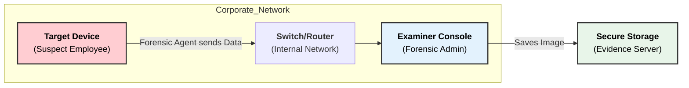
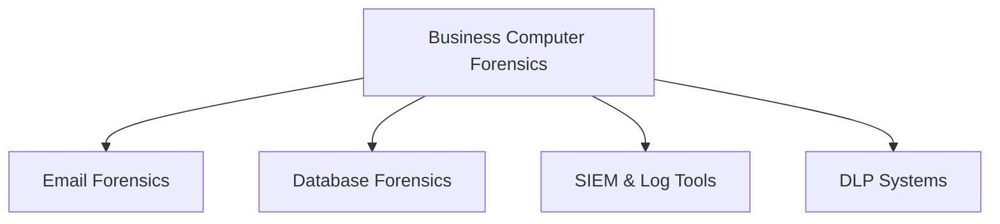

### **Q: What specific technologies are utilized in the field of business computer forensics? (Describe any two)**

#### **1. Overview of Business Forensic Technologies**

Business computer forensics (also known as Corporate Forensics) differs from law enforcement forensics as it prioritizes **business continuity**, **scalability**, and **internal policy compliance**. The technologies used must be able to handle vast amounts of data across corporate networks often without seizing physical devices.

**Common Technologies:**

  * **Remote Forensic Acquisition:** Tools to analyze devices over a network (LAN/WAN).
  * **E-Discovery Platforms:** For legal review and litigation support.
  * **Live Forensics Tools:** To capture RAM/volatile data from running servers.
  * **Log Analysis & SIEM:** To trace insider threats or unauthorized access.

-----

#### **2. Detailed Explanation of Two Technologies**

**A. Enterprise Remote Forensics (e.g., EnCase Endpoint Investigator, AXIOM Cyber)**

  * **Purpose:** To investigate employee laptops, servers, or cloud endpoints discreetly without physically seizing the device or disrupting the employee's work.
  * **Mechanism:**
      * **Agent-Based:** A small software "agent" is deployed to all company endpoints.
      * **Network Extraction:** The forensic examiner connects to the target machine via the internal network to preview files, dump RAM, or create a disk image.
  * **Business Relevance:** Essential for investigating **Internal Fraud**, **IP Theft**, or **HR Violations** where secrecy is required before alerting the suspect.
  * **Technical Keywords:** Agent deployment, volatile data capture, remote acquisition, non-disruptive.

**B. E-Discovery (Electronic Discovery) Technologies (e.g., Relativity, Nuix)**

  * **Purpose:** To identify, collect, and produce Electronically Stored Information (ESI) in response to a lawsuit or audit.
  * **Mechanism:** These tools ingest massive volumes of unstructured data (emails, PDFs, chats) and use **analytics** to filter relevant information.
  * **Key Technical Features:**
      * **Deduplication:** Automatically removing identical files to reduce review time.
      * **Optical Character Recognition (OCR):** Converting scanned images into searchable text.
      * **Predictive Coding:** Using Machine Learning (Technology Assisted Review) to classify documents as "Relevant" or "Non-Relevant."
  * **Business Relevance:** Critical for regulatory compliance and handling corporate lawsuits efficiently.

-----

#### **3. Diagram: Corporate Remote Forensic Architecture**

The following diagram illustrates how an examiner investigates a suspect's PC over the company network.

-----

#### **4. Summary of Keywords**

  * **Business Continuity:** Ensuring investigations do not stop company operations.
  * **EDRM (Electronic Discovery Reference Model):** The standard framework for E-Discovery.
  * **Insider Threat:** A security risk that originates from within the targeted organization.
  * **SIEM (Security Information and Event Management):** Real-time analysis of security alerts generated by applications and network hardware.

-----
# **Technologies Utilized in Business Computer Forensics**

## **1️⃣ Specific Technologies Used**

1. **Email Forensic Tools** (e.g., X1 Social Discovery, MailXaminer)
2. **Database Forensic Tools** (e.g., ApexSQL Log, EnCase Enterprise)
3. **Log Management & SIEM Systems** (e.g., Splunk, IBM QRadar)
4. **Disk & File Imaging Tools** (e.g., FTK Imager, EnCase)
5. **Endpoint Monitoring Tools** (e.g., CrowdStrike, Carbon Black)
6. **Data Loss Prevention (DLP) Systems** (e.g., Symantec DLP, McAfee DLP)
7. **Cloud Forensics Tools** (e.g., Oxygen Forensic Cloud Extractor)
8. **Memory Forensic Tools** (e.g., Volatility, Rekall)

---

## **2️⃣ Small Diagram – Business Forensic Technologies**

---

# **Explanation of Any Two**

---

## **A. Email Forensic Tools (e.g., MailXaminer, X1 Social Discovery)**

### **Key Features**

* Analyze **email headers, metadata, attachments, timestamps**
* Recover **deleted or archived emails** from PST, OST, MBOX files
* Detect **phishing, insider threats, fraud, unauthorized data transfer**
* Supports keyword search, pattern matching, and chain-of-custody documentation

### **Importance**

* Crucial for investigating **corporate fraud, employee misconduct, data leakage**, and **financial crime**.

---

## **B. SIEM & Log Management Tools (e.g., Splunk, IBM QRadar)**

### **Key Features**

* Collect and correlate logs from **servers, firewalls, applications, endpoints**
* Real-time **threat detection**, anomaly analysis, and incident alerts
* Generates **timeline reconstruction** and forensic-friendly audit trails
* Supports compliance with **business regulations** (PCI-DSS, SOX, GDPR)

### **Importance**

* Helps identify **security breaches, unauthorized access, policy violations**, and provides **legally admissible logs** for investigations.

---
