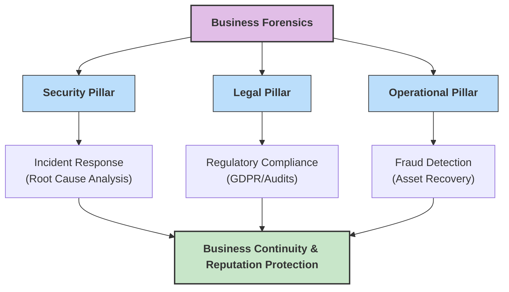
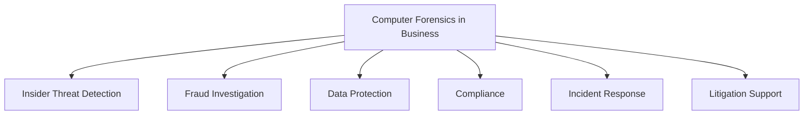

Here is the answer formatted according to university examination standards: clear, structured, and technical.

### **Q: In what ways can business benefit from computer forensics technology? Explain in detail.**

#### **1. Overview**

While computer forensics is often associated with crime scenes, in a business context, it acts as a critical tool for **Risk Management**, **Asset Protection**, and **Legal Compliance**. It allows organizations to investigate internal irregularities and respond to external cyber threats effectively.

#### **2. Key Benefits to Business**

**A. Combatting Insider Threats & Fraud**

  * **Context:** The most damaging threats often come from within (disgruntled employees or corporate spies).
  * **Benefit:** Forensic analysis of logs, emails, and financial systems can detect:
      * **Embezzlement:** Tracing unauthorized fund transfers or manipulation of spreadsheets.
      * **Data Exfiltration:** Identifying if an employee copied sensitive client lists or source code to a personal USB drive or cloud storage before resigning.
      * **Misconduct:** Proving policy violations such as sexual harassment via chat logs or viewing illicit content on company time.

**B. Efficient Incident Response (IR) & Mitigation**

  * **Context:** When a cyberattack (like Ransomware or a Data Breach) occurs, speed is critical.
  * **Benefit:** Forensics moves beyond just "cleaning" the virus to providing **Root Cause Analysis (RCA)**.
      * **Entry Point Identification:** Determining exactly how the attackers got in (e.g., Phishing email, unpatched server).
      * **Scope Assessment:** Identifying exactly which data was stolen, preventing the company from over-reporting or under-reporting the breach to regulators.
      * **Remediation:** Ensuring backdoors left by attackers are found and closed.

**C. Regulatory Compliance & Legal Liability**

  * **Context:** Businesses must comply with strict data laws (e.g., **GDPR**, **HIPAA**, **SOX**).
  * **Benefit:**
      * **Due Diligence:** In the event of a breach, forensic reports prove to auditors that the company took necessary security steps, potentially reducing fines.
      * **E-Discovery:** Significantly reduces legal costs during lawsuits by using automated forensic tools to filter millions of documents to find relevant evidence for litigation.

**D. Intellectual Property (IP) Protection**

  * **Context:** For tech and pharma companies, trade secrets are their most valuable asset.
  * **Benefit:** Forensics provides **Non-Repudiation** (proof that cannot be denied). If a competitor launches a product identical to yours, forensic analysis can trace the leakage of blueprints or designs back to a specific internal source or hack.

-----

#### **3. Diagram: Business Value Proposition**

The following diagram illustrates how forensic readiness supports the three pillars of business stability.

-----

#### **4. Key Technical Keywords**

  * **Root Cause Analysis (RCA):** The systematic process of finding the fundamental cause of an incident.
  * **Non-Repudiation:** Assurance that the sender of information cannot deny having sent it.
  * **Data Exfiltration:** The unauthorized transfer of data from a computer or other device.
  * **Due Diligence:** The investigation or exercise of care that a reasonable business or person is expected to take before entering into an agreement or during an incident.
---
# **Benefits of Computer Forensics Technology for Businesses**

---

## **1️⃣ Ways Businesses Benefit from Computer Forensics**

### **A. Detection of Insider Threats**

* Identifies **unauthorized access**, data copying, file deletion, or policy violations.
* Uses tools like **DLP systems, SIEM logs, endpoint monitoring**.

### **B. Prevention of Data Theft & IP Leakage**

* Tracks **USB transfers, email attachments, cloud uploads**.
* Preserves evidence of **intellectual property theft**.

### **C. Fraud Investigation**

* Helps uncover **financial fraud, embezzlement, invoice manipulation**, and **account tampering**.
* Analyzes **email trails, transaction logs, and database records**.

### **D. Compliance With Legal & Regulatory Standards**

* Supports compliance with **SOX, PCI-DSS, HIPAA, GDPR**.
* Maintains proper **auditable logs** for regulatory audits.

### **E. Incident Response & Breach Analysis**

* Provides tools to analyze **malware attacks, network breaches, ransomware incidents**.
* Helps isolate compromised systems and assess damage.

### **F. Protection of Corporate Assets**

* Ensures **confidentiality, integrity, and availability** of business-critical data.
* Detects **tampering, unauthorized changes, and corruption**.

### **G. Litigation Support & Legal Evidence**

* Generates **court-admissible forensic reports**.
* Supports businesses in **internal disputes**, employee termination cases, and **IP lawsuits**.

### **H. Recovery of Critical Data**

* Recovers **deleted, encrypted, hidden, or corrupted** files.
* Useful in accidental data loss or intentional destruction.

---

# **2️⃣ Small Diagram – Business Benefits of Computer Forensics**

---

# **3️⃣ Detailed Explanation (Key Benefits)**

---

## **1. Detection of Insider Threats (Detailed)**

### **Technical Role**

* Monitoring of **endpoint activity**, **file access logs**, and **process behavior**.
* SIEM systems correlate events to detect **abnormal user actions**.
* DLP systems block unauthorized **data transfers**.

### **Business Impact**

* Prevents intentional data misuse by employees.
* Protects intellectual property and sensitive business documents.
* Minimizes financial loss and reputation damage.

---

## **2. Incident Response & Breach Analysis (Detailed)**

### **Technical Role**

* Forensic tools analyze **malware signatures, command-and-control traffic**, and **compromised endpoints**.
* Packet capture tools detect **intrusion paths** and **attack techniques**.
* Memory forensics identifies **running malicious processes**.

### **Business Impact**

* Reduces downtime and limits damage after cyber attacks.
* Helps businesses quickly restore normal operations.
* Provides evidence for legal action against attackers.

---

## **Summary**

Businesses benefit from computer forensics through **insider threat detection, fraud prevention, data protection, regulatory compliance, incident response, litigation support, and data recovery**. These technologies enhance **security, accountability, and operational resilience** within corporate environments.
