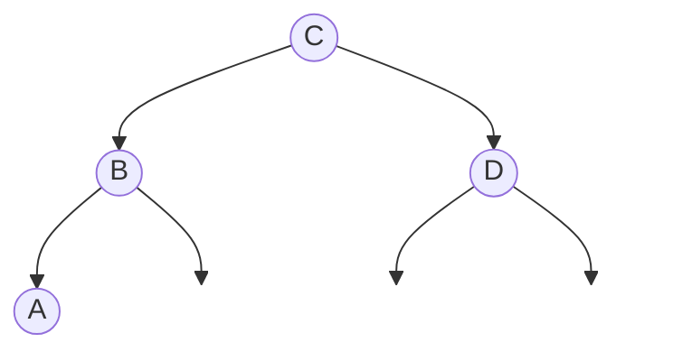

# Dynamic Programming and Optimal Binary Search Tree (OBST)

## 1. Dynamic Programming Approach

**Definition:**
Dynamic Programming (DP) is an algorithm design technique used for solving optimization problems. It breaks a complex problem into simpler, overlapping sub-problems, solves each sub-problem exactly once, and stores the results in a table (a process called **memoization**) to avoid redundant computations.

### Key Principles
1.  **Optimal Substructure (Principle of Optimality):** An optimal solution to the problem contains within it optimal solutions to its sub-problems.
2.  **Overlapping Sub-problems:** The recursive solution involves solving the same sub-problems repeatedly. DP computes these once and stores the result.

---

## 2. Algorithm for Optimal Binary Search Tree (OBST)

**Problem:** Given a sorted sequence of keys $K = \{k_1, k_2, ..., k_n\}$ with associated access probabilities $p_i$, construct a Binary Search Tree (BST) such that the expected search cost is minimized.

**Mathematical Formulation:**
Let $C[i, j]$ be the cost of the optimal BST containing keys $k_i$ through $k_j$.
Let $W[i, j]$ be the sum of probabilities for keys $k_i$ through $k_j$.

**Recurrence Relation:**
$$C[i, j] = \min_{k=i}^{j} \{ C[i, k-1] + C[k+1, j] \} + W[i, j]$$

**Base Cases:**
* $C[i, i-1] = 0$ (Empty tree)
* $W[i, i-1] = 0$
* $C[i, i] = p_i$ (Single key)

**Algorithm (Pseudocode):**

```python
Function Optimal_BST(p, n):
    // Initialization
    Create tables C[1..n+1, 0..n] and W[1..n+1, 0..n]
    
    // Base Case: Length 0 and 1
    For i = 1 to n:
        C[i, i-1] = 0
        W[i, i-1] = 0
        C[i, i] = p[i]
        W[i, i] = p[i]
    C[n+1, n] = 0
    W[n+1, n] = 0

    // Build table for Length L = 2 to n
    For L = 2 to n:
        For i = 1 to n - L + 1:
            j = i + L - 1
            W[i, j] = W[i, j-1] + p[j]
            
            // Find minimum cost C[i,j] trying all roots k
            C[i, j] = INFINITY
            For k = i to j:
                temp_cost = C[i, k-1] + C[k+1, j] + W[i, j]
                If temp_cost < C[i, j]:
                    C[i, j] = temp_cost
                    Root[i, j] = k  // Store root to reconstruct tree
    
    Return C[1, n]
````

-----

## 3\. Numerical Solution

**Input:**

  * **Keys:** A, B, C, D (Mapped to indices 1, 2, 3, 4)
  * **Probabilities:** $p_1=0.1, p_2=0.2, p_3=0.4, p_4=0.3$

**Goal:** Fill the Cost Matrix $C[i, j]$ and Root Matrix $R[i, j]$.

### Step-by-Step Calculation

**1. Length L = 1 (Main Diagonal)**
Cost is simply the probability of the key.

  * $C(1,1) = 0.1$ (Root A)
  * $C(2,2) = 0.2$ (Root B)
  * $C(3,3) = 0.4$ (Root C)
  * $C(4,4) = 0.3$ (Root D)

**2. Length L = 2**

  * **$C(1,2)$ (Keys A, B):** $W = 0.3$

      * Root A ($k=1$): $C(2,2) + W = 0.2 + 0.3 = 0.5$
      * Root B ($k=2$): $C(1,1) + W = 0.1 + 0.3 = \mathbf{0.4}$ **(Min)**
      * **$C(1,2) = 0.4$, Root = B**

  * **$C(2,3)$ (Keys B, C):** $W = 0.6$

      * Root B ($k=2$): $C(3,3) + W = 0.4 + 0.6 = 1.0$
      * Root C ($k=3$): $C(2,2) + W = 0.2 + 0.6 = \mathbf{0.8}$ **(Min)**
      * **$C(2,3) = 0.8$, Root = C**

  * **$C(3,4)$ (Keys C, D):** $W = 0.7$

      * Root C ($k=3$): $C(4,4) + W = 0.3 + 0.7 = 1.0$
      * Root D ($k=4$): $C(3,3) + W = 0.4 + 0.7 = \mathbf{1.1}$ **(Min)** (Wait, $1.0 < 1.1$)
      * Let's Re-calculate:
          * $k=3$ (Root C): $C(3,2) + C(4,4) + 0.7 = 0 + 0.3 + 0.7 = 1.0$
          * $k=4$ (Root D): $C(3,3) + C(5,4) + 0.7 = 0.4 + 0 + 0.7 = 1.1$
      * **$C(3,4) = 1.0$, Root = C**

**3. Length L = 3**

  * **$C(1,3)$ (Keys A, B, C):** $W = 0.7$

      * Root A ($k=1$): $C(2,3) + W = 0.8 + 0.7 = 1.5$
      * Root B ($k=2$): $C(1,1) + C(3,3) + W = 0.1 + 0.4 + 0.7 = 1.2$
      * Root C ($k=3$): $C(1,2) + W = 0.4 + 0.7 = \mathbf{1.1}$ **(Min)**
      * **$C(1,3) = 1.1$, Root = C**

  * **$C(2,4)$ (Keys B, C, D):** $W = 0.9$

      * Root B ($k=2$): $C(3,4) + W = 1.0 + 0.9 = 1.9$
      * Root C ($k=3$): $C(2,2) + C(4,4) + W = 0.2 + 0.3 + 0.9 = \mathbf{1.4}$ **(Min)**
      * Root D ($k=4$): $C(2,3) + W = 0.8 + 0.9 = 1.7$
      * **$C(2,4) = 1.4$, Root = C**

**4. Length L = 4 (Total)**

  * **$C(1,4)$ (Keys A, B, C, D):** $W = 1.0$
      * Root A ($k=1$): $C(2,4) + W = 1.4 + 1.0 = 2.4$
      * Root B ($k=2$): $C(1,1) + C(3,4) + W = 0.1 + 1.0 + 1.0 = 2.1$
      * Root C ($k=3$): $C(1,2) + C(4,4) + W = 0.4 + 0.3 + 1.0 = \mathbf{1.7}$ **(Min)**
      * Root D ($k=4$): $C(1,3) + W = 1.1 + 1.0 = 2.1$
      * **$C(1,4) = 1.7$, Root = C**

### Final Cost Matrix (DP Table)

| i \\ j | 0 | 1 (A) | 2 (B) | 3 (C) | 4 (D) |
| :--- | :--- | :--- | :--- | :--- | :--- |
| **1** | 0 | 0.1 | 0.4 | 1.1 | **1.7** |
| **2** | - | 0 | 0.2 | 0.8 | 1.4 |
| **3** | - | - | 0 | 0.4 | 1.0 |
| **4** | - | - | - | 0 | 0.3 |
| **5** | - | - | - | - | 0 |

### Tree Construction

Using the Root values calculated:

1.  **Global Range (1-4):** Root is **C** ($k=3$).
2.  **Left Subtree (1-2):** Keys A, B. Look at $C(1,2)$, Root is **B**.
3.  **Right Subtree (4-4):** Keys D. Look at $C(4,4)$, Root is **D**.
4.  **Left Child of B (1-1):** Keys A. Look at $C(1,1)$, Root is **A**.

**Resulting Structure:**



**Minimum Search Cost:** **1.7**

```
