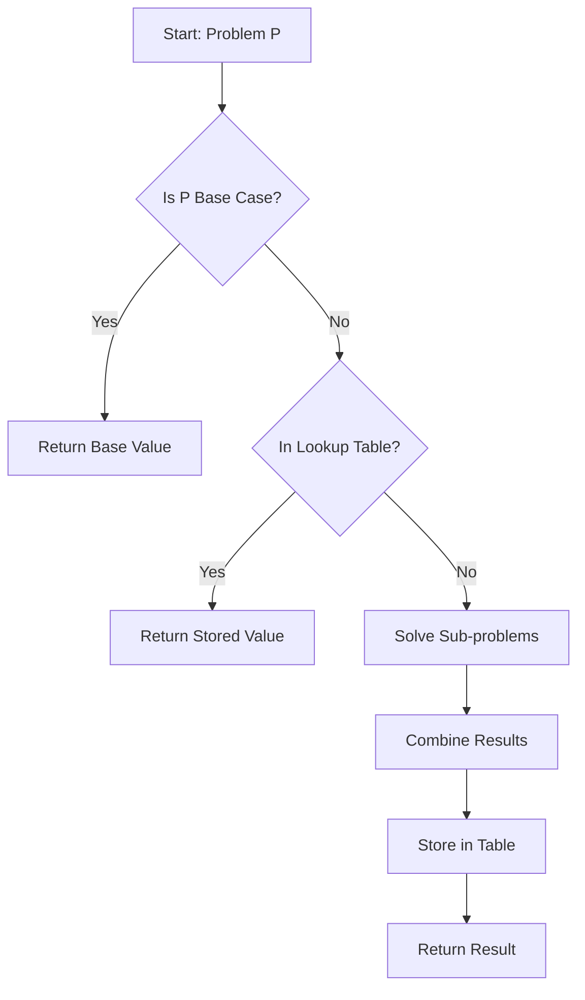

# Dynamic Programming (DP)

## 1. Definition
**Dynamic Programming** is an algorithm design paradigm used to find the global optimal solution for optimization problems. It works by breaking a complex problem into simpler, **overlapping sub-problems**, solving each sub-problem exactly once, and storing the results (Memoization) for future reference.

---

## 2. Principle of Dynamic Programming
The efficiency of DP relies on two fundamental properties:

### A. Optimal Substructure (Principle of Optimality)
A problem has optimal substructure if an optimal solution to the global problem contains within it optimal solutions to its sub-problems.
* **Mathematical Relation:** $$Solution(P) = Combine(Solution(P_1), Solution(P_2))$$

### B. Overlapping Sub-problems
The recursive breakdown of the problem generates the same sub-problems repeatedly. DP solves this by storing solutions in a table to avoid re-computation.

---

## 3. Control Abstraction (General Algorithm)
The control abstraction typically follows the **Memoization (Top-Down)** approach.

```pseudo
Algorithm DP_Solve(P)
Input: Problem Instance P
Global: Table[] initialized to NULL

1.  if P is a base case then
2.      return BaseValue(P)
3.  if Table[P] != NULL then
4.      return Table[P]      // Reuse stored result (Lookup)
5.  else
6.      S = Combine(DP_Solve(sub_1), ..., DP_Solve(sub_k))
7.      Table[P] = S         // Store result (Memoize)
8.      return S
````

### Flow Diagram (Mermaid)

*(Note: GitHub supports Mermaid diagrams natively)*



-----

## 4\. Time Analysis of Control Abstraction

The time complexity of a Dynamic Programming algorithm is theoretically determined by the following formula:

$$T(n) = (\text{Total Unique States}) \times (\text{Time per State})$$

  * **Total Unique States:** This corresponds to the size of the storage table (e.g., $O(n)$ or $O(n^2)$).
  * **Time per State:** The time required to compute a state transition (usually $O(1)$).

**Comparison:**

  * **Naive Recursion:** Often **Exponential** ($O(2^n)$) due to redundant calculations.
  * **Dynamic Programming:** Often **Polynomial** ($O(n^k)$) because every distinct sub-problem is solved only once.

-----

## 5\. Suitable Example: Fibonacci Sequence

**Problem:** Find the $n^{th}$ Fibonacci number.

### A. Naive Recursive Approach

  * **Formula:** $F(n) = F(n-1) + F(n-2)$
  * **Analysis:** Recalculates the same values multiple times.
  * **Complexity:** $O(2^n)$

### B. Dynamic Programming Approach

We store values in an array `Memo[]`.

```cpp
int Fib_DP(int n) {
    if (n <= 1) return n;
    
    // Lookup Step
    if (Memo[n] != -1) return Memo[n];
    
    // Store Step
    Memo[n] = Fib_DP(n-1) + Fib_DP(n-2);
    return Memo[n];
}
```

**Time Analysis for DP:**

1.  **Unique States:** We calculate $F(0)$ to $F(n)$. Total states = $n$.
2.  **Time per State:** Addition takes $O(1)$.
3.  **Total Complexity:** $n \times O(1) = O(n)$.

**Conclusion:** DP reduces complexity from **Exponential** to **Linear**.
