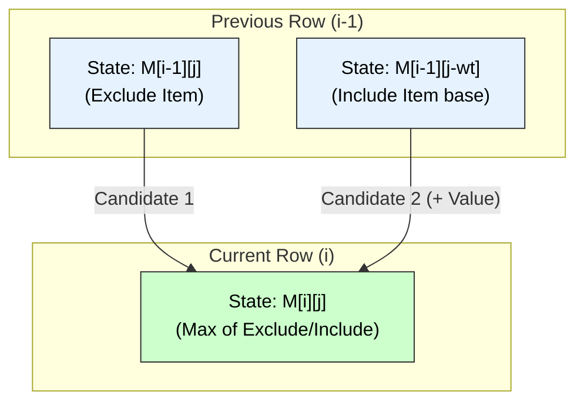

# Dynamic Programming Strategy

## 1. Principle of Dynamic Programming
**Definition:**
Dynamic Programming (DP) is an algorithm design technique for solving optimization problems by breaking them down into simpler **Overlapping Subproblems** and building the solution in a bottom-up manner.

**Core Principles:**
1.  **Principle of Optimality:** An optimal solution to the problem contains within it optimal solutions to its subproblems.
2.  **Overlapping Subproblems:** The recursive subproblems share common sub-subproblems. DP solves each subproblem only once and stores the result (Memoization/Tabulation) to avoid redundant computations.
3.  **Irreversibility:** Once a decision is made to reach a state, it is not changed.

---

## 2. Control Abstraction (General Template)

There is no single code template for DP (unlike Greedy), but the **Tabulation Method** (Iterative) generally follows this structure:

**Algorithm** `DynamicProgramming(Input)`
1.  **Initialize Table:** Create a table (array/matrix) `M` to store solutions to subproblems.
2.  **Base Cases:** Fill the table entries corresponding to the smallest subproblems (trivial solutions).
3.  **Recursive Step (Bottom-Up):**
    * Iterate through the table using nested loops.
    * For each state `M[i]`, compute its value using previously computed values from the table (based on the Recurrence Relation).
4.  **Termination:** The final answer is stored in the last entry of the table (e.g., `M[n]`).

```cpp
Algorithm DP_Solver(n) {
    // 1. Initialize Table
    Table[0...n] = {0};

    // 2. Base Case
    Table[0] = BaseValue;

    // 3. Fill Table
    for i = 1 to n {
        // Recurrence Relation: Depends on previous states
        Table[i] = OptimalFunction(Table[i-1], Table[i-2], ...);
    }
    
    // 4. Return Final State
    return Table[n];
}
````

-----

## 3\. Time Analysis of Control Abstraction

The time complexity of a Dynamic Programming algorithm is determined by the size of the storage table and the work done to fill each entry.

$$ T(n) = (\text{Total Number of Subproblems}) \times (\text{Time to solve one Subproblem}) $$

  * **Subproblems:** Usually correspond to the size of the DP Table (e.g., $O(n)$ for 1D, $O(n^2)$ for 2D).
  * **Time per Subproblem:** Usually $O(1)$ (looking up previous values) or $O(n)$ (looping through previous values).
  * **Space Complexity:** Equal to the size of the DP Table.

-----

## 4\. Suitable Example: 0/1 Knapsack Problem

**Problem:** Given $n$ items with weights $w_i$ and values $v_i$, and a knapsack of capacity $W$, find the maximum value subset such that total weight $\le W$. Items cannot be broken (0/1).

**Recurrence Relation:**
Let `M[i][j]` be the max value using subset of first $i$ items with capacity $j$.
$$M[i][j] = \max \begin{cases} M[i-1][j] & \text{(Exclude Item } i) \\ v_i + M[i-1][j - w_i] & \text{(Include Item } i \text{ if } j \ge w_i) \end{cases}$$

### Pseudocode

```cpp
Algorithm DP_Knapsack(w, v, n, W) {
    // Create Table (n+1) rows x (W+1) columns
    int M[n+1][W+1];

    // Initialization (Row 0 and Col 0 are 0)
    for i = 0 to n: M[i][0] = 0;
    for j = 0 to W: M[0][j] = 0;

    // Fill Table
    for i = 1 to n {         // For each item
        for j = 1 to W {     // For each capacity
            if (w[i] <= j)
                M[i][j] = max(M[i-1][j], v[i] + M[i-1][j - w[i]]);
            else
                M[i][j] = M[i-1][j];
        }
    }
    return M[n][W];
}
```

-----

## 5\. Visual Representation: DP Dependency

The diagram below shows how the solution for `M[i][j]` (State X) depends on two previous states: directly above (Exclusion) and above-left (Inclusion).



### Complexity for Example

  * **Time Complexity:** $O(n \times W)$ (Pseudo-polynomial).
  * **Space Complexity:** $O(n \times W)$ (Can be optimized to $O(W)$).

<!-- end list -->

```
```
