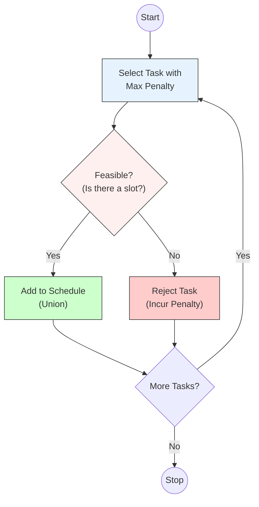

# Greedy Algorithm for Task Scheduling (Minimizing Penalty)

## 1. Control Abstraction (Pseudocode)
This algorithm follows the standard Greedy template. We build the set of scheduled tasks ($S$) by selecting tasks with the highest penalty one by one.

**Algorithm** `TaskScheduling(Tasks, n)`
```cpp
Algorithm TaskScheduling(Tasks, n) {
    // 1. Initialize
    Solution = {}; // Set of scheduled tasks
    
    // 2. Greedy Loop
    for i = 1 to n do {
        
        // A. Select: Pick the task with the highest penalty not yet considered
        task_i = Select(Tasks); 
        
        // B. Feasibility: Check if task_i can be scheduled before its deadline
        // without conflicting with already scheduled tasks in 'Solution'
        if (Feasible(Solution, task_i)) then {
            
            // C. Union: Add task to the schedule (assign to latest possible slot)
            Solution = Union(Solution, task_i);
        }
    }
    
    // 3. Return the optimal set of scheduled tasks
    return Solution; 
}
````

-----

## 2\. Explanation of Abstract Functions

To make this abstraction work for **Minimizing Penalty**, the functions behave as follows:

  * **`Select(Tasks)`**:
      * **Logic:** Returns the task with the **maximum penalty** among those remaining.
      * **Implementation:** Usually achieved by sorting tasks by penalty in descending order initially.
  * **`Feasible(Solution, task_i)`**:
      * **Logic:** Checks if there is a free time slot $t$ such that $1 \le t \le task\_i.deadline$.
      * **Constraint:** We typically look for the **latest available slot** to leave room for earlier tasks.
  * **`Union(Solution, task_i)`**:
      * **Logic:** Assigns `task_i` to that identified empty slot and marks the slot as occupied.

-----

## 3\. Visual Representation: Control Flow



-----

## 4\. Proof of Correctness (Brief)

To prove this greedy strategy minimizes total penalty:

1.  **Greedy Choice Property:**
      * Suppose there is an optimal solution that excludes the highest-penalty task ($T_{max}$).
      * If we can fit $T_{max}$, we can swap it into the schedule. Since $T_{max}$ has the highest value, the total penalty saved will either increase or stay the same. Thus, picking $T_{max}$ is always safe.
2.  **Optimal Substructure:**
      * After scheduling $T_{max}$, the problem reduces to scheduling the remaining tasks in the remaining slots. The same logic applies recursively.
3.  **Conclusion:** The local optimum (picking max penalty) leads to the global optimum (minimum total penalty).

<!-- end list -->

```
```
