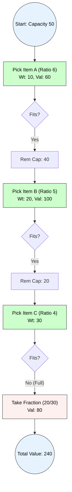

# Greedy Strategy

## 1. Principle of Greedy Strategy
**Definition:**
The Greedy method is an algorithmic paradigm that builds up a solution piece by piece, always choosing the next piece that offers the most immediate and obvious benefit.

**Core Philosophy:**
* **Local Optimality:** At every step, make the choice that looks best **at the moment**.
* **Global Optimality:** Hope that these locally optimal choices lead to a **globally optimal** solution.

**Key Components:**
1.  **Candidate Set:** A list of items to choose from (inputs).
2.  **Selection Function:** Chooses the best candidate to add to the solution next.
3.  **Feasibility Function:** Checks if the selected candidate can contribute to the solution without violating constraints.
4.  **Objective Function:** Assigns a value to a solution (which we want to Maximize or Minimize).

---

## 2. Control Abstraction (Pseudocode)

The general template for any greedy algorithm is as follows:

**Algorithm** `Greedy(A, n)`
* **Input:** Set of inputs $A$ of size $n$.
* **Output:** A subset of $A$ that forms the optimal solution.

```cpp
Algorithm Greedy(A, n) {
    Solution = {}; // Initialize empty solution
    
    for i = 1 to n do {
        // 1. Select best candidate (Greedy Choice)
        x = Select(A);
        
        // 2. Check Feasibility
        if (Feasible(Solution, x)) then {
            // 3. Add to Solution
            Solution = Union(Solution, x);
        }
    }
    return Solution;
}
````

-----

## 3\. Time Analysis of Control Abstraction

The time complexity depends on the implementation of the `Select` function and the loop.

1.  **Preprocessing (Sorting):** Most greedy problems require the input to be sorted first (e.g., by weight, profit, or finish time).
      * **Cost:** $O(n \log n)$.
2.  **Iteration:** The main loop runs $n$ times.
3.  **Inside Loop:**
      * `Select`: If sorted, this is $O(1)$ (just pick next).
      * `Feasible`: Typically $O(1)$ (simple check).
      * `Union`: $O(1)$.
      * **Total Loop Cost:** $O(n)$.

**Overall Time Complexity:**
$$ T(n) = O(n \log n) + O(n) \approx O(n \log n) $$

-----

## 4\. Suitable Example: Fractional Knapsack Problem

**Problem:** Given weights and values of $n$ items, we need to put these items in a knapsack of capacity $W$ to get the **maximum total value**. We can take fractions of items.

**Greedy Strategy:**

1.  Calculate **Value-per-Weight ratio** ($v_i / w_i$) for all items.
2.  Sort items in **descending order** of this ratio.
3.  Pick items with the highest ratio first until the knapsack is full.

### Example Trace

  * **Capacity:** $W = 50$
  * **Items:**
      * Item A: Val=60, Wt=10 (Ratio = 6.0)
      * Item B: Val=100, Wt=20 (Ratio = 5.0)
      * Item C: Val=120, Wt=30 (Ratio = 4.0)

**Execution:**

1.  **Select A:** Wt 10 $\le$ 50. Add A. Rem Cap = 40. Total Val = 60.
2.  **Select B:** Wt 20 $\le$ 40. Add B. Rem Cap = 20. Total Val = 160.
3.  **Select C:** Wt 30 $>$ 20. Take fraction ($20/30$). Add $2/3$ of C. Total Val = $160 + 80 = 240$.
4.  **Result:** Max Value = 240.

### Visual Representation



```
```
