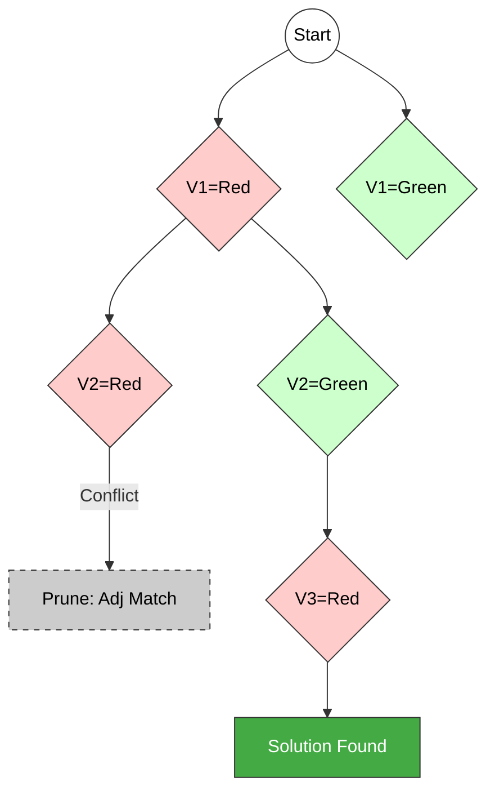

# m-Coloring Problem (Recursive Backtracking)

## 1. Problem Statement
**Definition:**
Given an undirected graph $G = (V, E)$ represented by an adjacency matrix $G[1..n][1..n]$ and a set of $m$ colors, the problem is to assign a color to each vertex such that no two adjacent vertices share the same color.

**Objective:**
Find a coloring vector $X = (x_1, x_2, \dots, x_n)$ where $x_i \in \{1, 2, \dots, m\}$ represents the color assigned to vertex $i$.

---

## 2. Recursive Backtracking Algorithm

The algorithm uses a state space tree. We define two main functions: `mColoring` (recursive control) and `NextValue` (bounding function).

### Pseudocode

**Algorithm** `mColoring(k)`
* **Input:** $k$ is the index of the vertex currently being colored.
* **Global:** $n$ (vertices), $m$ (max colors), $G$ (Adjacency Matrix), $X$ (Solution Vector, initialized to 0).

```cpp
Algorithm mColoring(k) {
    repeat {
        // Generate next valid color for vertex k
        NextValue(k); 
        
        if (X[k] == 0) then return; // No valid color found, backtrack
        
        if (k == n) then
            print(X[1...n]); // All vertices colored successfully
        else
            mColoring(k + 1); // Proceed to color next vertex
    } until (false);
}
````

**Algorithm** `NextValue(k)`

  * **Function:** Assigns the smallest possible color number to $x_k$ that is distinct from its adjacent vertices.

<!-- end list -->

```cpp
Algorithm NextValue(k) {
    repeat {
        X[k] = (X[k] + 1) mod (m + 1); // Try next color (1 to m)
        
        if (X[k] == 0) then return; // All colors exhausted
        
        // Check consistency with neighbors
        for j = 1 to n do {
            // If edge exists and colors match
            if (G[k][j] != 0 and X[k] == X[j]) then
                break; // Color conflict, try next color in loop
        }
        
        if (j == n + 1) then return; // No conflict found, color is valid
    } until (false);
}
```

-----

## 3\. State Space Tree Diagram

**Example:** 3 Vertices ($V_1, V_2, V_3$), 2 Colors (R, G).



-----

## 4\. Time Complexity Analysis

The complexity is determined by the size of the state space tree generated.

1.  **Branching Factor:** At each node (vertex), there are $m$ possible branches (colors).

2.  **Depth:** The tree has a depth of $n$ (total vertices).

3.  **Total Nodes (Worst Case):** A complete $m$-ary tree of depth $n$ has geometric series summation:
    $$1 + m + m^2 + \dots + m^n = \frac{m^{n+1} - 1}{m - 1}$$
    Therefore, the number of internal nodes is $O(m^n)$.

4.  **Work per Node:** The `NextValue` function iterates through neighbors, taking $O(n)$ time.

**Total Time Complexity:**
$$O(n \times m^n)$$

### Summary

  * **Time Complexity:** Exponential, $O(n \cdot m^n)$.
  * **Space Complexity:** $O(n)$ for the recursion stack and solution vector.

<!-- end list -->


# Graph Colouring Using Backtracking (Adjacency Matrix Representation)

---

## 1. Problem Statement

Given:

- A graph with **n vertices**, represented by an **adjacency matrix**  
  $$G[1..n][1..n]$$


$$
where 
G[i][j] = 
\begin{cases}
1, & \text{if there is an edge between vertex } i \text{ and } j \\
0, & \text{otherwise}
\end{cases}
$$

- A set of **m available colours**:
$$C = \{1, 2, \dots, m\}$$

**Graph Colouring Problem:**

> Assign a colour to **each vertex** such that **no two adjacent vertices** have the **same colour**, using at most **m colours**.  
> Use a **recursive backtracking algorithm** to colour all the vertices.

---

## 2. Data Structures and Notation

- `G[1..n][1..n]` → adjacency matrix of the graph  
- `color[1..n]` → colour assigned to vertex `i`, where  
  $$ 
  color[i] \in \{0, 1, \dots, m\}
  $$
  - `color[i] = 0` means **no colour assigned yet**  
- `m` → number of available colours  
- `n` → number of vertices  

**Technical Keywords:** backtracking, recursive algorithm, feasibility check, adjacency matrix, graph colouring, state space tree.

---

## 3. Helper Function: Feasibility Check (IsSafe)

We need to check whether assigning a given colour to a vertex is **safe** (i.e., does not violate the colouring constraint).

```text
Function IsSafe(v, c)
Input : v → vertex index
        c → colour to try
Global: G[1..n][1..n], color[1..n]

for i ← 1 to n do
      if G[v][i] == 1 and color[i] == c then
            return false         // adjacent vertex has same colour

return true                      // no conflict with neighbours
````

---

## 4. Recursive Backtracking Algorithm to Colour All Vertices

```text
Procedure ColourGraph(v)
Input : v → current vertex index to colour
Global: G[1..n][1..n], color[1..n], m, n

// If all vertices are coloured, we have found a valid colouring
if v > n then
      output color[1..n]         // one valid colouring
      return                     // to find all colourings, do NOT stop here

// Try all m possible colours for vertex v
for c ← 1 to m do
      if IsSafe(v, c) then
            color[v] ← c         // assign colour c to vertex v
            ColourGraph(v + 1)   // recursively colour next vertex
            color[v] ← 0         // backtrack (remove colour assignment)
```

### Driver Procedure

```text
Algorithm GraphColouring()
Input : n, m, G[1..n][1..n]

for i ← 1 to n do
      color[i] ← 0               // initially no vertex is coloured

ColourGraph(1)
```

* This algorithm **generates all valid m-colourings** of the graph.
* To **stop after the first valid colouring**, you can modify `ColourGraph` to return a boolean and stop recursion when a solution is found.

---

## 5. Small Diagram (Example Graph)

Example: Graph with 4 vertices.

```text
   v1 ----- v2
    |      /
    |     /
    |    /
    v3 ----- v4
```

* Edges: { (v1, v2), (v1, v3), (v2, v3), (v3, v4) }
* Adjacency matrix `G` (4 × 4):

```text
      v1 v2 v3 v4
    ┌─────────────┐
v1  │ 0  1  1  0  │
v2  │ 1  0  1  0  │
v3  │ 1  1  0  1  │
v4  │ 0  0  1  0  │
    └─────────────┘
```

The backtracking algorithm explores all possible **m-colour assignments** to `v1, v2, v3, v4`, pruning those where **adjacent vertices share the same colour**.

---

## 6. Time Complexity of the Backtracking Algorithm

Let:

* `n` = number of vertices
* `m` = number of colours

### 6.1 Worst-Case Time Complexity

* For each of the `n` vertices, we can try up to `m` colours.
* In the **worst case** (when very few or no assignments are pruned), the algorithm explores all possible assignments:

[
\text{Total possible colourings} = m^n
]

So, the **worst-case time complexity** is:

[
T(n) = O(m^n)
]

* Additionally, each `IsSafe(v, c)` call checks all `n` vertices in the worst case via the adjacency matrix → `O(n)` time.
* Therefore, a more detailed bound:

[
T(n) = O(n \cdot m^n)
]

But asymptotically, the **dominant factor** is the exponential number of colour combinations:

[
\boxed{T(n) = O(m^n)}
]

### 6.2 Practical Note

* **Backtracking with pruning** may significantly reduce the number of explored states for many graphs.
* However, **in general** graph colouring is **NP-complete**, and the backtracking algorithm remains **exponential in the worst case**.

---

## 7. Exam-Ready Summary

* Graph colouring is to assign colours to vertices so that **no two adjacent vertices** share the **same colour**, using at most `m` colours.
* Using **recursive backtracking**, we:

  * Colour vertices **one by one**.
  * Try all colours `1..m` for each vertex.
  * Use a **feasibility check (IsSafe)** to avoid invalid assignments.
* **Worst-case time complexity** of the algorithm:

[
\boxed{T(n) = O(m^n)}
]

(with adjacency checks giving up to `O(n·m^n)` operations).

---

```

