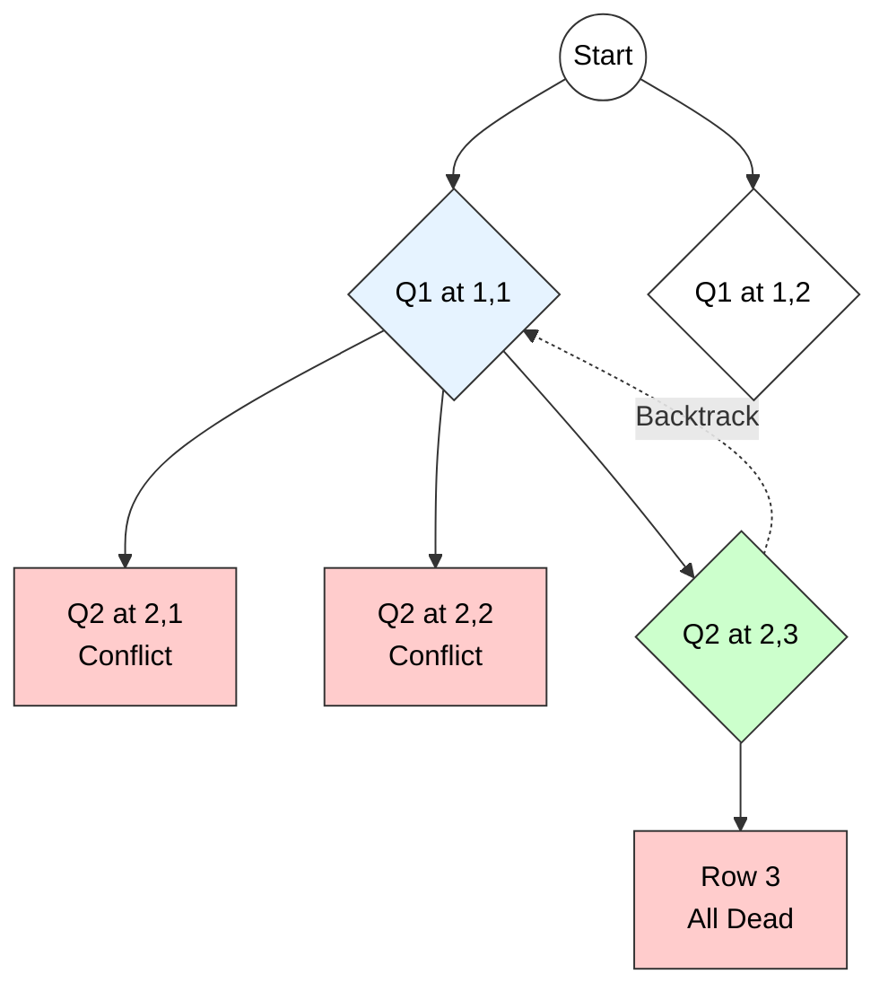

# Backtracking Algorithm

## 1. Principle of Backtracking

**Definition:**
Backtracking is a general algorithmic technique that considers searching every possible combination in order to solve a computational problem. It builds candidates for the solution incrementally and abandons a candidate ("backtracks") as soon as it determines that the candidate cannot possibly be completed to a valid solution.

### Key Technical Concepts
1.  **State Space Tree:** The problem is modeled as a tree where each node represents a partial solution.
2.  **Depth First Search (DFS):** The tree is explored using DFS. It goes as deep as possible along one branch before backtracking.
3.  **Bounding Function (Pruning):** A criteria used to check if a node is **promising**.
    * **Promising:** The partial solution can potentially lead to a complete solution.
    * **Non-Promising (Dead End):** The partial solution violates constraints. The subtree rooted at this node is pruned (skipped).

---

## 2. Control Abstraction (Pseudocode)

The general recursive algorithm for backtracking is as follows:

**Algorithm** `Backtrack(k)`
* **Input:** $k$ is the index of the component currently being decided.
* **Global:** $X[1..n]$ stores the solution vector.

```cpp
Algorithm Backtrack(k) {
    // Iterate through all possible values for the k-th component
    for each value xi in Domain do {
        
        X[k] = xi; // Tentatively assign value
        
        // Check if this assignment is valid (Promising)
        if (Place(k, X) == true) then {
            
            // Check if solution is complete
            if (k == n) then
                Print(X[1..n]); // Solution Found
            else
                Backtrack(k + 1); // Recursive Step: Move to next component
        }
        // If not promising, the loop continues to the next value (Implicit Backtracking)
    }
}
````

-----

## 3\. Suitable Example: 4-Queens Problem

**Problem:** Place 4 queens on a $4 \times 4$ chessboard such that no two queens attack each other (no shared row, column, or diagonal).

**Process:**

1.  Place Q1 at $(1, 1)$.
2.  Try placing Q2. Positions $(2, 1)$ and $(2, 2)$ are attacked. Place at $(2, 3)$.
3.  Try placing Q3. All positions in Row 3 are attacked by Q1 or Q2.
4.  **Backtrack:** Go back to Q2, move it to $(2, 4)$.
5.  Retry Q3...

### State Space Tree Diagram

[Image of state space tree diagram]



-----

## 4\. Time Analysis of Control Abstraction

The time complexity of backtracking is determined by the number of nodes in the state space tree generated.

1.  **Worst-Case Scenario:**

      * If the bounding function is ineffective (never prunes), the algorithm generates the entire tree.
      * For a problem selecting subsets (e.g., Sum of Subsets), the tree size is **$O(2^n)$**.
      * For a problem identifying permutations (e.g., N-Queens, TSP), the tree size is **$O(n!)$**.

2.  **Average Case:**

      * With an effective bounding function, the number of nodes actually visited is significantly less than the worst case.
      * However, theoretically, the upper bound remains exponential.

**Conclusion:** Backtracking is an **Exponential Time** algorithm, but it is often efficient in practice for small to medium inputs due to pruning.


# Backtracking – Principle, Control Abstraction, and Time Analysis  
*(Clear, pointwise, exam-oriented with example and small diagram)*

---

# 1. Principle of Backtracking

Backtracking is a **depth-first search (DFS)** strategy used to solve **constraint satisfaction problems** by exploring the state-space tree and **pruning** infeasible or non-promising branches.

### **Principle (Core Idea)**  
> **Build the solution incrementally, and whenever the partial solution becomes infeasible or cannot lead to a valid complete solution, BACKTRACK and try a different option.**

### **Technical Keywords:**  
feasibility check, pruning, bounding condition, partial solution, state-space tree, DFS, backtrack.

---

# 2. Control Abstraction for Backtracking

This is the **generic template** used for all backtracking algorithms.

```text
Procedure Backtrack(k)
Input:  k → current stage / decision index
Output: All feasible solutions up to stage k

if Solution(k) then
      output current solution
else
      for each candidate c in Candidate(k) do
            if Feasible(c, k) then
                  Add c to partial solution
                  Backtrack(k + 1)
                  Remove c from partial solution   // Undo (backtrack)
````

### Explanation of Key Functions

* **Solution(k)** → checks whether a complete solution has been formed.
* **Candidate(k)** → returns all possible choices at stage k.
* **Feasible(c, k)** → ensures adding candidate c keeps the partial solution valid.
* **Backtrack(k+1)** → recursively explores next decision.

---

# 3. Small Diagram (State Space Tree Concept)

Example shown for backtracking on a 3-variable decision problem:

```text
                        Start
                          ●
                        /   \
                     x1=a   x1=b
                      ●       ●
                    /  \     /  \
               x2=a  x2=b x2=a  x2=b
                 ●      ●    ●      ●
               /  \    / \  / \    / \
         x3=a x3=b ... etc  (prune when infeasible)
```

* Each level = one decision (variable).
* Each branch = one candidate value.
* **Pruning** happens as soon as a feasibility check fails.

---

# 4. Example of Backtracking

### **Example: N-Queens Problem (n = 4)**

Problem: Place 4 queens on a 4×4 chessboard so that **no two queens attack each other**.

Backtracking decisions:

1. Place a queen in row 1
2. Move to next row
3. Try each column
4. If conflict: **prune** and backtrack

Backtracking explores only feasible (non-attacking) placements.

---

# 5. Time Analysis of Backtracking Control Abstraction

Let:

* **n** = number of decision stages
* **b** = branching factor (candidates per stage)

### **Worst-Case Time Complexity**

Backtracking may explore **all nodes** in the search tree:

[
T(n) = O(b^n)
]

This happens when:

* No pruning is effective
* All candidate choices must be explored

### **Best Case (With Strong Pruning)**

If many branches are pruned early:

[
T(n) \ll b^n
]

The exact time depends on:

* Number of feasible nodes
* Structure of constraints
* Ordering of candidates

### **Space Complexity**

Backtracking uses **O(n)** space for:

* Recursion stack of depth n
* Partial solution vector

[
Space = O(n)
]

---

# 6. Summary (Exam-Ready Points)

* **Principle**: Build partial solutions, prune infeasible ones, and backtrack.
* **Control Abstraction**: DFS procedure with feasibility checks and recursive exploration.
* **Time Analysis**: Worst-case exponential
  [
  T(n) = O(b^n)
  ]
* **Space**: O(n) due to recursion and partial solutions.
* **Used for**: N-Queens, Graph Colouring, Sum of Subsets, Hamiltonian Cycle, Sudoku, etc.

---


