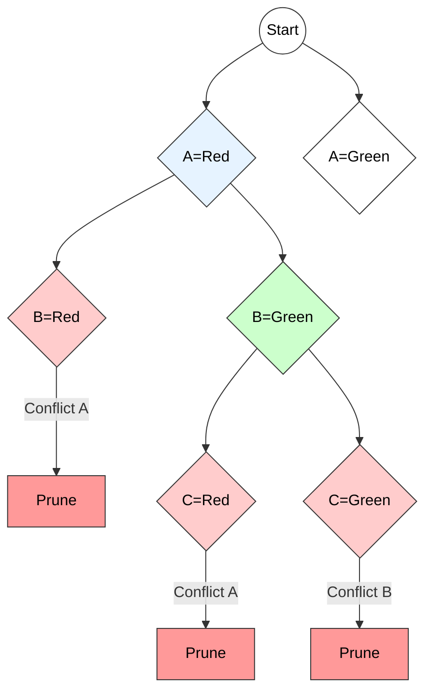

# Backtracking: Graph Coloring Problem

## 1. Problem Statement (m-Coloring)
**Definition:**
Given an undirected graph $G = (V, E)$ and an integer $m$ (number of colors), the problem is to determine if it is possible to assign a color to each vertex $v \in V$ such that **no two adjacent vertices share the same color**.

**Objective:**
Find a solution vector $X = (x_1, x_2, \dots, x_n)$ where $x_i$ is the color of vertex $i$ ($1 \le x_i \le m$), satisfying the constraint:
$$\text{If } (u, v) \in E \implies \text{color}(u) \neq \text{color}(v)$$

* If such a coloring exists, the graph is **m-colorable**.
* The smallest integer $m$ for which the graph is colorable is called the **Chromatic Number** ($\chi(G)$).

---

## 2. Backtracking Approach

Backtracking solves this by incrementally building the solution vector one vertex at a time.

### Mechanism
1.  **Start:** Begin with vertex 1.
2.  **Assignment:** Assign the first valid color (from $1$ to $m$) to the current vertex $k$.
3.  **Safety Check (Bounding Function):** Check if the assigned color conflicts with any already colored adjacent vertices.
    * **Safe:** If no conflict, move to vertex $k+1$.
    * **Unsafe:** Try the next color for vertex $k$.
4.  **Backtrack:** If all $m$ colors have been tried for vertex $k$ and none work, return to vertex $k-1$ and change its color.
5.  **Termination:** If all vertices are colored ($k=n$), print the solution.

---

## 3. Algorithm (Pseudocode)

**Algorithm** `mColoring(k)`
* **Input:** $k$ (index of vertex).
* **Global:** $G$ (Graph), $X$ (Solution array), $m$ (Colors).

```cpp
mColoring(k) {
    // Try to assign a color to vertex k
    TryNextColor(k); 
    
    // If no valid color could be assigned, backtrack
    if (X[k] == 0) return; 
    
    // If all vertices are colored, print the solution
    if (k == n) 
        Print(X); // Solution found
    
    // Otherwise, move to the next vertex
    else 
        mColoring(k + 1); // Proceed to next vertex
}
TryNextColor(k) {
    // Try all colors from 1 to m
    for each color from 1 to m do {
        X[k] = color; // Assign the color to vertex k
        
        // Check if assigning this color causes a conflict with adjacent vertices
        conflict = false;
        for each vertex j adjacent to k do {
            if (X[k] == X[j]) { 
                conflict = true; 
                break; // Conflict found, stop checking further
            }
        }

        // If no conflict, this color is valid for vertex k
        if (!conflict) return; // Valid color found, exit the loop
    }
    
    // If no valid color found, set X[k] to 0 and backtrack
    X[k] = 0;
}

````

-----

## 4\. Visual Example

**Graph:** A simple triangle (3 vertices: A, B, C) connected to each other.
**Colors ($m=2$):** Red, Green.

**Execution Trace:**

1.  **A = Red:** Valid. Move to B.
2.  **B = Red:** Conflict with A.
3.  **B = Green:** Valid. Move to C.
4.  **C = Red:** Conflict with A.
5.  **C = Green:** Conflict with B.
6.  **Backtrack to B:** No more colors for B.
7.  **Backtrack to A:** Change A to Green.
8.  **...** (Eventually proves 2 colors are insufficient).

### State Space Tree Diagram




-----

## 5\. Complexity Analysis

1.  **Time Complexity:**

      * In the worst case (e.g., trying to find all solutions), we explore the entire state space tree.
      * Branching factor = $m$ (colors).
      * Depth = $n$ (vertices).
      * Total Nodes $\approx m^n$.
      * Complexity: **$O(m^n)$** (Exponential).

2.  **Space Complexity:**

      * We store the solution vector $X$ of size $n$.
      * Recursion stack depth is $n$.
      * Complexity: **$O(n)$** (Linear).

### Applications

  * Map Coloring (Planar graphs).
  * Register Allocation in Compilers.
  * Timetable Scheduling (Exam slots).

<!-- end list -->

# Backtracking with Graph Coloring  
*(Clear, pointwise, technical explanation with small diagram – exam-ready)*

---

# 1. Introduction

Graph Coloring is a classic **constraint satisfaction problem**.  
Given a graph \( G(V, E) \) and **m colours**, the goal is to assign a colour to every vertex such that:

> **No two adjacent vertices share the same colour.**

Backtracking is used to **explore the state space tree** of colour assignments and **prune** infeasible partial solutions.

### **Technical Keywords:**  
backtracking, DFS search, feasibility check, pruning, state-space tree, adjacency constraint, m-coloring.

---

# 2. Problem Definition

Given:

- A graph with \( n \) vertices:  
  \( V = \{1, 2, ..., n\} \)
- Adjacency matrix \( G[i][j] \), where  
  \( G[i][j] = 1 \) if there is an edge between vertex \( i \) and \( j \)
- A set of **m available colours**:  
  \( C = \{1, 2, ..., m\} \)

**Task:** Assign colours to all vertices such that  
**adjacent vertices have different colours.**

---

# 3. Backtracking Principle for Graph Coloring

Backtracking tries to colour each vertex **one by one**:

1. Try assigning each of the **m colours** to the current vertex.  
2. Before assigning, check if the colour is **safe** (no neighbour has same colour).  
3. If safe → continue to next vertex.  
4. If no colour is safe → **backtrack** and change the colour of previous vertex.

This produces a **DFS traversal** of the colouring search tree.

---

# 4. Feasibility Check (IsSafe Function)

A colour assignment to vertex `v` is **feasible** if:

```text
For every vertex u:
    If (u adjacent to v) AND (color[u] == color[v]):
          Then the assignment is NOT feasible.
````

This ensures graph colouring constraints are satisfied.

---

# 5. Backtracking Algorithm for Graph Coloring

```text
Procedure ColorGraph(v)
Input : v → current vertex index

if v > n then
      output color[1..n]    // Found one valid coloring
      return

for c ← 1 to m do
      if IsSafe(v, c) then
            color[v] ← c
            ColorGraph(v + 1)
            color[v] ← 0         // Backtrack
```

### Driver Code

```text
Initialize color[1..n] ← 0
Call ColorGraph(1)
```

---

# 6. Small State Space Tree (Conceptual)

Example for 3 colours (m = 3):

```text
                        v1
                 /       |        \
            c1            c2           c3
             ●             ●             ●
             |              \             \
            v2               v2            v2
        /   |   \        /   |   \
     c1   c2   c3     c1   c2   c3
      X    ●    ●       ●   X    ●
         /   \             \
       v3    v3            v3
```

* Each level represents a **vertex** to color.
* Each branch represents a **colour choice**.
* **X** marks invalid choices where neighbours have the same colour → pruned.

---

# 7. Time Complexity Analysis

Let:

* ( n ) = number of vertices
* ( m ) = number of colours

### **Worst-Case Time Complexity**

All vertices may try all colours → full m-ary tree:

[
T(n) = O(m^n)
]

Backtracking may avoid exploring large sections due to pruning, but theoretically:

* Still **exponential**, as graph colouring is NP-complete.

### **Space Complexity**

* Depth of recursion = ( n )
* Colour array = size ( n )

[
Space = O(n)
]

---

# 8. Final Exam-Ready Summary

* Backtracking for graph colouring assigns colours to vertices **one at a time**, checking if each assignment is **feasible**.
* Uses **pruning** to avoid exploring invalid colour assignments.
* Implemented with a **recursive DFS** algorithm.
* Time complexity is **exponential (O(m^n))**, but pruning improves practical performance.
* Suitable for combinatorial CSPs like N-Queens, Sudoku, and Graph Colouring.

---

