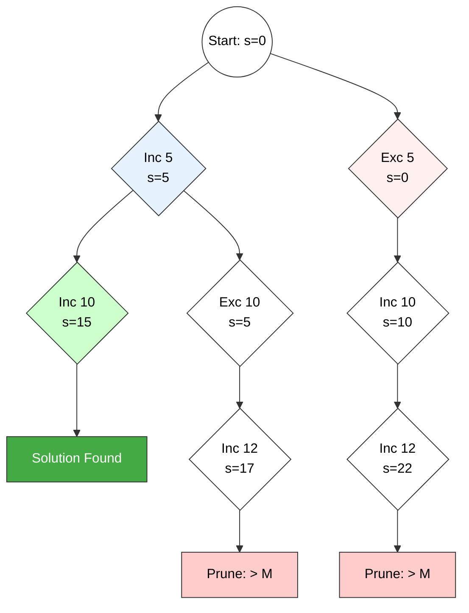

# Sum of Subsets Problem (Backtracking)

## 1. Problem Statement
**Definition:**
Given a set of $n$ distinct positive numbers (weights) $W = \{w_1, w_2, \dots, w_n\}$ and a target sum $M$, the problem is to find all possible subsets of $W$ such that the sum of the elements in the subset is exactly equal to $M$.

**Mathematical Formulation:**
Find a solution vector $X = (x_1, x_2, \dots, x_n)$ where $x_i \in \{0, 1\}$, such that:
$$\sum_{i=1}^{n} w_i x_i = M$$
* $x_i = 1$: Item $w_i$ is included.
* $x_i = 0$: Item $w_i$ is excluded.

---

## 2. Algorithm (Backtracking)

The solution uses a **State Space Tree** approach. We invoke a recursive procedure `SumOfSub` that explores the binary tree.

### Bounding Functions (Pruning Criteria)
To minimize unnecessary computations, we stop generating nodes if:
1.  **Exceeds Target:** The current sum plus the next element exceeds $M$ ($s + w[k] > M$).
2.  **Cannot Reach Target:** Even if we take all remaining elements, the sum is still less than $M$ ($s + r < M$).

### Pseudocode

**Algorithm** `SumOfSub(s, k, r)`
* **Inputs:**
    * $s$: Current sum of selected elements.
    * $k$: Index of the current element being decided.
    * $r$: Total sum of remaining elements ($w_k$ to $w_n$).
* **Global:** $X$ (Solution vector), $W$ (Weights), $M$ (Target).

```cpp
Algorithm SumOfSubsets(s, k, r) {
    // 1. Generate Left Child (Include w[k])
    x[k] = 1;
    
    // Check if Including leads to a Solution
    if (s + w[k] == M) {
        print(x[1...k]); // Solution Found
    }
    // Check if Promising to continue Left
    else if (s + w[k] + w[k+1] <= M) {
        SumOfSubsets(s + w[k], k + 1, r - w[k]);
    }

    // 2. Generate Right Child (Exclude w[k])
    // Pruning: Can we still reach M without w[k]?
    if ((s + r - w[k] >= M) && (s + w[k+1] <= M)) {
        x[k] = 0;
        SumOfSubsets(s, k + 1, r - w[k]);
    }
}
````

-----

## 3\. State Space Tree Diagram

**Example:** $W = \{5, 10, 12, 13\}$, $M = 15$.

[Image of state space tree diagram]





-----

## 4\. Time Complexity Analysis

  * **Structure:** The problem generates a binary tree where each level represents an element from the set $W$.
  * **Depth:** The depth of the tree is $n$ (number of elements).
  * **Total Nodes:** In the worst case (without effective pruning), the algorithm explores all possible subsets. The number of nodes in a full binary tree of depth $n$ is $2^{n+1} - 1$.
  * **Complexity:**
    $$
    O(2^n)
    $$
    This is an **Exponential Time** algorithm.

### Key Technical Notes

  * **NP-Complete:** The Sum of Subsets problem is a classic NP-Complete problem.
  * **Optimization:** Sorting the weights $W$ in ascending order initially can significantly improve the efficiency of the pruning functions.

<!-- end list -->


---
# Sum of Subsets Problem – Backtracking

---

## 1. Problem Statement (Sum of Subsets)

Given:

- A set of **positive integers (weights)**
- $S = \{w_1, w_2, \dots, w_n\}$

  
- A **target sum**  
  $M$

**Sum of Subsets Problem:**

> Find all subsets of \( S \) whose sum is exactly equal to \( M \), i.e.,  
> find all subsets \( S' \subseteq S \) such that  
> $$ \sum_{w_i \in S'} w_i = M. $$

This problem is solved using the **backtracking method**, where we systematically **include or exclude** each element and **prune** infeasible partial solutions.

---

## 2. Idea of Backtracking Solution (Technical Overview)

- Represent choices using a **state space tree**:
  - At each level \( i \), we decide whether to **include** or **exclude** \( w_i \).
- Maintain:
  - `sum` → current partial sum of chosen elements  
  - `remaining` → sum of elements not yet considered
- Use **bounding conditions** to **prune branches**:
  - If `sum > M` → cannot reach a valid solution (prune).  
  - If `sum + remaining < M` → even if we take all remaining elements, we cannot reach `M` (prune).

**Technical keywords:** backtracking, state space tree, bounding, pruning, feasibility check, solution vector.

---

## 3. Algorithm to Solve Sum of Subsets Using Backtracking

### Notation

- `w[1..n]` – array of weights (often sorted in non-decreasing order)  
- `x[1..n]` – solution vector, where  
  $$ 
  x_i =
  \begin{cases}
  1, & \text{if } w_i \text{ is included} \\
  0, & \text{otherwise}
  \end{cases}
  $$
- `M` – target sum  
- `sum` – partial sum so far  
- `remaining` – sum of weights not yet processed  

---

### Recursive Backtracking Procedure

```text
Algorithm SumOfSubsets(i, sum, remaining)
Input : i         → current index (1..n)
        sum       → sum of included elements so far
        remaining → sum of w[j] for all j ≥ i
Global: w[1..n], x[1..n], M

// Check if current partial subset is a complete solution
if sum == M then
      output x[1..n] as one valid subset
      return

// If no more elements, or cannot reach M, prune this branch
if i > n or sum > M or sum + remaining < M then
      return

// Case 1: Include w[i]
x[i] ← 1
SumOfSubsets(i + 1, sum + w[i], remaining - w[i])

// Case 2: Exclude w[i]
x[i] ← 0
SumOfSubsets(i + 1, sum, remaining - w[i])
````

---

### Driver Procedure

```text
Algorithm SumOfSubsetsDriver()
Input : n, w[1..n], M

Compute total ← w[1] + w[2] + ... + w[n]
Initialize x[1..n] ← 0

Call SumOfSubsets(1, 0, total)
```

---

## 4. Small State Space Tree Diagram (Conceptual)

Example for ( n = 3 ) with elements ( w_1, w_2, w_3 ):

```text
                      (i=1, sum=0)
                            ●
                      /           \
             include w1          exclude w1
               x1=1                x1=0
                 ●                   ●
              /     \             /      \
     include w2   exclude w2  include w2  exclude w2
        x2=1        x2=0        x2=1        x2=0
          ●           ●           ●           ●
          .           .           .           .
    (decisions for w3 at next level, with pruning
     when sum > M or sum + remaining < M)
```

* Each **level ( i )** corresponds to a decision about **( w_i )**.
* **Left child**: include ( w_i ) (set ( x_i = 1 ))
* **Right child**: exclude ( w_i ) (set ( x_i = 0 ))
* **Pruning** avoids exploring branches that can never reach sum ( M ).

---

## 5. Time Complexity of the Backtracking Algorithm

Let ( n ) = number of elements.

### 5.1 Worst-Case Time Complexity

* In the **worst case**, the bounding conditions may **fail to prune** many branches.
* Then, the algorithm explores **all possible subsets**.
* Number of subsets of ( n ) elements:
  $$ 2^n $$
* Therefore, the **worst-case time complexity** is:
  $$ T(n) = O(2^n) $$

### 5.2 Practical Behavior (With Pruning)

* Bounding conditions:

  * `sum > M`
  * `sum + remaining < M`
    prune a large part of the **state space tree**.
* In practice, this can significantly **reduce** the number of nodes visited.
* However, **asymptotically** the worst-case complexity remains:
  $$ T(n) = O(2^n) $$

### 5.3 Space Complexity

* Recursion depth is at most ( n ).
* Arrays `w[1..n]` and `x[1..n]` are used.
* Hence, **space complexity**:
  $$ O(n) $$

---

## 6. Exam-Ready Summary

* **Sum of subsets problem**: find all subsets of ( {w_1, \dots, w_n} ) whose sum equals a given target ( M ).
* Solved using **backtracking** by exploring a **binary state space tree** of include/exclude decisions.
* Uses **bounding and pruning** to avoid exploring infeasible partial solutions (`sum > M` or `sum + remaining < M`).
* **Worst-case time complexity**:
  $$ O(2^n) $$
* **Space complexity**:
  $$ O(n) $$

---

```


