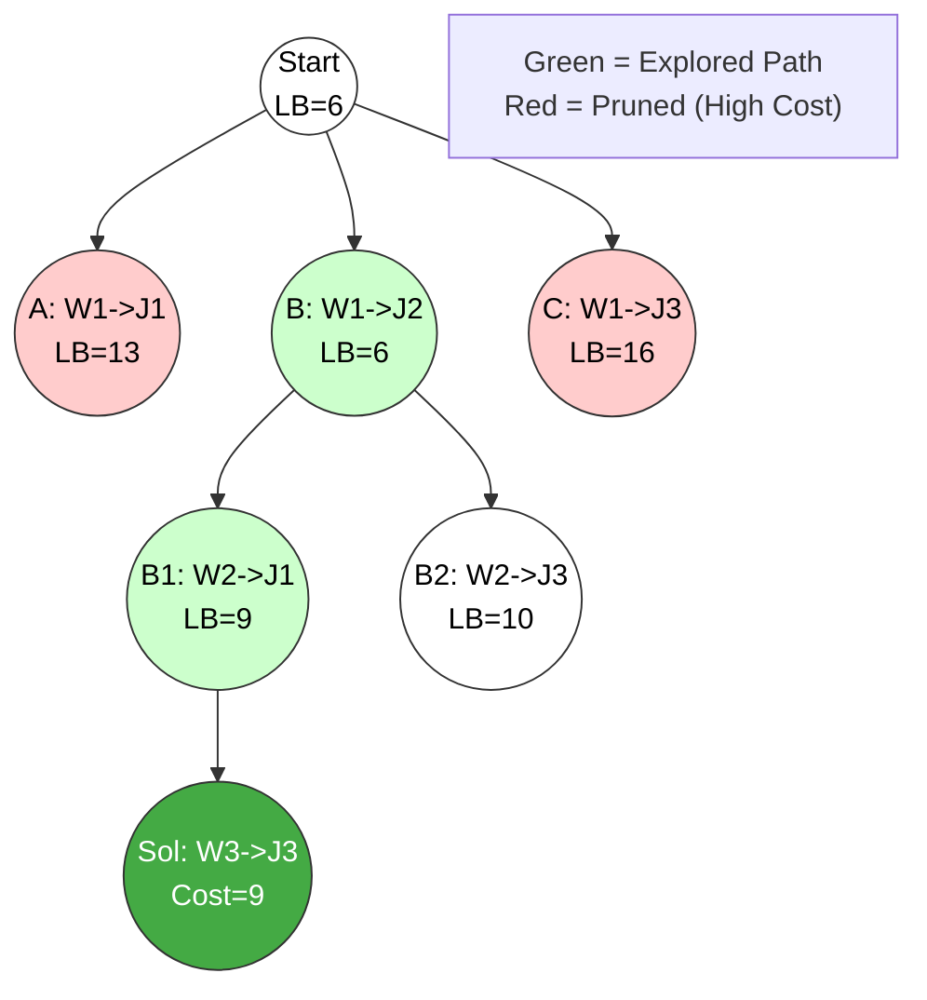

NOTPYQ
# Branch and Bound (B&B) Method

## 1. Principle of Branch and Bound

**Definition:**
Branch and Bound is an algorithm design paradigm used for solving combinatorial **optimization problems** (minimization or maximization). Unlike Backtracking (which uses DFS), Branch and Bound typically uses **Breadth-First Search (BFS)** or **Best-First Search (LC-Search)** to traverse the state space tree.

### Key Technical Concepts
1.  **State Space Tree:** The problem is viewed as a search through a tree of partial solutions.
2.  **Live Nodes:** Nodes that have been generated but whose children have not yet been fully explored.
3.  **Bounding Function:** A heuristic function that calculates a lower bound (for minimization) or upper bound (for maximization) on the cost of any solution reachable from a node.
4.  **Pruning (Fathoming):**
    * If the calculated bound of a node is worse than the current best solution found so far (Global Upper Bound), the node is killed (pruned).
    * This prevents searching non-optimal subtrees.
5.  **Search Strategy:**
    * **FIFO B&B:** Uses a Queue (Level-by-level).
    * **LC (Least Cost) B&B:** Uses a **Priority Queue** (Min-Heap) to explore the most promising node first.

---

## 2. Control Abstraction (Least Cost Search)

The general algorithm for **LC-Branch and Bound** (Minimization problem) is:

**Algorithm** `LC_BranchBound(CostMatrix)`
* **Input:** Problem instance (e.g., Cost Matrix).
* **Data Structure:** `MinHeap` (Priority Queue) to store live nodes.
* **Global:** `UpperBound` (initialized to $\infty$).

```cpp
Algorithm LC_BranchBound(ProblemInstance) {
    MinHeap H; // List of active nodes
    Node E, Child;
    
    // Initialize Root
    E = CreateRootNode();
    E.cost = CalculateBound(E);
    H.Insert(E);
    
    UpperBound = infinity;
    
    while (not H.IsEmpty()) {
        E = H.DeleteMin(); // Extract node with lowest lower bound
        
        if (E.cost >= UpperBound) continue; // Prune
        
        // Generate Children
        for each child C of E {
            C.cost = CalculateBound(C);
            
            if (IsCompleteSolution(C)) {
                 if (C.cost < UpperBound) {
                     UpperBound = C.cost; // Update best solution
                     BestSolution = C;
                 }
            }
            else if (C.cost < UpperBound) {
                H.Insert(C); // Add to list of live nodes
            }
            else {
                Kill(C); // Prune: Bound is worse than known solution
            }
        }
    }
    return BestSolution;
}
````

-----

## 3\. Suitable Example: Assignment Problem (Minimization)

**Problem:** Assign 3 jobs ($J_1, J_2, J_3$) to 3 workers ($W_1, W_2, W_3$) such that the total cost is minimized.

**Cost Matrix:**
| | J1 | J2 | J3 |
|---|---|---|---|
| **W1** | 9 | 2 | 7 |
| **W2** | 6 | 4 | 3 |
| **W3** | 5 | 8 | 1 |

**Step 1: Calculate Bounds (Lower Bound Logic)**

  * A simple lower bound is the sum of the minimum elements in each row of the available sub-matrix.
  * **Root (Start):** Min(Row1)=2, Min(Row2)=3, Min(Row3)=1. **LB = 2+3+1 = 6**.

**Step 2: Exploration (Best-First)**

1.  **Expand Root:**
      * **Child A (W1 $\to$ J1):** Cost = 9. Rem Matrix (W2, W3 vs J2, J3). LB = 9 + (3+1) = 13.
      * **Child B (W1 $\to$ J2):** Cost = 2. Rem Matrix (W2, W3 vs J1, J3). LB = 2 + (3+1) = 6.
      * **Child C (W1 $\to$ J3):** Cost = 7. Rem Matrix (W2, W3 vs J1, J2). LB = 7 + (4+5) = 16.
2.  **Selection:** Child B has lowest LB (6). Expand B.
      * **Child B1 (W2 $\to$ J1):** Cost = 2+6 = 8. LB = 8 + (1) = 9.
      * **Child B2 (W2 $\to$ J3):** Cost = 2+3 = 5. LB = 5 + (5) = 10.
3.  **Selection:** Child B1 has lowest LB (9). Expand B1.
      * **Leaf (W3 $\to$ J3):** Cost = 8+1 = 9. **Solution Found.**

### State Space Tree Diagram



-----

## 4\. Time Analysis of Control Abstraction

1.  **Worst-Case Time Complexity:**

      * In the worst case (poor bounding function), the algorithm visits every node in the state space tree.
      * Complexity: **Exponential** ($O(2^n)$ or $O(n!)$ depending on the problem).
      * Example: TSP worst case is $O(n!)$.

2.  **Space Complexity (Major Drawback):**

      * Since BFS/Best-First search maintains a list of **Live Nodes** in memory (Priority Queue), the memory consumption can be exponential.
      * **$O(2^n)$** in worst case.

3.  **Average Case:**

      * With a strong bounding function, large subtrees are pruned effectively.
      * It is generally faster than Backtracking for optimization problems but consumes significantly more memory.

<!-- end list -->


# Branch and Bound – Principle, Control Abstraction, and Time Analysis  
*(Clear, pointwise, exam-oriented with example and small diagram)*

---

# 1. Principle of Branch and Bound

Branch and Bound (**B&B**) is a **state-space search strategy** used primarily for **optimization problems** (minimization/maximization).  
It systematically explores the search tree but uses **bounds** to prune non-promising branches.

### **Principle (Core Idea)**  
> **Divide the problem into subproblems (branching), compute a bound on the best possible solution from each subproblem, and prune (bound) those subproblems whose bound is worse than the best known solution.**

### **Technical Keywords:**  
bounding function, promising node, cost/benefit estimate, best-first search, pruning, priority queue, optimal solution, state-space tree.

---

# 2. Control Abstraction for Branch and Bound

This is the **generic algorithmic template** for B&B.

```text
Procedure BranchAndBound()
Input  : Initial problem state
Output : Optimal solution

1. Insert the root node into a priority queue (ordered by bound value)

2. While the priority queue is not empty do
       a. Remove the node with the best bound (most promising node)
       b. If the node represents a complete solution then
               update best_solution and best_bound
          else
               generate all child nodes (branching)
               for each child node do
                     compute its bound
                     if bound(child) is better than best_bound then
                           insert child into the priority queue
                     else
                           prune the child (discard)
3. Return best_solution
````

### Key Functions

* **Bound(node)** → computes the lower/upper bound of optimal solution from this node
* **Promising(node)** → true if bound(node) is good enough
* **Branch(node)** → generates children (subproblems)

---

# 3. Small Diagram (Conceptual State-Space Tree)

```text
                      Root
                       ● (bound = 40)
                     /             \
           (bound=25)●             ●(bound=42)
                   /   \            (pruned)
        (15)●          ●(30)
        /   \         /   \
    (12)●  (16)   (28)●  (31)
     |       X       |       X
   Best      pruned  feasible pruned
```

* Each node shows its **bound**.
* Nodes with bounds worse than the current best solution are **pruned**.
* Only promising nodes are expanded.

---

# 4. Suitable Example – 0/1 Knapsack Using Branch and Bound

**Goal:** Maximize profit without exceeding capacity.

### Steps:

1. Compute **upper bound** = profit of current items + fractional profit of remaining items (like Fractional Knapsack).
2. Branch:

   * Include item i
   * Exclude item i
3. Use bound to prune:

   * If bound < current best profit → prune branch.

This ensures the method finds the **optimal** (globally best) solution.

---

# 5. Time Analysis of Control Abstraction

Let:

* **n** = number of decision variables (depth of tree)
* **b** = branching factor (usually 2)
* **B(v)** = cost of computing the bound

---

## **5.1 Worst-Case Time Complexity**

Even after bounding, B&B may explore all nodes of the state space tree:

[
T(n) = O(b^n)
]

For binary branching (common):

[
T(n) = O(2^n)
]

Because bounding may fail to prune nodes.

---

## **5.2 Practical Behavior (Best Case / Average Case)**

With strong bounds:

* Many branches are pruned early
* The number of explored nodes drops significantly
* Often close to polynomial for many structured inputs

But **theoretical complexity remains exponential**.

---

## **5.3 Cost of Bound Computation**

Each node expansion requires computing a **bound**, so practical runtime includes:

[
T(n) = O(b^n \cdot B(v))
]

Where:

* For Knapsack, ( B(v) = O(n) ) due to fractional profit computation
* For TSP, ( B(v) = O(n^2) )

---

## **5.4 Space Complexity**

Because B&B keeps a **priority queue** of active nodes:

[
Space = O(b^n)
]

Much higher than backtracking (which uses only O(n) stack space).

---

# 6. Final Exam-Ready Summary

* **Principle:** Branch and Bound uses **bounding** to prune non-promising branches and ensures **optimal** solutions.
* **Control Abstraction:** Uses a **priority queue**, **bound computation**, and **promising-node expansion**.
* **Example:** Widely used in **0/1 Knapsack**, **Travelling Salesman**, **Assignment Problem**, and **Job Scheduling**.
* **Time Analysis:**

  * Worst case:
    [
    O(2^n)
    ]
  * Practical time: significantly reduced due to pruning
  * Space requirement is high due to storing many live nodes.

---


