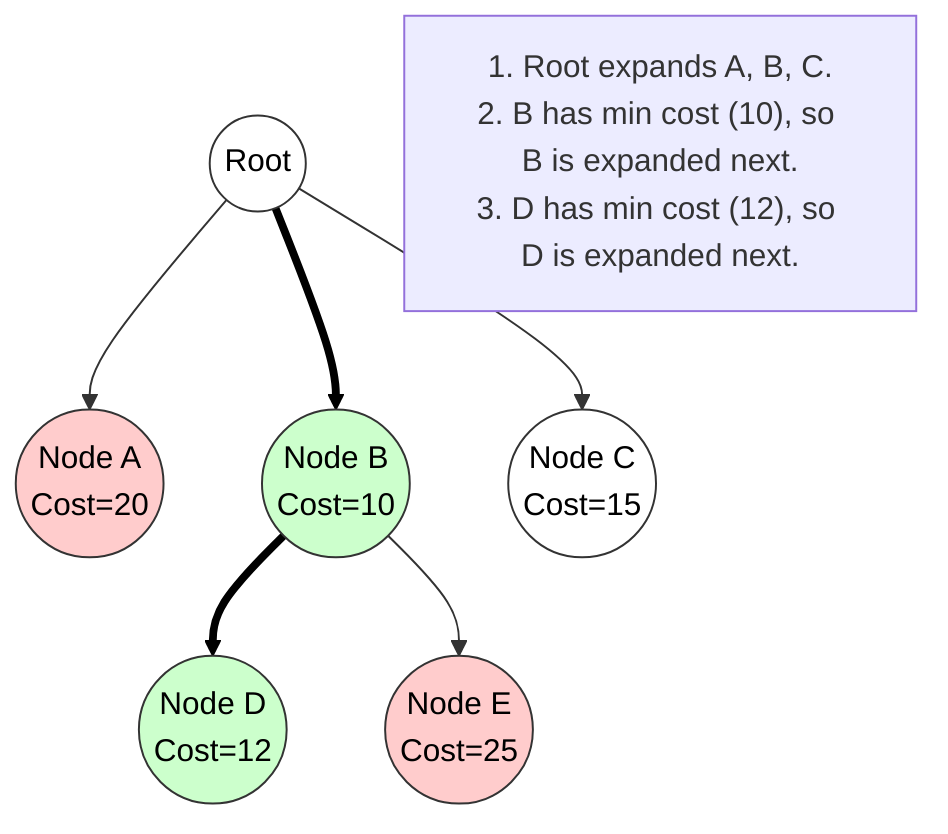

# Branch and Bound (B&B) and Least Cost Search

## 1. What is Branch and Bound?

**Definition:**
Branch and Bound (B&B) is an algorithm design technique used specifically for solving **Combinatorial Optimization Problems** (Minimization or Maximization). It explores the State Space Tree to find the global optimum.

### Key Principles
1.  **State Space Traversal:** Unlike Backtracking (which uses DFS), Branch and Bound typically traverses the tree using **Breadth-First Search (BFS)** or **Least Cost Search (Best-First)**.
2.  **The "Branch" Step:** The algorithm "branches" out by generating all children of the current active node (E-Node).
3.  **The "Bound" Step:** Every node is assigned a cost/bound value (e.g., Lower Bound for minimization).
    * If the bound of a node is worse than the best solution found so far (Upper Bound), the node is **pruned** (killed).
    * This prevents exploring non-promising subtrees.

### Terminology
* **Live Node:** A node that has been generated but whose children have not yet been generated.
* **E-Node (Expansion Node):** The live node currently being expanded.
* **Dead Node:** A generated node that is not to be expanded further (either fully explored or pruned).

---

## 2. Control Abstraction for Least Cost (LC) Search

**Concept:**
In LC Search, the selection of the next E-Node is based on a ranking function $\hat{c}(x)$. We use a **Min-Heap (Priority Queue)** to store live nodes. The node with the **minimum estimated cost** is selected first, regardless of its depth in the tree.

### Algorithm Pseudocode

**Algorithm** `LCSearch(t)`
* **Input:** `t` (Root of the state space tree).
* **Data Structure:** `LiveNodes` (A Min-Heap / Priority Queue).
* **Global:** `Ans` (Current best solution node), `Upper` (Current upper bound cost).

```cpp
Algorithm LCSearch(t) {
    if (t is an answer node) {
        Print(t);
        return;
    }
    
    // Initialize
    Initialize(LiveNodes); // Min-Heap
    E = t; // Current E-Node is Root
    Insert(LiveNodes, E);
    
    // Search Loop
    while (not IsEmpty(LiveNodes)) {
        
        // 1. Select Best Node
        E = DeleteMin(LiveNodes); // Extract node with lowest cost
        
        // 2. Bound Check (Pruning)
        if (Cost(E) >= Upper) {
             continue; // Prune: This path cannot be better than current best
        }
        
        // 3. Generate Children
        for each child C of E {
            C.cost = CalculateBound(C);
            
            if (C is a Solution) {
                if (C.cost < Upper) {
                    Upper = C.cost;
                    Ans = C; // Update Global Best
                }
            }
            else if (C.cost < Upper) {
                Insert(LiveNodes, C); // Add to Live Nodes
            }
            else {
                Kill(C); // Prune (Bound > Upper)
            }
        }
    }
    return Ans;
}
````

-----

## 3\. Diagram: LC Search Traversal

The following diagram illustrates how LC Search jumps between branches. Even though Node C is deeper, the algorithm expands Node B first because it has a lower cost.



### Key Technical Keywords

  * **Combinatorial Optimization**
  * **Priority Queue / Min-Heap**
  * **Cost Function $\hat{c}(x)$**
  * **Bounding Function**
  * **Fathoming (Pruning)**

<!-- end list -->


# Branch and Bound Method & Control Abstraction for Least Cost Search  
*(Clear, pointwise, technical, exam-oriented with a small diagram)*

---

# 1. What is Branch and Bound Method?

Branch and Bound (**B&B**) is a **systematic state-space search technique** used to solve **optimization problems** (minimization or maximization).  
It works by:

1. **Branching** → dividing a problem into smaller subproblems (children nodes).  
2. **Bounding** → computing a **bound** (lower/upper estimate) on the best solution obtainable from each subproblem.  
3. **Pruning** → eliminating nodes whose bound is **worse** than the best-known solution.  

### **Technical Keywords:**  
bounding function, promising node, cost estimate, priority queue, optimal solution, state-space tree, pruning, best-first search.

### **Advantages:**
- Prunes large parts of the search tree.  
- Guarantees **optimal** solution.  

### **Used For:**  
0/1 Knapsack, TSP, Assignment Problem, Scheduling, Integer Programming.

---

# 2. Control Abstraction for Least Cost Search  
(Used in Branch and Bound)

Least-cost search expands the **most promising node** (node with minimum cost or smallest bound) first.  
A **priority queue/min-heap** is used to select the next node.

```text
Procedure LeastCostSearch()
Input  : Root node of the problem
Output : Optimal solution

1. Initialize priority queue PQ
2. Insert root node into PQ with its cost/bound

3. While PQ is not empty do
        a. Remove node u from PQ with the least cost/bound
        b. If u represents a complete solution then
                update best_solution and best_cost
                continue        // or return if only one optimum is needed
        c. Generate all children of u          // Branching
        d. For each child v do
                compute cost(v) or bound(v)
                if bound(v) ≤ best_cost then   // Promising condition
                      insert v into PQ
                else
                      prune v                   // Discard non-promising node

4. Return best_solution
````

### Explanation of Key Steps

* **Priority Queue:** ensures nodes with least bound are explored first.
* **Cost/Bound:** indicates potential optimality (lower is better for minimization).
* **Promising Node:** a node whose bound does not exceed the current best cost.

---

# 3. Small Diagram (Least-Cost Search)

```text
                    Root (bound = 40)
                         ●
                   /             \
        (bound=25) ●           ● (bound=42)
                 /   \             (pruned)
      (15) ●           ● (30)
          /   \          \
   (12) ●   (18)●      (28) ●
       |         X         |
     best      pruned    expand next
```

* Node 15 is explored before node 30 because **15 < 30**.
* Node 42 is pruned since its bound is worse than the current best.

---

# 4. Exam-Ready Summary

* **Branch and Bound** is an optimization search strategy that uses **branching** to generate subproblems and **bounding** to prune infeasible or non-promising nodes.
* **Least-Cost Search** is a B&B strategy where the node with the **smallest bound** is expanded first, using a **priority queue**.
* Control abstraction includes:

  * Maintaining a priority queue
  * Selecting node with **minimum bound**
  * Generating children
  * Pruning nodes whose bound exceeds current best

This abstraction guarantees **optimal solutions** for many NP-hard optimization problems.

---


