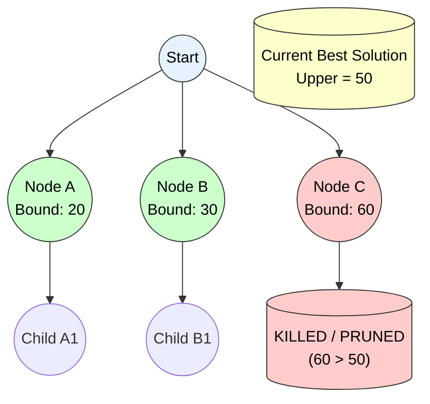

-----

# Branch and Bound (General Strategy)

## 1\. Principle

**Definition:**
Branch and Bound is a systematic method for solving **Combinatorial Optimization Problems**. It builds a state space tree and finds the optimal solution by exploring branches and "pruning" (killing) those that cannot possibly lead to a better solution than the one currently found.

**Core Mechanisms:**

1.  **Branching:** splitting a problem into smaller sub-problems (generating children nodes).
2.  **Bounding:** Calculating a lower/upper bound on the cost of any solution reachable from a node.
3.  **Pruning:** If a node's bound is worse than the current best solution, the node is **killed** (not added to the list of active nodes).
4.  **Selection Strategy:** The order in which nodes are explored depends on the data structure:
      * **FIFO B\&B:** Uses a **Queue** (Breadth-First).
      * **LIFO B\&B:** Uses a **Stack** (Depth-First).
      * **LC B\&B:** Uses a **Priority Queue** (Best-First).

-----

## 2\. Control Abstraction (General B\&B)

This pseudocode is generic. The function `NextLiveNode()` determines the strategy (FIFO, LIFO, or LC).

**Algorithm** `General_BB(t)`

  * **Input:** Root node `t`.
  * **Output:** Optimal solution.

<!-- end list -->

```cpp
Algorithm General_BB(t) {
    // 1. Initialize
    LiveNodeList = {t}; // Can be Queue, Stack, or Heap
    Upper = infinity;   // Current best solution cost
    Ans = null;

    // 2. Search Loop
    while (not IsEmpty(LiveNodeList)) {
        
        // Select next node based on strategy (FIFO/LIFO/LC)
        E = NextLiveNode(LiveNodeList); 
        
        // Pruning Check (Optimization)
        if (Bound(E) >= Upper) {
            continue; // Kill node
        }

        // 3. Generate Children
        for each child C of E {
            if (C is a Complete Solution) {
                // Is this the best solution so far?
                if (Cost(C) < Upper) {
                    Upper = Cost(C);
                    Ans = C;
                }
            }
            // If not complete, check if it's promising
            else if (Bound(C) < Upper) {
                Add(LiveNodeList, C); // Add to list for future expansion
            }
            else {
                Kill(C); // Prune: Bound is too high
            }
        }
    }
    return Ans;
}
```

-----

## 3\. Time Complexity Analysis

1.  **Worst Case:**

      * If the bounding function is ineffective (prunes nothing), B\&B explores the entire state space tree.
      * **Complexity:** **$O(b^d)$** (Exponential).
          * $b$: Branching factor (number of children per node).
          * $d$: Depth of the tree.
      * *Note: This is the same as Brute Force.*

2.  **Average Case:**

      * With a strong bounding function, large subtrees are pruned early.
      * The effective number of nodes visited is significantly less than $O(b^d)$, making it efficient for many practical problems (like TSP or Job Sequencing).

3.  **Space Complexity:**

      * Depends on the `LiveNodeList`. In the worst case, we must store all nodes at the current level (FIFO) or the frontier (LC).
      * **Complexity:** **$O(b^d)$** (Exponential growth of memory is the biggest drawback).

-----

## 4\. Visual Representation: Generic Pruning

The diagram below shows the generic concept: Node C is killed because its bound (60) is worse than the current best known solution (Upper = 50).


