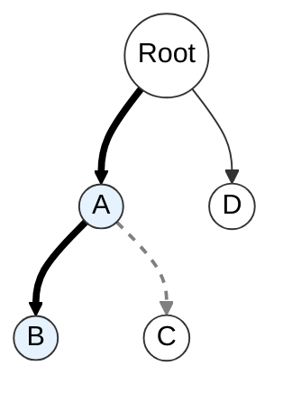
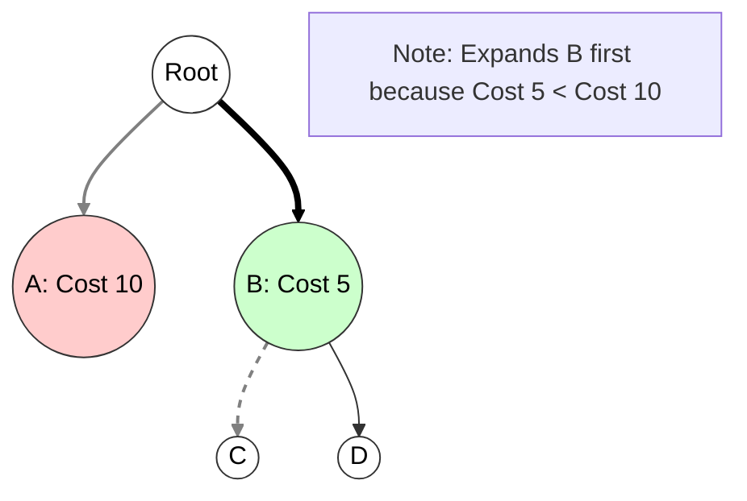

# Comparison: Backtracking vs. Branch and Bound (B&B)

## 1. Tabular Comparison

| Feature | Backtracking | Branch and Bound (B&B) |
| :--- | :--- | :--- |
| **Search Technique** | Uses **Depth First Search (DFS)**. It explores one path as deep as possible before backtracking. | Uses **Breadth First Search (BFS)** or **Best-First Search (LC-Search)**. It explores nodes level-by-level or based on cost. |
| **State Space Exploration** | Explores the tree in a **recursive** manner. Only the current path from the root is stored in the stack. | Maintains a list of **Live Nodes** (often in a Priority Queue/Min-Heap). It can jump across the tree to the most promising node. |
| **Pruning Mechanism** | Uses a **Bounding Function** to kill a node if it violates constraints. | Uses a **Cost Function** (Lower/Upper Bound) to prune nodes that cannot possibly lead to an optimal solution better than the one already found. |
| **Optimization Criteria** | Optimality is not the primary focus; often used to find **all feasible solutions**. | Explicitly designed for **Combinatorial Optimization** to find the single **global optimum** (Min/Max). |
| **Efficiency** | Generally slower for optimization because it may explore non-promising subtrees deeply. | More efficient for optimization as it prunes large sections of the tree early using bounds. |
| **Kind of Problems** | **Constraint Satisfaction Problems** (e.g., N-Queens, Graph Coloring, Hamiltonian Cycles). | **Optimization Problems** (e.g., Traveling Salesperson Problem, 0/1 Knapsack, Job Sequencing). |

---

## 2. Visual Comparison of State Space Exploration

### A. Backtracking (Depth-First)
* **Strategy:** Go deep, hit a dead end, retreat, try next branch.
* **Path:** Root $\to$ A $\to$ B $\to$ (Backtrack) $\to$ C.


note[Note: Follows one branch deeply (A->B) before C or D]
### B. Branch and Bound (Best-First / Level-Order)

  * **Strategy:** Generate all children, calculate costs, pick the best node to expand.
  * **Path:** Root $\to$ A & B (Calculate Costs) $\to$ Pick B (Best Cost) $\to$ Expand B.

<!-- end list -->



-----

## 3\. Key Technical Keywords

  * **Backtracking:** DFS, Recursion Stack, Feasibility Function, Constraint Satisfaction.
  * **Branch and Bound:** BFS, Least Cost (LC) Search, Min-Heap, Priority Queue, Lower Bound, Global Optimum.

<!-- end list -->


# Comparison: Backtracking vs Branch and Bound  
(With respect to Search Technique, State Space Exploration, and Types of Problems)

---

## 1. Introduction

Both **Backtracking** and **Branch and Bound (B&B)** are **state-space search strategies**, used for solving combinatorial problems.  
However, they differ in how they explore the search tree, how they prune nodes, and which types of problems they are suitable for.

---

# **2. Comparison (Pointwise, Exam-Ready)**

---

## **A. Search Technique**

### **Backtracking**
- Uses **depth-first search (DFS)**.
- Explores one path completely before backtracking.
- Prunes nodes using **feasibility checks** (constraint violations).
- Does *not* use cost/optimization bounds.

### **Branch and Bound**
- Uses **best-first search** or **breadth-first search** depending on implementation.
- Selects next node to explore based on **bound value** (usually stored in a priority queue).
- Prunes nodes using **upper/lower bounds** (optimization-based pruning).
- Always aims at **finding optimal solutions**.

---

## **B. Exploration of State Space Tree**

### **Backtracking**
- Explores the tree **systematically** (left-to-right DFS).
- A node is expanded only if it is **feasible**.
- Prunes nodes when constraints fail:
  - Example: partial sum > target in Sum of Subsets.
- Does **not** compute bounds or global information.

### **Branch and Bound**
- Uses **cost bounds** (like best possible profit or minimum distance).
- Expands the node with the **most promising bound** first.
- Uses **bounding + feasibility** for pruning.
- Can skip large portions of the tree due to strong bounds.
- More memory-intensive (stores many active nodes).

---

## **C. Kind of Problems Solved**

### **Backtracking**
Suitable for **decision problems** and **constraint satisfaction problems (CSP)**:
- N-Queens
- Graph Colouring
- Sudoku
- Sum of Subsets
- Hamiltonian Cycle
- Permutation generation

Focuses on **finding *a* feasible solution** (or all feasible solutions).

### **Branch and Bound**
Suitable for **optimization problems**, where a **best (optimal)** value must be found:
- 0/1 Knapsack (maximize profit)
- Travelling Salesman Problem (minimize cost)
- Job Scheduling
- Integer Programming
- Assignment Problem

Focuses on **finding the optimal solution**, not just any feasible one.

---

# **3. Small Diagram (Conceptual Difference)**

```text
                State Space Tree

        Backtracking (DFS)                    Branch & Bound
        ---------------------                 ----------------------

                ●                                     ●
               / \                                   / \
              ●   ●                               (bound values)
             /     \                               /         \
            ●       ●                             ●           ●
           / \     / \                          /   \       /   \
      Explore left branch fully         Explore best-bound node first
      and backtrack.                    before others.

Backtracking → depth-first search  
Branch & Bound → best-first / breadth-first using bounds
