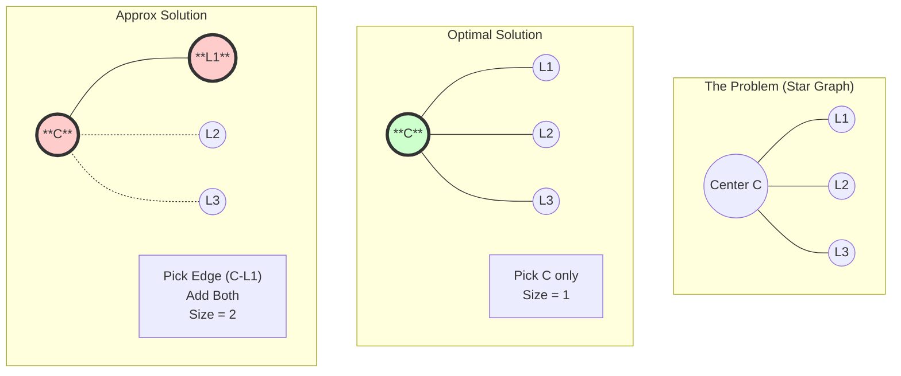

# Approximation Algorithms

## 1. Definition
An **Approximation Algorithm** is a technique used to find near-optimal solutions for **NP-Hard optimization problems** (where finding the exact optimal solution is computationally intractable/expensive).

* **Goal:** To find a solution in **Polynomial Time** that is guaranteed to be within a specific factor of the optimal solution.
* **Trade-off:** We sacrifice **Accuracy** (Optimality) to gain **Speed** (Efficiency).

## 2. Key Metrics
* **Approximation Ratio ($\rho$):** The core metric that bounds how "bad" the approximate solution can be compared to the optimal.
    * For **Minimization** problems:
        $$\frac{Cost(Approx)}{Cost(Optimal)} \le \rho$$
        (Where $\rho \ge 1$. A 2-approximation means the solution is never more than twice the cost of the optimal.)

## 3. Suitable Example: Vertex Cover Problem

**Problem:** Given a graph $G$, find the smallest set of vertices such that every edge in the graph is connected to at least one vertex in the set.
* **Complexity:** This is NP-Complete. Finding the absolute minimum is hard.

**Approximation Algorithm (2-Approximation):**
1.  Initialize set $C = \emptyset$.
2.  While edges remain in graph $G$:
    * Arbitrarily pick any edge $(u, v)$.
    * Add **both** $u$ and $v$ to $C$.
    * Remove all edges incident to $u$ or $v$ from $G$.
3.  Return $C$.

**Analysis:**
This simple algorithm guarantees a **2-Approximation**.
* **Why?** By picking both endpoints of an edge, we ensure the edge is covered. In the optimal solution, *at least one* of those two vertices must be chosen. Therefore, our set is at most twice the size of the optimal set ($|C_{approx}| \le 2 \times |C_{opt}|$).

---

## 4. Visual Representation: Star Graph Scenario

Consider a "Star Graph" where center $C$ is connected to leaves $L1, L2, L3$.

* **Optimal Solution:** Pick only **C**. (Size = 1).
* **Approx Algorithm:** Picks edge $(C, L1)$. Adds **{C, L1}**. Deletes all edges connected to $C$. (Size = 2).
* **Ratio:** $2 / 1 = 2$.



```
