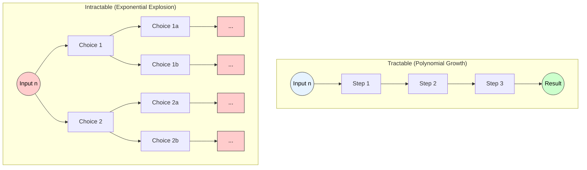

# Tractable vs. Non-Tractable Problems

## 1. Tractable Problems (Class P)

**Definition:**
A problem is called **Tractable** if there exists a deterministic algorithm that can solve it in **Polynomial Time**. These are problems that can be solved efficiently, even for relatively large input sizes.

**Technical Characteristics:**
* **Complexity Class:** Belongs to **Class P** (Polynomial).
* **Time Complexity:** The execution time is bounded by a polynomial function of the input size $n$.
    $$T(n) = O(n^k)$$ 
    where $k$ is a constant (e.g., $O(n), O(n \log n), O(n^2), O(n^3)$).
* **Feasibility:** Practical to solve for large datasets.

**Examples:**
1.  **Sorting:** Merge Sort ($O(n \log n)$).
2.  **Shortest Path:** Dijkstra's Algorithm ($O(E + V \log V)$).
3.  **Searching:** Binary Search ($O(\log n)$).
4.  **Matrix Multiplication:** Strassen’s Algorithm ($O(n^{2.81})$).

---

## 2. Non-Tractable Problems (Intractable)

**Definition:**
A problem is called **Non-Tractable** (or Intractable) if there is no known efficient algorithm to solve it. Solving these problems requires **Super-Polynomial Time** (typically Exponential or Factorial time). While they are theoretically solvable, they are practically impossible to solve for moderate to large inputs due to the "Combinatorial Explosion."

**Technical Characteristics:**
* **Complexity Class:** Often belongs to **Class NP-Hard** or **NP-Complete**.
* **Time Complexity:** The execution time grows exponentially or factorially.
    $$T(n) = O(k^n) \text{ or } O(n!)$$
    where $k > 1$.
* **Feasibility:** Solvable only for very small input sizes (e.g., $n \le 20$). Small increases in $n$ result in massive increases in time.

**Examples:**
1.  **Traveling Salesperson Problem (TSP):** $O(n^2 2^n)$ (using DP).
2.  **0/1 Knapsack Problem:** $O(2^n)$ (Naive).
3.  **Graph Coloring (m-coloring):** $O(m^n)$.
4.  **Hamiltonian Cycle:** Determining if a tour exists that visits every vertex exactly once.

---

## 3. Visual Comparison: Growth Rates

The diagram below illustrates the divergence between Tractable ($n^2$) and Non-Tractable ($2^n$) growth rates.



*(Note: In the chart above, the Intractable line shoots up vertically very quickly, demonstrating why large inputs are impossible to process.)*

-----

## 4\. Summary Differences

| Feature | Tractable | Non-Tractable |
| :--- | :--- | :--- |
| **Equation** | $O(n^k)$ | $O(k^n)$ or $O(n!)$ |
| **Algorithmic Class** | **P** (Polynomial) | Usually **NP-Hard** |
| **Efficiency** | Efficient | Inefficient |
| **Example** | Shortest Path | Traveling Salesman |
| **Solution Nature** | Exact solution found quickly | Often requires Heuristics or Approx. Algorithms |


---
# Tractable and Non-Tractable Problems  
*(Clear, pointwise, technical keywords, small diagram, exam-ready)*

---

# 1. Tractable Problems

### **Definition**
A problem is called **tractable** if it can be solved in **polynomial time**, i.e., its time complexity is:

$$
O(n^k) \quad \text{for some constant } k
$$

Tractable problems are considered **efficiently solvable** on deterministic machines.

### **Key Characteristics**
- Solvable in **polynomial time**: P class  
- Running time grows **manageable** with input size  
- Algorithms are **feasible** for large inputs  
- Problems typically belong to:  
  - **P (Polynomial-Time)**  
  - **Sometimes NP problems with polynomial algorithms**

### **Examples**
- Searching (Binary Search) → `O(log n)`  
- Sorting (Merge Sort, Quick Sort) → `O(n log n)`  
- Shortest path (Dijkstra) → `O((V + E) log V)`  
- Minimum Spanning Tree (Kruskal, Prim) → `O(E log V)`  
- Matrix multiplication → `O(n^3)` (or better)

---

# 2. Non-Tractable Problems

### **Definition**
A problem is **non-tractable** (intractable) if:

> It **cannot** be solved in polynomial time;  
> its best-known algorithms require **exponential**, **factorial**, or **super-polynomial** time.

These problems become **computationally infeasible** even for moderately large input sizes.

### **Key Characteristics**
- Require **exponential time** or worse  
- Belong to **NP-hard**, **NP-complete**, **Undecidable** classes  
- Exhaustive search or brute-force methods needed  
- Not feasible for large inputs

### **Examples**
- Travelling Salesman Problem (TSP) → `O(n!)` brute force  
- 0/1 Knapsack (exact) → `O(2^n)`  
- Hamiltonian Cycle → NP-Complete  
- Graph Coloring (m-coloring) → NP-Complete  
- Satisfiability (SAT) → NP-Complete  
- Subset Sum (exact) → `O(2^n)`  
- Halting Problem → Undecidable (cannot be solved by any algorithm)

---

# 3. Small Diagram (Conceptual Classification)

```text
                     All Problems
                          |
              --------------------------
              |                        |
        Tractable                 Non-Tractable
     (Polynomial Time)       (Super-Polynomial Time)
              |                        |
     Examples: Sorting,         Examples: TSP, SAT,
      MST, Shortest Path         Knapsack, HC, etc.
````

---

# 4. Exam-Ready Summary

* **Tractable problems** → solvable in **polynomial time** (efficient).

  * Examples: Searching, Sorting, MST, Shortest Path.
* **Non-tractable problems** → require **exponential or worse** time; not feasible for large inputs.

  * Examples: TSP, SAT, Knapsack, Hamiltonian Cycle.
* Tractability is a fundamental concept in **computational complexity**, differentiating **feasible** vs **infeasible** problems.

---


