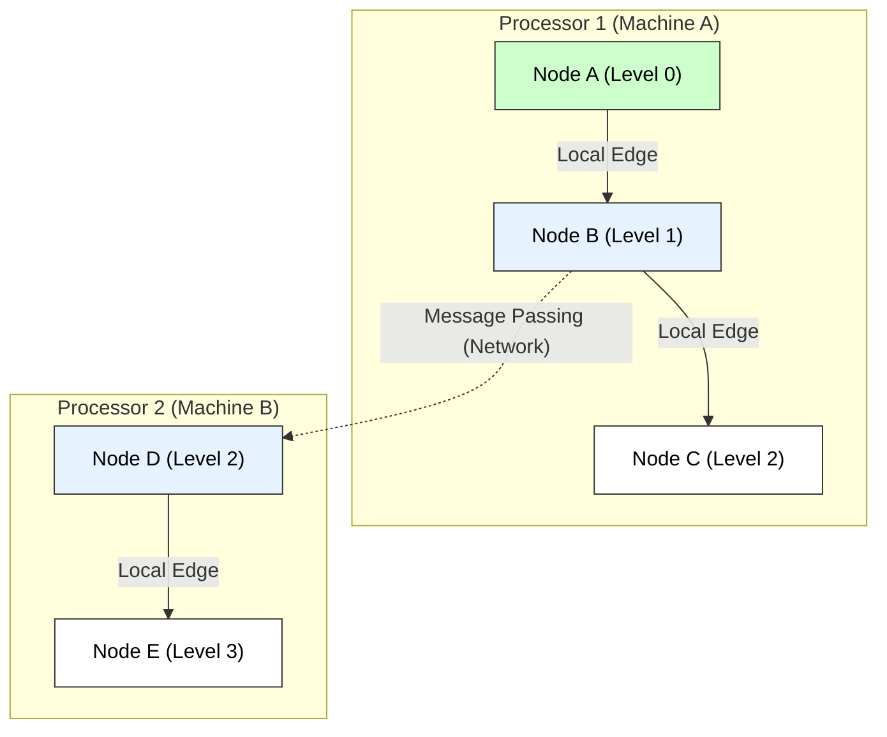

# Distributed Breadth-First Search (BFS) Algorithm

## 1. Algorithm Overview
**Distributed BFS** is designed to traverse massive graphs that are partitioned across multiple processors or machines (nodes) in a distributed system. Unlike conventional BFS, which runs on a single machine, this algorithm uses **Message Passing** to coordinate exploration.

### Key Technical Concepts
* **Graph Partitioning:** The graph $G(V, E)$ is split into subgraphs, each assigned to a processor $P_i$.
* **Level-Synchronized Approach:** The search proceeds in "waves" (layers). All nodes at distance $k$ are processed before any node at distance $k+1$.
* **Frontier Set ($F$):** The set of vertices currently being visited.
* **Ghost Vertices:** Vertices adjacent to local nodes but stored on remote processors.

---

## 2. Distributed BFS Algorithm (Level-Wise)

**Input:** Distributed Graph $G$, Source Vertex $s$.
**Local State:** Each processor maintains $d[v]$ (distance) and $visited[v]$ for its local vertices.

### Pseudocode

```cpp
Algorithm Distributed_BFS(s) {
    // Initialization
    for each vertex v in local_partition:
        d[v] = infinity;
        parent[v] = null;
    
    if (s is local) {
        d[s] = 0;
        Current_Frontier = {s};
    } else {
        Current_Frontier = {};
    }

    Level = 0;
    
    // Main Loop
    while (Global_Frontier_Size > 0) {
        Next_Frontier = {};
        
        // 1. Process Local Nodes
        for each u in Current_Frontier:
            for each neighbor v of u:
                if (v is local) {
                    if (d[v] == infinity) {
                        d[v] = Level + 1;
                        parent[v] = u;
                        Add v to Next_Frontier;
                    }
                } else {
                    // v is remote: Send message to owner of v
                    SendMessage(Owner(v), "Visit v from u");
                }
        
        // 2. Communication Phase
        Synchronize(); // Barrier
        ReceiveMessages();
        
        // 3. Process Remote Messages
        for each msg ("Visit v from u") received:
            if (d[v] == infinity) {
                d[v] = Level + 1;
                parent[v] = u;
                Add v to Next_Frontier;
            }
            
        // 4. Update Global State
        Current_Frontier = Next_Frontier;
        Level = Level + 1;
        Check_Global_Termination();
    }
}
````

-----

## 3\. Visual Representation

The diagram below shows two processors, P1 and P2. When Node B (on P1) discovers Node D (on P2), a message must be sent across the network.



-----

## 4\. Advantages over Conventional (Centralized) Approach

### A. Memory Scalability (Handling Massive Graphs)

  * **Conventional:** Requires the entire graph to fit into the RAM of a single computer. Large graphs (like the Web Graph or Facebook Social Graph) exceed single-machine memory.
  * **Distributed:** The graph is partitioned. We can process graphs of virtually unlimited size by simply adding more machines (Horizontal Scaling).

### B. Computational Speedup (Parallelism)

  * **Conventional:** Sequential execution. Complexity is $O(V + E)$.
  * **Distributed:** Multiple processors explore different parts of the graph simultaneously.
      * Ideally, with $P$ processors, the time complexity drops towards $O((V+E)/P + \text{CommCost})$.

### C. Resource Utilization

  * **Distributed:** Utilization of aggregate bandwidth and CPU power of a cluster, making it feasible to solve complex path-finding problems in reasonable time.

### Summary Comparison

| Feature | Conventional BFS | Distributed BFS |
| :--- | :--- | :--- |
| **Graph Size** | Limited by single RAM | Limited by Cluster RAM (Huge) |
| **Processing** | Sequential | Parallel |
| **Bottleneck** | CPU Speed | Network Communication / Synchronization |
| **Synchronization** | None needed | Required (Barriers / Message Passing) |

---

# Distributed Breadth-First Search (Distributed BFS)  
*(Clear, pointwise, technical keywords, small diagram, exam-ready)*

---

# 1. Introduction

Breadth-First Search (BFS) is traditionally performed on a **single processor**.  
However, for **large graphs** (social networks, web graphs, sensor networks), data may be distributed across multiple machines or nodes.

**Distributed BFS** performs BFS across multiple processors/nodes connected over a network.

### **Technical Keywords:**  
distributed graph traversal, message passing, frontier expansion, parallel exploration, superstep, synchronization, distributed memory.

---

# 2. Distributed Breadth-First Search Algorithm (Message-Passing Model)

We assume:

- The graph is **partitioned** across P distributed nodes.
- Communication occurs using **message passing**.
- Each processor stores:
  - Its subset of vertices  
  - Adjacency lists of those vertices  

---

# 3. Distributed BFS Algorithm (Stepwise Pseudocode)

```text
Algorithm Distributed_BFS(root)

1. For each processor Pi:
       Initialize:
           distance[v] = ∞ for all local vertices v
           visited[v]  = false

2. Identify processor Pr that contains root:
       distance[root] = 0
       visited[root] = true
       frontier = { root }

3. While frontier is not empty do
       3.1 Each processor Pi:
               next_frontier = ∅

               For each vertex u in frontier owned by Pi:
                       For each neighbor v of u:
                               if visited[v] == false then
                                      visited[v] = true
                                      distance[v] = distance[u] + 1
                                      Add v to next_frontier

       3.2 Processors exchange next_frontier lists
           (send vertices to the processors that own them)

       3.3 Each processor merges received vertices into frontier

4. End While

5. Collect distances from all processors if needed
````

---

# 4. Explanation of Key Steps

### **Frontier Expansion**

* Each processor expands only the vertices it owns.

### **Message Passing**

* When a neighbor belongs to another processor, the vertex is sent to that processor.

### **Synchronization**

* After each BFS level, processors synchronize to form the new frontier.

---

# 5. Small Diagram (Conceptual View of Distributed BFS)

```text
           P1                         P2
       (Graph Part 1)            (Graph Part 2)
          ●───●────●  <--messages-->  ●───●──●
         /           \                 \
        root          ●-----------------●
               Distributed exploration
```

Each processor expands part of the graph and exchanges frontier nodes to explore BFS levels **in parallel**.

---

# 6. Advantage Over Conventional BFS

Distributed BFS offers **significant advantages**, especially for large-scale graphs:

---

## **1. Scalability (Can Handle Very Large Graphs)**

Conventional BFS requires the entire graph to fit in **one machine’s memory**.
Distributed BFS partitions the graph across **many processors**, enabling:

* Processing of massive graphs
* Web-scale or social network graphs
* Large sensor or communication networks

---

## **2. Parallelism (Faster Execution)**

Each processor expands part of the BFS frontier **in parallel**, reducing:

* Total execution time
* Per-level traversal time

Thus, distributed BFS is **much faster** for large graphs.

---

## **3. Reduced Memory Load**

Each processor stores only a **fraction** of the graph → avoids memory overflow.

---

## **4. Suitable for Distributed Environments**

Useful for:

* Distributed databases
* Cloud computing
* Cluster-based graph analytics

---

## **5. Better Load Balancing**

Frontier nodes are spread across processors, avoiding single-node bottlenecks.

---

# 7. Final Exam-Ready Summary

* **Distributed BFS** performs BFS across multiple machines using message passing and synchronized frontier expansion.
* **Algorithm**: Each processor expands its local vertices, sends discovered neighbors to owners, and synchronizes frontiers.
* **Advantages over conventional BFS**:

  1. Handles extremely large graphs (scalable)
  2. Faster due to parallelism
  3. Lower memory usage per processor
  4. Suitable for cloud/distributed architectures
  5. Better load distribution

Distributed BFS is essential for modern large-scale graph processing systems.

---


