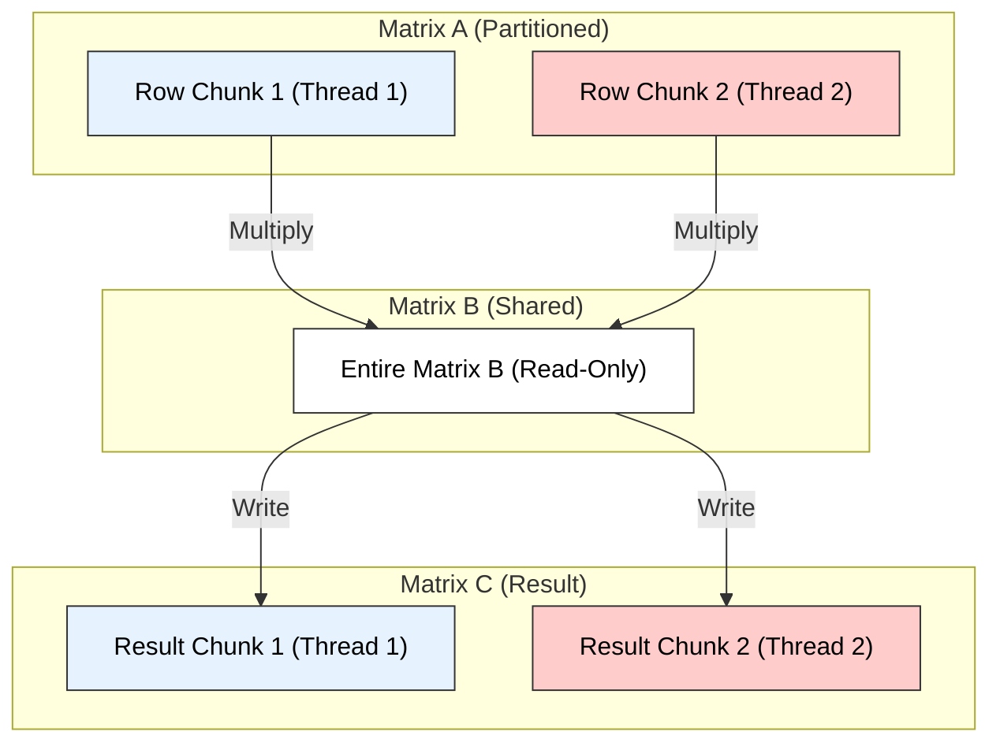

# Multithreaded Matrix Multiplication (Loop Parallelization)

## 1. Core Concept: Data Parallelism
The conventional matrix multiplication algorithm computes result matrix $C$ from matrices $A$ and $B$ (of size $N \times N$) using three nested loops.
* **Independence:** The calculation of each element $C[i][j]$ is independent of others.
* **Strategy:** We parallelize the **outermost loop** (Row-wise decomposition). We divide the rows of Matrix $A$ among $P$ available threads. Each thread computes a specific chunk of rows for the Result Matrix $C$.

---

## 2. Algorithm Pseudocode

**Input:** Matrices $A, B$ ($N \times N$), Number of Threads $P$.
**Output:** Matrix $C$.

### A. Worker Thread Function
Each thread is assigned a range of rows `[start_row, end_row)`.

```cpp
Function Thread_Worker(thread_id, A, B, C, N, P) {
    // 1. Calculate assigned row range (Static Partitioning)
    rows_per_thread = N / P;
    start_row = thread_id * rows_per_thread;
    end_row = (thread_id + 1) * rows_per_thread;
    
    // Handle remaining rows for last thread
    if (thread_id == P - 1) end_row = N;

    // 2. Compute assigned rows (Relevant Loop Parallelization)
    for i = start_row to end_row - 1 {         // Loop 1: Rows (Parallel)
        for j = 0 to N - 1 {                   // Loop 2: Columns
            sum = 0;
            for k = 0 to N - 1 {               // Loop 3: Dot Product
                sum = sum + A[i][k] * B[k][j];
            }
            C[i][j] = sum; // Write to shared memory (No Race Condition)
        }
    }
}
````

### B. Main Driver

```cpp
Algorithm Parallel_MatMul(A, B, C, N, P) {
    List<Thread> threads;

    // 1. Fork: Create and start threads
    for t = 0 to P - 1 {
        Thread new_thread = CreateThread(Thread_Worker, t, A, B, C, N, P);
        threads.add(new_thread);
        new_thread.start();
    }

    // 2. Join: Wait for all threads to complete
    for each t in threads {
        t.join(); // Synchronization Barrier
    }

    return C;
}
```

-----

## 3\. Visual Representation: Row-Wise Decomposition

The diagram below illustrates how 2 threads split the work. Thread 1 calculates the top half of $C$, and Thread 2 calculates the bottom half. Both read the entire Matrix $B$.



-----

## 4\. Performance Analysis

| Metric | Sequential | Multithreaded (Ideal) |
| :--- | :--- | :--- |
| **Time Complexity** | $O(N^3)$ | $O(N^3 / P)$ |
| **Space Complexity** | $O(1)$ (Auxiliary) | $O(1)$ (Shared Memory) |
| **Overhead** | None | Thread Creation & Context Switching |
| **Race Conditions** | None | None (Disjoint write locations) |

### Key Technical Considerations

  * **Load Balancing:** If $N$ is not divisible by $P$, the last thread does slightly more work.
  * **Cache Coherence:** Since threads write to distinct memory lines (different rows), "False Sharing" is minimized, leading to good scalability.
  * **Shared Memory:** Matrix $A$ and $B$ are read-only shared resources; Matrix $C$ is a write-shared resource but with disjoint access patterns.

<!-- end list -->
---

# Multithreaded Matrix Multiplication  
*(Parallelizing loops of the conventional procedure – exam-ready)*

---

## 1. Conventional Matrix Multiplication (Single Thread)

Given two matrices:

- \( A \) of size \( n \times n \)  
- \( B \) of size \( n \times n \)  
- Result matrix \( C \) of size \( n \times n \), where  
  \[
  C[i][j] = \sum_{k=0}^{n-1} A[i][k] \cdot B[k][j]
  \]

### Conventional (Sequential) Triple-Loop Algorithm

```text
for i = 0 to n-1 do
    for j = 0 to n-1 do
        C[i][j] = 0
        for k = 0 to n-1 do
            C[i][j] = C[i][j] + A[i][k] * B[k][j]
````

**Technical Keywords:** data parallelism, loop parallelization, shared memory, independent rows, race-free writes.

---

## 2. Principle of Parallelization

Observation:

* Each row `i` of `C` is computed **independently** from other rows.
* Therefore, we can **parallelize the outer `i` loop**:

  * Assign **different sets of rows** of matrix `C` to different threads.
  * Each thread computes **its own subset** of rows.

This is a form of **data parallelism**.

---

## 3. Work Division Among Threads

Assume:

* `p` = number of threads
* `n` = number of rows

Each thread `tid` (thread ID from `0` to `p-1`) gets a **contiguous block of rows**:

```text
rows_per_thread = n / p
start_row = tid * rows_per_thread
end_row   = (tid == p-1) ? (n - 1) : (start_row + rows_per_thread - 1)
```

Each thread computes:

```text
for i = start_row to end_row
    for j = 0 to n-1
        C[i][j] = 0
        for k = 0 to n-1
            C[i][j] = C[i][j] + A[i][k] * B[k][j]
```

Because each thread writes to a **disjoint set of rows of C**, there is **no race condition**.

---

## 4. Pseudo Code: Simple Multithreaded Matrix Multiplication

### 4.1 Thread Function

```text
ThreadFunction(tid)         // tid: thread ID (0..p-1)
Input : tid, n, p, A, B, C  // A, B, C are shared among threads

    rows_per_thread = n / p
    start_row = tid * rows_per_thread
    if tid == p - 1 then
         end_row = n - 1            // last thread may take extra rows
    else
         end_row = start_row + rows_per_thread - 1

    for i = start_row to end_row do
        for j = 0 to n - 1 do
            C[i][j] = 0
            for k = 0 to n - 1 do
                C[i][j] = C[i][j] + A[i][k] * B[k][j]
```

---

### 4.2 Main Procedure (Creating Threads)

```text
Algorithm MultiThreadedMatMul(A, B, C, n, p)
Input : A[n][n], B[n][n], n = size, p = number of threads
Output: C[n][n] = A × B

    Create p threads T0, T1, ..., T(p-1)

    for tid = 0 to p - 1 do
        start ThreadFunction(tid)      // pass tid, n, p, A, B, C

    for tid = 0 to p - 1 do
        join thread Ttid               // wait for all threads to finish

    // After all threads complete, matrix C contains the result
```

**Technical Keywords:** thread creation, join, shared matrices, partitioned rows, race-free access, parallel speedup.

---

## 5. Small Diagram (Row-wise Parallelization)

```text
Matrix C (n × n)

   Rows:  0       1       2       3       4       ...    n-1
         ┌──────┬──────┬──────┬──────┬──────┬──────┬─────────┐
         │      │      │      │      │      │      │         │
         └──────┴──────┴──────┴──────┴──────┴──────┴─────────┘
          ↑      ↑      ↑      ↑      ↑                ↑
          │      │      │      │      │                │
     Thread 0  Thread 0  Thread 1  Thread 1        Thread (p-1)

Example:
- Thread 0 → rows 0 to r1
- Thread 1 → rows r1+1 to r2
- ...
- Thread (p-1) → last block of rows
```

Each thread computes a **disjoint block of rows** of `C` in parallel.

---

## 6. Complexity Analysis (High-Level)

* Single-threaded matrix multiplication:
  [
  O(n^3)
  ]

* With `p` threads (ideal case, no overhead, perfect load balance):

  * Each thread does approximately ( \dfrac{n^3}{p} ) work.
  * **Parallel time** ≈ ( O\left(\dfrac{n^3}{p}\right) )

* Parallelism gives a **speedup factor** up to `p` (theoretically), limited in practice by:

  * Thread creation/join overhead
  * Memory bandwidth
  * Cache effects

---

## 7. Exam-Ready Summary

* Start from conventional **triple-loop** matrix multiplication ( C = A \times B ).
* Parallelize the **outer loop over rows (i)**:

  * Divide rows among `p` threads → data parallelism.
* Each thread computes its assigned rows of `C` independently:

  * Avoids race conditions (each thread writes to different rows).
* Pseudo code includes:

  * **ThreadFunction(tid)** computing a row block.
  * **Main function** creating and joining `p` threads.
* Time complexity:

  * Sequential: ( O(n^3) )
  * Parallel (ideal): ( O\left(\dfrac{n^3}{p}\right) )

## This is a **simple multithreaded matrix multiplication algorithm** based on **parallelizing the outer loop** of the conventional procedure.


