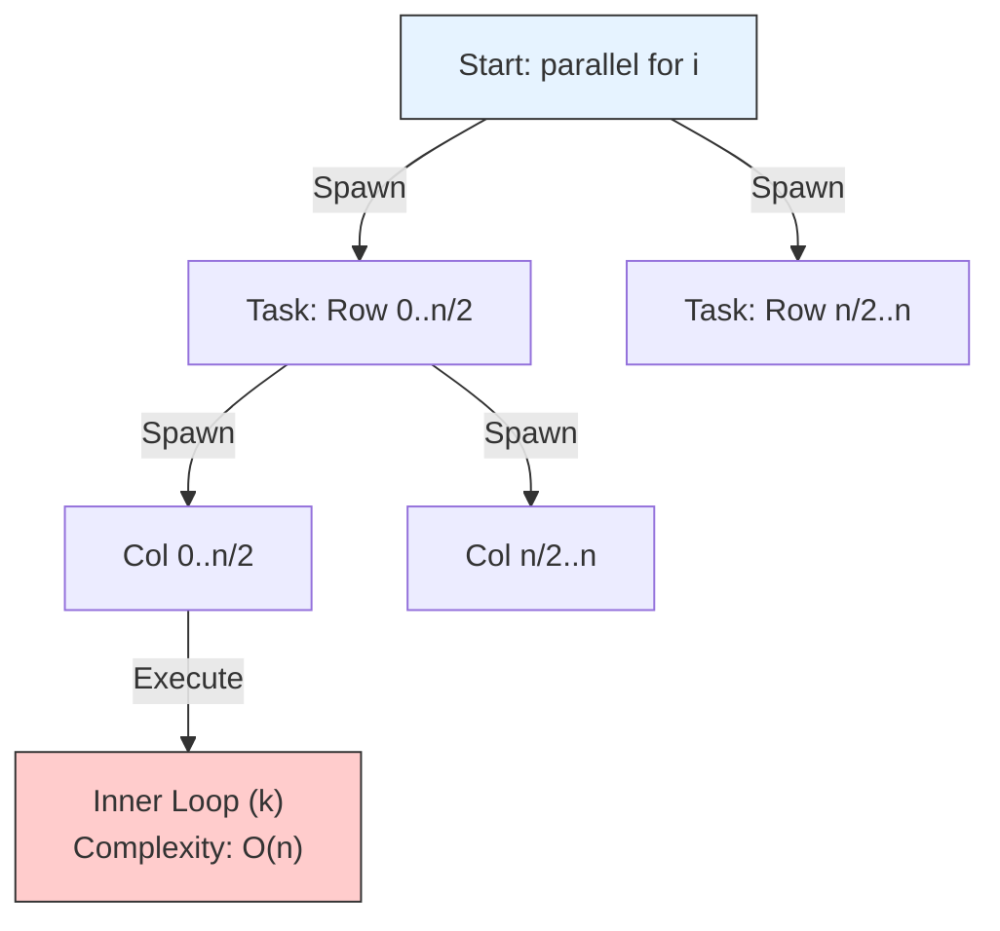

# Multithreaded Matrix Multiplication (Parallel Loop Model)

## 1. Algorithm Principle
This algorithm utilizes **Shared-Memory Parallelism** (Dynamic Multithreading). It replaces standard sequential loops with parallel control structures (`parallel for` or `spawn/sync`).

**Strategy:**
* **Decomposition:** The problem is decomposed by iterating over the output matrix coordinates $(i, j)$ in parallel.
* **Nested Parallelism:** Both the outer loop (rows) and the middle loop (columns) are parallelized to maximize the available concurrency.
* **Race Conditions:** Since each iteration $(i, j)$ computes a distinct element $C[i][j]$ and only reads from shared matrices $A$ and $B$, the updates are independent. No locks are required.

---

## 2. Pseudocode (Analysis Style)

**Algorithm** `Mat_Mul_Parallel(A, B, C, n)`
* **Input:** $n \times n$ matrices $A, B$.
* **Output:** $n \times n$ matrix $C$.

```cpp
Algorithm Mat_Mul_Parallel(A, B, C, n) {
    // 1. Parallelize Rows (Outer Loop)
    parallel for i = 0 to n-1 {
        
        // 2. Parallelize Columns (Middle Loop)
        parallel for j = 0 to n-1 {
            
            // Initialize accumulator
            sum = 0;
            
            // 3. Serial Dot Product (Inner Loop)
            // This loop must remain serial to sum into a single variable
            for k = 0 to n-1 {
                sum = sum + A[i][k] * B[k][j];
            }
            
            // Store result
            C[i][j] = sum;
        }
    }
}
````

-----

## 3\. Analysis: Work and Span

We analyze the algorithm using the **DAG Model** (Work-Span Law).

### A. Work ($T_1$)

This is the total time taken by a single processor (Sequential execution).

  * Three nested loops of size $n$.
  * **$T_1(n) = \Theta(n^3)$**

### B. Span ($T_\infty$)

This is the longest path of dependencies (Critical Path) assuming infinite processors.

  * The `parallel for` loops (row and col) have a span of $\Theta(\log n)$ due to the divide-and-conquer tree structure of spawning tasks.
  * The inner loop (dot product) is **serial** and takes $\Theta(n)$.
  * Total Span = $\Theta(\log n) + \Theta(\log n) + \Theta(n)$.
  * **$T_\infty(n) = \Theta(n)$**

### C. Parallelism

The maximum possible speedup on an ideal machine.

  * **Parallelism** $= \frac{T_1}{T_\infty} = \frac{\Theta(n^3)}{\Theta(n)} = \mathbf{\Theta(n^2)}$.
  * *Interpretation:* With enough processors, we can speed up the calculation by a factor of $n^2$.

-----

## 4\. Visual Representation: Recursive Spawning

The diagram illustrates how `parallel for` divides the work into a tree of tasks.



```
```
