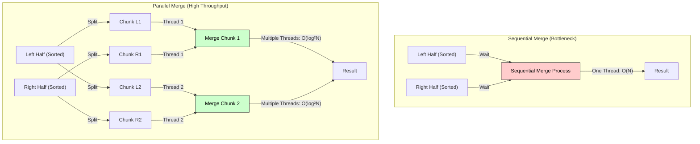

# Multi-threaded Merge Sort & Parallel Merging

## 1. Pseudo Code: Multi-threaded Merge Sort
The algorithm utilizes the **Fork-Join** parallelism model. It recursively spawns threads to sort the left and right halves and uses a **Parallel Merge** procedure to combine them.

**Algorithm** `P_MergeSort(A, p, r)`
* **Input:** Array $A$, start index $p$, end index $r$.
* **Aux:** Array $B$ (temporary buffer), Threshold (base case size).

```cpp
Algorithm P_MergeSort(A, p, r, B, s) {
    n = r - p + 1;

    // 1. Base Case: Use sequential sort for small subarrays
    if (n < Threshold) {
        Sequential_MergeSort(A, p, r);
        return;
    }

    // 2. Divide
    q = (p + r) / 2; // Midpoint
    q_prime = q - p + 1; // Relative index in B

    // 3. Conquer (Parallel Recursion)
    // Spawn a child task to sort the left half
    spawn P_MergeSort(A, p, q, B, s);
    
    // The main task sorts the right half
    P_MergeSort(A, q + 1, r, B, s + q_prime);
    
    // Synchronization Point: Wait for both halves to be sorted
    sync;

    // 4. Combine (Parallel Merge)
    // Use a parallel merging subroutine to merge A[p..q] and A[q+1..r] into B
    P_Merge(A, p, q, q + 1, r, B, s);
    
    // Copy back (can also be parallelized)
    sync;
    Parallel_Copy(B, s, A, p, n);
}
````

-----

## 2\. Explanation of the Algorithm

1.  **Divide:** The problem is split into two independent subproblems of size $N/2$.
2.  **Conquer (Parallelism):** The `spawn` keyword creates a new thread for the left half, allowing the left and right halves to be sorted **concurrently**. The `sync` keyword ensures both halves are sorted before merging begins.
3.  **Combine (Parallel Merging):** Instead of a standard sequential merge, we call `P_Merge`. This subroutine finds splitting points in the two subarrays (using Binary Search) and recursively spawns threads to merge smaller chunks of the data in parallel.

-----

## 3\. Parallelism Advantage of Parallel Merging

The core advantage lies in reducing the **Span** (Critical Path Length) of the algorithm.

### A. The Limitation of Conventional Merge Sort (Sequential Merge)

  * Even if we sort the halves in parallel, a **Sequential Merge** takes **$O(N)$** time to combine them.
  * As $N$ grows, this linear merge step becomes a bottleneck. The algorithm cannot run faster than $O(N)$ regardless of how many processors are added.
  * **Span Recurrence:** $T_\infty(N) = T_\infty(N/2) + N \implies \mathbf{O(N)}$.

### B. The Advantage of Parallel Merging

  * **Parallel Merging** divides the merge process itself. It finds the median of the larger subarray and splits the smaller subarray at the corresponding value. It then merges the two "lower" parts and two "upper" parts in parallel.
  * This reduces the time complexity of the merge step from $O(N)$ to **$O(\log^2 N)$**.
  * **Span Recurrence:** $T_\infty(N) = T_\infty(N/2) + \log^2 N \implies \mathbf{O(\log^3 N)}$.

### Conclusion

Parallel merging significantly reduces the critical path from **Linear ($N$)** to **Poly-Logarithmic ($\log^3 N$)**. This enables **High Scalability**: the algorithm can effectively utilize thousands of cores, whereas the sequential merge version saturates performance very quickly.

-----

## 4\. Visual Representation: Breaking the Bottleneck

The diagram shows how Parallel Merging allows multiple threads to work on the "Combine" phase simultaneously.



# Multi-Threaded Merge Sort  
*(Pseudo code, explanation, and how parallel merging improves parallelism — exam-ready)*

---

# 1. Introduction

**Merge Sort** is a classic **Divide-and-Conquer** algorithm:

1. **Divide** array into two halves  
2. **Conquer** → recursively sort two halves  
3. **Combine** → merge the sorted halves  

In **multi-threaded merge sort**, steps 1 and 2 are parallelized using **threads**, and in advanced models even the **merge step** can be parallelized.

### **Technical Keywords:**  
parallel recursion, fork–join model, task parallelism, parallel merge, shared-memory threads, synchronization.

---

# 2. Pseudo Code: Multi-Threaded Merge Sort

We assume we spawn threads for sorting left and right halves and (optionally) for merging.

---

# 2.1 Merge Procedure (Same as Standard Merge)

```text
Procedure Merge(A, left, mid, right)
    Create temp array T
    i ← left
    j ← mid + 1
    k ← left

    while i ≤ mid and j ≤ right do
         if A[i] ≤ A[j] then
              T[k] ← A[i]
              i ← i + 1
         else
              T[k] ← A[j]
              j ← j + 1
         k ← k + 1

    while i ≤ mid do
         T[k] ← A[i]
         i ← i + 1
         k ← k + 1

    while j ≤ right do
         T[k] ← A[j]
         j ← j + 1
         k ← k + 1

    for x ← left to right do
         A[x] ← T[x]
````

---

# 2.2 Multi-Threaded Merge Sort (Fork–Join Model)

```text
Procedure MT_MergeSort(A, left, right)
    if left ≥ right then
         return

    mid = ⌊(left + right) / 2⌋

    // --- Spawn threads for parallel sorting ---
    spawn MT_MergeSort(A, left, mid)       // Left half in parallel
    spawn MT_MergeSort(A, mid + 1, right)  // Right half in parallel

    sync     // Wait for both threads to finish

    // --- Merge the two sorted halves ---
    Merge(A, left, mid, right)
```

### Explanation of Keywords

* **spawn** → create a parallel task for a recursive subproblem
* **sync** → wait until all spawned tasks in this scope finish

This follows the **fork–join parallelism** model.

---

# 3. Small Diagram (Parallel Recursion)

```text
                        A[0..n-1]
                              |
                    ----------------------
                    |                    |
                 spawn                spawn
           A[0..mid]                A[mid+1..n-1]
              |                         |
         -----------                ------------
         |         |                |          |
      spawn      spawn          spawn       spawn
     ...         ...            ...          ...
```

* Each recursive division spawns **two new threads**, enabling parallel processing of subproblems.

---

# 4. Parallel Merging (Where Extra Advantage Comes From)

Standard multi-threaded merge sort parallelizes **sorting**, but **merge** is still sequential.

However, merging can also be parallelized:

---

## 4.1 Idea of Parallel Merge

To merge sorted arrays **Left[]** and **Right[]**:

1. Take the **middle element** of Left[]
2. Use **binary search** to find its position in Right[]
3. This divides the merge problem into **two independent parts**
4. Spawn threads to merge these two halves in parallel

### Complexity

Parallel merge reduces merge cost from:

* Sequential: `O(n)`
* Parallel: `O(log n)` per element partitioning
* Overall merging time: `O(n / p + log n)` with `p` threads

---

## 4.2 Why Parallel Merge Gives Significant Advantage

### **1. Merge is typically the bottleneck**

* In normal parallel merge sort:

  * Sorting is parallel
  * Merge stays sequential
* This limits speedup due to **Amdahl’s Law**

### **2. Parallel merge reduces sequential portion**

* By parallelizing merge:

  * The merge step scales with #threads
  * Critical path length gets shorter
  * More of the algorithm becomes parallel

### **3. Better utilization of multi-core systems**

* Sorting halves + merging can use **all CPU cores**
* Avoids phases where some cores would remain idle

### **4. Reduces overall time complexity**

Ideal parallel merge sort with parallel merging:

[
T_p(n) \approx O\left( \frac{n \log n}{p} + \log^2 n \right)
]

vs. standard parallel merge sort:

[
T_p(n) \approx O\left( \frac{n \log n}{p} + n \right)
]

Parallel merging eliminates the **O(n)** sequential bottleneck.

---

# 5. Summary Comparison (Standard vs Parallel Merge)

| Feature         | Standard Multithreaded Merge Sort | With Parallel Merge |
| --------------- | --------------------------------- | ------------------- |
| Sorting         | Parallel                          | Parallel            |
| Merging         | Sequential                        | Parallel            |
| CPU Utilization | Drops during merge                | High throughout     |
| Speedup         | Limited by merge step             | Much higher         |
| Bottleneck      | Merge step                        | Greatly reduced     |

---

# 6. Final Exam-Ready Summary

* Multi-threaded merge sort uses **spawn** to sort left and right halves **in parallel**, and **sync** to join them before merging.
* Pseudo code follows **fork–join parallel recursion**.
* Parallel merging further divides the merge step into **independent smaller merges**, boosting performance by:

  * Reducing sequential bottlenecks
  * Improving CPU utilization
  * Increasing speedup on multi-core systems
* Hence, parallel merge sort offers significant parallelism advantage over conventional merge sort by exploiting **parallel recursion + parallel merging**.

---


