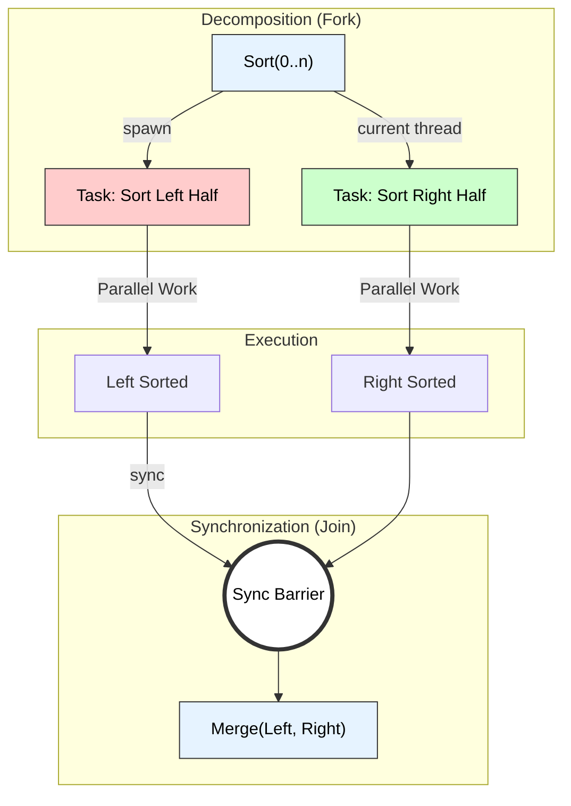

# Multi-threaded Merge Sort Algorithm

## 1. Algorithm Overview
Merge Sort is a **Divide and Conquer** algorithm that splits the array into halves, sorts them recursively, and then merges them.
* **Conventional:** Executes sequentially (Depth-First).
* **Multi-threaded:** Exploits **Data Parallelism**. Since the two halves of the array are independent, they can be sorted by separate threads simultaneously using the **Fork-Join** model.

---

## 2. Pseudocode

**Input:** Array $A$, indices $p$ (start) and $r$ (end).
**Threshold:** A cutoff size (e.g., $N < 1000$) below which we switch to sequential sorting to avoid thread overhead.

```cpp
Algorithm Parallel_MergeSort(A, p, r) {
    // 1. Base Case: Use sequential sort for small arrays
    if (r - p < Threshold) {
        Sequential_MergeSort(A, p, r);
        return;
    }

    // 2. Divide
    q = (p + r) / 2;

    // 3. Conquer (Parallel Execution)
    // Spawn a new thread for the left half
    spawn Parallel_MergeSort(A, p, q);
    
    // The current (parent) thread handles the right half
    // (Alternatively, spawn both and wait)
    Parallel_MergeSort(A, q + 1, r);

    // 4. Synchronization barrier
    sync; // Wait for the spawned child to finish

    // 5. Combine (Sequential Merge)
    // Note: Merge step can also be parallelized, but typically is sequential here
    Merge(A, p, q, r);
}
````

-----

## 3\. Difference from Conventional Merge Sort

| Feature | Conventional Merge Sort | Multi-threaded Merge Sort |
| :--- | :--- | :--- |
| **Execution Flow** | **Sequential (Serial):** Processing happens one step at a time (Depth-First). | **Parallel (Concurrent):** Multiple branches execute simultaneously on different cores. |
| **Recursion Tree** | Traverses the entire tree path-by-path. | Expands the tree breadth-wise (limited by available cores). |
| **Time Complexity** | **$O(N \log N)$** (Work & Span are same). | **Span (Critical Path):** **$O(N)$** (assuming parallel merge) or **$O(N \log N)$** with limited threads. |
| **Overhead** | Minimal (Function stack calls). | High (Thread creation, Context switching, Synchronization). |
| **Hardware** | Runs on Single Core. | Requires Multi-core CPU for speedup. |

-----

## 4\. Visual Representation: Fork-Join Tree

The diagram below shows how the main thread forks a task for the left subarray while processing the right subarray itself, then joins (syncs) before merging.


---

# Multithreaded Merge Sort Algorithm  
*(Clear, pointwise, technical keywords, small diagram – exam-ready)*

---

## 1. Recall: Conventional Merge Sort (Single-Threaded)

### Principle
- **Divide and Conquer** algorithm:
  1. **Divide**: Split array into two halves.
  2. **Conquer**: Recursively sort each half.
  3. **Combine**: Merge the two sorted halves.

### Time Complexity
- Time: `O(n log n)`  
- Space: `O(n)` (for temporary merge array)

---

## 2. Idea of Multithreaded Merge Sort

### Key Concept
Use **multiple threads** to sort the left and right halves **in parallel**.

- The **recursive calls** to sort subarrays are **parallelized**.
- The **merge step** remains (typically) **single-threaded**.

### Technical Keywords
multithreading, parallel recursion, fork–join model, thread creation, join, parallel speedup, shared memory.

---

## 3. Pseudo Code: Multithreaded Merge Sort

Assume:
- Array `A[0..n-1]`
- A fixed **maximum depth** or **minimum subarray size** to avoid creating too many threads.

---

### 3.1 Merge Function (Same as Conventional)

```text
Procedure Merge(A, left, mid, right)
    // Merge sorted subarrays A[left..mid] and A[mid+1..right]
    create temporary arrays L and R

    i ← left
    j ← mid + 1
    k ← left

    while i ≤ mid and j ≤ right do
          if A[i] ≤ A[j] then
                temp[k] ← A[i]
                i ← i + 1
          else
                temp[k] ← A[j]
                j ← j + 1
          k ← k + 1

    // Copy remaining elements
    while i ≤ mid do
          temp[k] ← A[i]
          i ← i + 1
          k ← k + 1

    while j ≤ right do
          temp[k] ← A[j]
          j ← j + 1
          k ← k + 1

    // Copy back into A
    for t ← left to right do
          A[t] ← temp[t]
````

---

### 3.2 Multithreaded Merge Sort – Threaded Version

```text
Procedure MT_MergeSort(A, left, right, depth)
Input : A → array
        left, right → indices
        depth → current recursion depth

    if left ≥ right then
          return

    mid = ⌊(left + right) / 2⌋

    if depth <= MAX_DEPTH then
          // Create two threads for left and right halves
          spawn Thread_Left  = MT_MergeSort(A, left, mid, depth + 1)
          spawn Thread_Right = MT_MergeSort(A, mid + 1, right, depth + 1)

          // Wait for both threads to complete
          join Thread_Left
          join Thread_Right
    else
          // Fall back to normal recursive merge sort (no more threads)
          MT_MergeSort(A, left, mid, depth + 1)
          MT_MergeSort(A, mid + 1, right, depth + 1)

    // Merge the two sorted halves
    Merge(A, left, mid, right)
```

### 3.3 Driver Procedure

```text
Algorithm MultiThreadedMergeSort(A, n)
Input : A[0..n-1]
Output: Sorted A

    depth ← 0
    MT_MergeSort(A, 0, n-1, depth)
```

> Note: `MAX_DEPTH` or a **minimum subarray size** is used to limit thread creation overhead.

---

## 4. Small Diagram (Parallel Recursion Tree)

```text
                     A[0..n-1]
                      (T0)
                     /     \
           A[0..mid]       A[mid+1..n-1]
             (T1)              (T2)
            /   \              /    \
         ...   ...          ...    ...

T0: main thread
T1, T2, ...: worker threads sorting subproblems in parallel
```

* Each recursive split spawns **two threads** (up to a limit).
* Subproblems at the same level can be processed **concurrently**.

---

## 5. How Multithreaded Merge Sort Differs from Conventional Merge Sort

### 5.1 Execution Model

* **Conventional Merge Sort**

  * Runs **sequentially** on a **single thread**.
  * Left and right halves are sorted **one after another**.

* **Multithreaded Merge Sort**

  * Uses **multiple threads** to sort halves **in parallel**.
  * Exploits **multi-core processors** for speedup.

---

### 5.2 Performance

* **Conventional**:

  * Time: `O(n log n)`
  * Utilizes only **one core**.

* **Multithreaded**:

  * Total work still `O(n log n)`.
  * **Parallel time** (ideal) can be reduced roughly to:

    * `O((n log n) / P)` where `P` is number of cores/threads
  * Actual speedup is limited by:

    * Thread creation overhead
    * Merge step (partly sequential)
    * Memory bandwidth and cache effects

---

### 5.3 Resource Usage

* **Conventional**:

  * Single stack, no thread management.
  * Less overhead and simpler debugging.

* **Multithreaded**:

  * Requires **thread creation and synchronization** (spawn/join).
  * Higher **memory usage** (multiple stacks).
  * Needs careful handling to avoid race conditions (though merge sort naturally writes disjoint regions).

---

### 5.4 Complexity Summary

* **Time Complexity** (both):

  * Work: `O(n log n)`
* **Parallel Time** (ideal multithreaded):

  * Approximately `O((n log n) / P)`
* **Space Complexity**:

  * Both: `O(n)` additional space for merging (plus small thread overhead)

---

## 6. Exam-Ready Summary

* **Multithreaded merge sort** is obtained by:

  * Parallelizing the **recursive calls** on left and right halves using **threads**.
  * Merging remains similar to conventional merge sort.
* **Difference from conventional merge sort**:

  1. Uses **multiple threads** instead of one.
  2. Exploits **parallelism** on multi-core CPUs.
  3. Same asymptotic work `O(n log n)` but **lower wall-clock time** due to parallel execution.
  4. Requires **thread creation, synchronization, and overhead management**.

This makes multithreaded merge sort a classic example of **parallel Divide and Conquer**.

---


