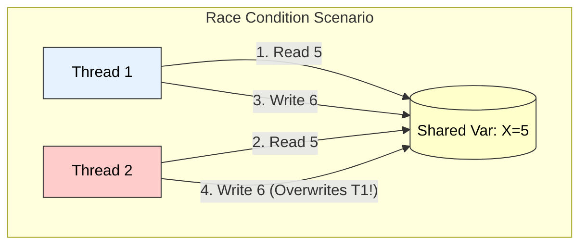

# Multithreaded Algorithms: Analysis, Parallel Loops, and Race Conditions

## 1. Analyzing Multithreaded Algorithms

Analyzing a multithreaded algorithm involves quantifying its theoretical performance limits using a **Directed Acyclic Graph (DAG)** model of computation.

### Key Metrics
1.  **Work ($T_1$):**
    * The total time to execute the entire computation on a single processor.
    * It is the sum of the execution times of all tasks (nodes) in the DAG.
2.  **Span ($T_\infty$):**
    * The longest time to execute the computation on an infinite number of processors.
    * It corresponds to the **Critical Path** (the longest path of dependencies) in the DAG.
3.  **Parallelism ($T_1 / T_\infty$):**
    * The average amount of work that can be performed in parallel for every step of the critical path.
    * It represents the maximum possible speedup.

### Performance Laws
* **Speedup:** $T_1 / T_P$ (where $T_P$ is time on $P$ processors).
* **Greedy Scheduler Bound:** $T_P \le (T_1 / P) + T_\infty$.

### Visual Representation: Work vs. Span

```mermaid
graph TD
    subgraph "Computation DAG"
    A["Start"] --> B["Task 1 (10ms)"]
    A --> C["Task 2 (10ms)"]
    B --> D["Task 3 (10ms)"]
    C --> D
    end

    style A fill:#e6f3ff,stroke:#333,color:#000
    style B fill:#ccffcc,stroke:#333,color:#000
    style C fill:#ccffcc,stroke:#333,color:#000
    style D fill:#e6f3ff,stroke:#333,color:#000

    note["Work (T1) = 10+10+10+10 = 40ms<br>Span (T∞) = 10+10+10 = 30ms"]
````

-----

## 2\. Parallel Loops

**Definition:**
Parallel loops allow iterations of a loop to be executed concurrently, provided that the iterations are **independent** (i.e., iteration $i$ does not depend on data computed in iteration $i-1$).

### Implementation (Divide and Conquer)

A standard `for` loop `for i = 1 to n` is typically implemented in multithreaded systems (like Cilk) not by spawning $n$ threads linearly, but by a recursive **divide-and-conquer** strategy.

1.  Split the range `[1, n]` into `[1, n/2]` and `[n/2 + 1, n]`.
2.  Recursively spawn tasks for both halves.
3.  **Benefit:** This reduces the Span (overhead) from $O(n)$ to **$O(\log n)$**.

### Pseudocode

```cpp
cilk_for (i = 0; i < n; i++) {
    // Independent calculation
    C[i] = A[i] + B[i];
}
```

-----

## 3\. Race Conditions

**Definition:**
A **Race Condition** is a determinism bug that occurs when multiple threads access the same shared memory location concurrently, and **at least one** of the accesses is a **Write** operation.

### Mechanism

  * **Cause:** Lack of atomicity in the **Critical Section**.
  * **Scenario:**
    1.  Thread A reads a value.
    2.  Thread B reads the same value.
    3.  Thread A modifies and writes it back.
    4.  Thread B modifies the *old* value and writes it back.
  * **Result:** Thread A's update is "Lost". The final state depends on the arbitrary timing of the scheduler.

### Prevention

  * **Mutual Exclusion:** Using Locks (`Mutex`), Semaphores, or `synchronized` blocks.
  * **Atomic Operations:** Using hardware-supported atomic instructions (e.g., `Compare-And-Swap`).

### Visual Representation: The Conflict



---

# Multithreaded Algorithms  
*(Analysis, Parallel Loops, Race Conditions — exam-ready, clear, pointwise with diagram)*

---

# 1. Analyzing Multithreaded Algorithms

Analyzing multithreaded algorithms involves evaluating **both the total amount of work** and the **parallel execution time** on multiple processors.

---

## 1.1 Key Performance Measures

### **(a) Work (T₁)**  
- Total time required by the algorithm on **one processor**  
- Equivalent to the time of the **sequential version**

\[
T_1 = \text{sum of all operations in the computation}
\]

### **(b) Span (T∞)**  
Also called **critical path length** or **computational depth**.

- Longest chain of dependencies
- Minimum possible running time even with **infinite processors**

\[
T_{\infty} = \text{longest dependence path}
\]

### **(c) Parallelism**

\[
\text{Parallelism} = \frac{T_1}{T_\infty}
\]

Higher parallelism ⇒ more speedup possible.

### **(d) Running Time on P Processors**

\[
T_P \approx O\left(\frac{T_1}{P} + T_\infty\right)
\]

---

## 1.2 Goals of Multithreaded Analysis

1. **Minimize work** (efficiency)  
2. **Minimize span** (maximize parallelism)  
3. **Achieve load balancing** across threads  
4. **Avoid contention and race conditions**

---

## 1.3 Small Diagram (Work vs Span)

```text
Computation DAG:

  A
 / \
B   C    ← parallel steps (span = 3)
|   |
D   E
 \ /
  F

Work (T1) = 6 nodes  
Span (T∞) = length of longest path = A → C → E → F = 4  
Parallelism = 6 / 4 = 1.5
````

---

# 2. Parallel Loops

Parallel loops are loops whose **iterations are independent** and can be executed concurrently.

---

## 2.1 Definition

A **parallel loop** is a loop where each iteration does **not depend** on the result of any other iteration.

### **Technical Keywords:**

iteration independence, data parallelism, loop unrolling, fork–join model.

---

## 2.2 Example of Parallel Loop

```text
for i = 0 to n-1 do
    A[i] = B[i] + C[i]
```

* Each iteration computes `A[i]` independently.
* Can spawn **n** threads or use thread blocks/chunks.

---

## 2.3 Pseudo Code (Parallel Loop Using Spawn)

```text
parallel_for i = 0 to n-1 do
    A[i] = B[i] + C[i]
```

Compiler/runtime divides the loop among P threads.

---

## 2.4 When Loops Cannot Be Parallelized

* Loop carries **data dependencies**:

```text
A[i] = A[i − 1] + 5
```

* Each iteration depends on previous ⇒ cannot run in parallel.

---

## 2.5 Advantage of Parallel Loops

* Uses **data parallelism**
* Achieves significant speedup on multicore systems
* Reduces execution time of large iterative tasks

---

## 2.6 Small Diagram (Parallel Loop Execution)

```text
Iterations:  i0   i1   i2   i3   i4   ...   in

Executed by: T0   T1   T2   T3   T0         T3
```

Iterations distributed across threads.

---

# 3. Race Conditions

---

## 3.1 Definition

A **race condition** occurs when:

> Two or more threads access **shared data** simultaneously and the **final result depends on the timing/ordering** of execution.

### **Technical Keywords:**

shared memory, critical section, non-determinism, data corruption.

---

## 3.2 Why Race Conditions Occur

1. **Shared variable** accessed by multiple threads
2. **At least one write operation**
3. **No synchronization** (no lock, mutex, semaphore)

---

## 3.3 Example

```text
Shared X = 10

Thread 1: read X (10) → add 1 → write 11
Thread 2: read X (10) → add 1 → write 11
```

Correct result should be 12 → race condition caused incorrect output.

---

## 3.4 Timeline Diagram (Race Condition)

```text
Time →
T1: read X=10 ---- compute ---- write 11
T2:     read X=10 -------- compute ---- write 11

Final value = 11 (incorrect!)
```

Outcome depends on which thread writes last.

---

## 3.5 How to Prevent Race Conditions

* **Locks / mutexes**
* **Semaphores**
* **Atomic operations**
* **Critical sections**
* **Thread-safe data structures**

---

# 4. Final Exam-Ready Summary

* **Analyzing multithreaded algorithms** involves computing:

  * Work ( T_1 )
  * Span ( T_\infty )
  * Parallelism ( T_1 / T_\infty )
  * Parallel running time ( T_P )
* **Parallel loops** exploit data parallelism by distributing independent loop iterations across threads.
* **Race conditions** occur when multiple threads access shared data without proper synchronization and cause nondeterministic, incorrect results.

These concepts are fundamental in designing **efficient and correct multithreaded algorithms**.

---


